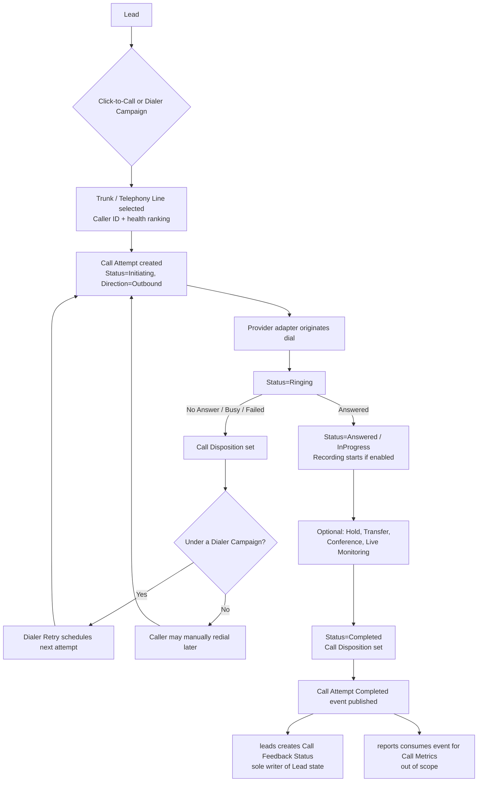
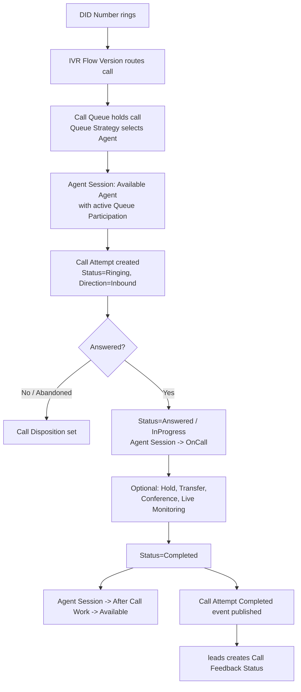

# 0006 — Telephony & Call Center: Aggregate Boundaries and Provider Abstraction

| | |
| --- | --- |
| **Status** | Accepted |
| **Date** | 2026-07-24 |

## Context

CRM Core (ADR 0004) and Loan Management (ADR 0005) are accepted and are not
revisited by this decision. Following their approval, the Telephony & Call
Center bounded context was designed and reviewed, covering: Click-to-Call,
PRI, GSM Gateway, SIP, Extensions, Telephony Line, Call, Call Attempt, Call
Queue, Queue Membership, Queue Participation, Queue Strategy, Call Recording,
Live Monitoring, Whisper, Barge-in, Call Transfer, Call Conference, IVR,
Dialer Campaign, Dialer Queue, Dialer Retry, Caller ID, DID Numbers, Trunks,
SIM Inventory, Call Status, Call Direction, Call Disposition, and Agent
Session. Ten unresolved modeling questions were identified, plus one
follow-up question raised after initial review:

1. Whether `Call` or `Call Attempt` should be the Aggregate Root.
2. How outbound retries should work — a new `Call` or a new `Call Attempt`.
3. How `Call Recording` should be modeled — child entity, separate aggregate,
   or external reference.
4. How `GSM Gateway`, `PRI`, and `SIP Trunks` should coexist without forcing a
   redesign every time a provider changes.
5. How `Live Monitoring` (`Listen` / `Whisper` / `Barge`) should work and who
   owns it.
6. Whether `Call Queue` belongs to `users`/`organization` or to `telephony`.
7. Whether `Queue Membership` should be historical.
8. Whether `Dialer Campaign` should reuse the CRM `Campaign` or be
   independent.
9. What the complete call lifecycle looks like end-to-end.
10. What weaknesses exist in the above and how they should be addressed
    before finalizing.
11. (Raised after initial review) Whether real-time Agent availability
    (login, break, idle, busy, after-call work, remote-agent context) should
    be modeled as part of `Call Attempt` or as its own aggregate.

Leaving any of these unresolved risked exactly the kind of ownership ambiguity
CRM Core and Loan Management already had to resolve once each: two aggregates
writing the same fact, a God-aggregate mixing a live telephony session with an
Agent's entire shift, or a future capability (Predictive Dialer, AI
Transcription, Multi-PRI, Remote Agents, Failover/HA) forcing a disruptive
redesign because today's model gave it no seam to attach to.

## Decision

### Call Attempt is the Aggregate Root; Call is not a stored aggregate

`telephony` owns **Call Attempt** as the Aggregate Root for all call
execution. Every real dial-out or inbound ring is exactly one telephony
session — one provider call identifier, one start/ring/answer/end timeline,
one recording, one disposition — and that is what Call Attempt represents.
Everything that can only exist while that one session is live — hold,
transfer, conference, live monitoring, recording — is a child entity or event
of Call Attempt, because they share its consistency boundary and cannot
outlive it.

**Call** is deliberately *not* modeled as a separate persisted aggregate. A
wrapping "Call" that groups multiple attempts would be redundant in the
common single-attempt case and would have no invariant of its own beyond "the
list of my attempts" in the multi-attempt case — the same test this codebase
already applies to reject unnecessary aggregates (EMI Schedule vs. Loan
Account in ADR 0005; Campaign Analytics vs. Campaign in ADR 0004). Where a
"how many attempts did it take to reach this Lead" view is needed, it is
served by a derived read projection (owned by reporting, out of scope here),
never by a mutable parent aggregate that a Call Attempt would have to reopen.

### Outbound retries always create a new Call Attempt

A retry never reopens or mutates a completed Call Attempt. Each retry is a
new, independent Call Attempt linked to its predecessor by an optional,
additive `retryOfCallAttemptId` reference — the same additive-reference
pattern already used for Loan Application's `originatingLoanOfferId` (ADR
0005). **Dialer Retry** (a child entity of a Dialer Queue Entry) owns only the
scheduling concern — attempt count, backoff, next-eligible time — and never
holds telephony facts itself; those always live on the new Call Attempt it
spawns. This preserves a complete, append-only audit trail, matching the
discipline already established for Disbursement, Customer Merge, and Import
Row.

### Call Recording: child entity metadata, external reference payload

`telephony` owns **Call Recording** as a child entity of Call Attempt for
metadata and an access-audit trail (who listened, when, retention policy,
consent flag) — never as a separate Aggregate Root, because it has no
independent lifecycle or query pattern outside the one Call Attempt it
captures. The audio payload itself is always an **external reference**
(pointer to storage), never inlined into the aggregate. Call Recording
carries an optional, additive annotation seam (`transcriptRef` /
`summaryRef` / `qualityScoreRef`) reserved for a future AI Transcription,
Summaries, and Quality Scoring capability, so that future work attaches
without any structural change here.

### Trunk is the single abstraction over PRI, GSM Gateway, and SIP

`telephony` owns **Trunk** as an Aggregate Root with a `TrunkType`
discriminator (`PRI` | `GSMGateway` | `SIP`) and a type-specific
configuration value — the identical discriminator pattern already used for
Loan Application's Top-up/Balance-Transfer Application Type (ADR 0005). Each
Trunk owns a collection of **Telephony Line** child entities (one per
addressable channel/circuit/registration); GSM-backed Lines optionally
reference a **SIM Inventory** item by identity (master data, referenced, not
embedded — the same pattern as Bank offering Loan Product in ADR 0005).
**DID Numbers** and **Caller ID** policy are owned as their own small
aggregates/child policies, referenced by Trunk, IVR, and Dialer Campaign by
identity.

Domain logic never depends on a specific vendor/protocol SDK. It depends only
on the `ITelephonyProvider` port already scaffolded in this codebase
(`src/modules/telephony`); vendor- and protocol-specific dialing/signaling
code for each Trunk Type lives entirely in `src/integrations/telephony/*`.
Adding, replacing, or multiplying providers — Multi-PRI, Multiple GSM
Gateways, additional SIP Providers, Failover/HA — means adding a new adapter
and a new Trunk record, never touching Call Attempt, Call Queue, or any other
domain logic.

### Live Monitoring: Listen, Whisper, and Barge are modes of one session

`telephony` owns a single **Call Monitoring Session** child entity of Call
Attempt, with a `Mode` field (`Listen` | `Whisper` | `Barge`), rather than
three separate entities:

- **Listen** — one-way audio tap, inaudible to both Agent and Customer.
- **Whisper** — private two-way channel to the Agent only; the Customer never
  hears it.
- **Barge** — the supervisor becomes audible to the Customer too, which is
  realized as the supervisor joining the existing **Call Conference** child
  entity rather than a separately invented join mechanism.

Every mode transition (including escalation from Listen to Whisper to Barge)
is a mandatory, individually logged, timestamped event — never a silent
jump. `telephony` owns the session mechanics; `rbac` owns which User is
authorized to start a monitoring session against a given Queue/Team scope,
the same clean split already used for Campaign Membership (`campaigns` owns
the fact, `rbac` owns the permission — ADR 0004).

### Call Queue and Queue Membership are owned by telephony, not by users/organization

`telephony` owns **Call Queue** as an Aggregate Root, with an embedded
**Queue Strategy** configuration value object (ring-all / round-robin /
skill-based / longest-idle, plus overflow and timeout rules) and a **Queue
Membership** child entity. A Call Queue is a live-call routing and holding
construct — SLA timers, ring strategy, abandonment handling — with no meaning
outside a telephony session; `users`/`organization` own identity and
organizational structure, not live-call routing state, so ownership here
would invert this codebase's established one-directional dependency
discipline (`campaigns -> leads`; never the reverse — ADR 0004). Queue
Membership *references* Users by identity only, exactly as Campaign
Membership already does.

**Queue Membership is historical**, not a single mutable "current members"
field: an append-only, time-bounded (`effectiveFrom`/`effectiveTo`) record
per Agent per Queue, the same discipline already used for Lead Assignment
history and Commission Policy Version (ADR 0005). This is required to
reconstruct who was eligible on a Queue at any past point in time for
staffing, SLA post-mortems, and utilization reporting. A "current members"
view is a derived read projection over open-ended records, never the primary
write target.

**Queue Participation** is a distinct, additional concept, owned as a child
entity of **Agent Session** (see below), not of Call Queue: it is the live,
session-scoped fact that an already-eligible Agent actually joined/left a
Queue's active pool during one specific session. Queue Membership answers "is
this Agent allowed to work this Queue at all"; Queue Participation answers
"did this Agent actually work it, and when, during this session." The two
must never be collapsed.

### Agent Session is a new, independent Aggregate Root

`telephony` owns **Agent Session** as an Aggregate Root, independent of Call
Attempt, modeling one Agent's continuous work session from Login to Logout:
assigned Extension, availability state (`Available` / `Break` / `Idle` /
`Busy` / `After Call Work`), Queue Participation, and a Remote Agent context
snapshot (device/network/location, captured once at Login).

Agent Session must exist independently of Call Attempt because:

- **Different lifespan and consistency boundary** — a session spans a whole
  shift; a Call Attempt spans one dial-to-hangup transaction. Sharing one
  boundary would force the Agent's entire shift state to be loaded and
  effectively locked on every call event, and vice versa.
- **Cardinality mismatch** — one Agent Session relates to zero, one, or many
  Call Attempts over its life, interleaved with Breaks and Idle time that
  have nothing to do with any specific call.
- **Independent invariants** — exactly one Active Agent Session per
  Extension, the Break/Idle/Busy/After-Call-Work state machine, and the
  After-Call-Work timer have no relationship to a Call Attempt's own
  invariants (Trunk/Line binding, recording, disposition). This is the same
  independent-lifecycle test already applied to Follow-up vs. Lead (ADR 0004)
  and EMI Schedule vs. Loan Account (ADR 0005).
- **Query pattern is agent-centric, not call-centric** — "who is Available
  right now," "how long was this Agent on Break today," "what was our
  occupancy rate this shift" are portfolio-wide, agent-centric questions, the
  same class that justified pulling Follow-up out of Lead.
- **Routing needs Agent state to exist before any call does** — Call Queue
  routing must know who is Available *before* it can attempt to connect a
  call; availability cannot be a property of something (Call Attempt) that
  does not yet exist.

`OnCall` and the transition into `After Call Work` are system-derived from
the bound Call Attempt's own lifecycle — Agent Session never sets them
manually and never duplicates Call Attempt state. Every availability
transition is appended to an immutable Agent Status History; a Queue
Participation entry may only reference a Queue the Agent already holds an
active Queue Membership for. A session, once ended by Logout, is never
reopened — a new Login always creates a new Agent Session.

### Dialer Campaign remains independent of, and references, CRM Campaign

`telephony` owns **Dialer Campaign**, **Dialer Queue**, and **Dialer Retry**
as an independent execution configuration — pacing, Trunk/Line pool, Caller
ID policy, working-hours window, retry defaults — that optionally
*references* a CRM `Campaign` (owned by `campaigns`) by identity. This
formalizes, at the entity level, the decision already recorded in
`docs/modules/campaigns.md`: *"Telephony Dialer Campaign is an execution
configuration owned by `telephony`, not a replacement for the CRM Campaign."*
CRM Campaign answers *which Leads and which Callers*; Dialer Campaign answers
*how the phone system dials through them*. Collapsing the two would force a
sales-allocation module to carry telephony execution concerns that have
nothing to do with Lead allocation, and would block a CRM Campaign being
worked partly by manual Click-to-Call and partly by a predictive-dialer
Dialer Campaign at the same time.

**Dialer Queue** is deliberately named and modeled distinctly from **Call
Queue**: Dialer Queue is the outbound *work* queue of numbers still to be
dialed; Call Queue is the live-call *holding* pool of already-connected calls
waiting for an Agent. The two must never be conflated despite the shared word
"Queue."

### Call Disposition and Call Feedback Status stay permanently separate

**Call Disposition** (owned by `telephony`) is a small, fixed, system-detected
technical outcome of a Call Attempt (Answered / No-Answer / Busy / Failed /
Voicemail / Network-Congestion), set automatically at termination. It is
permanently distinct from and never collapsed into `leads`' **Call Feedback
Status** (admin-configurable, human-entered business outcome) — the same
discipline ADR 0004 already established for Lead Stage vs. Call Feedback
Status. On Call Attempt completion, `telephony` publishes a domain event;
`leads` remains the sole writer of the resulting Call Feedback Status record.
`telephony` never writes Lead-side state directly, mirroring the
one-directional `campaigns -> leads` dependency discipline.

### Complete call lifecycle

**Outbound (Click-to-Call or Dialer-driven):**

**Inbound:**

The complete, canonical set of lifecycle diagrams (including Call Attempt and
Agent Session state diagrams) is maintained in `docs/modules/telephony.md`.

## Consequences

- Call execution has one unambiguous Aggregate Root (Call Attempt); "Call" is
  never reified into a redundant or ambiguous parent aggregate.
- Retries, transfers, and monitoring escalations are fully auditable and
  never overwrite prior history.
- Adding, replacing, or multiplying telephony providers (Multi-PRI, Multiple
  GSM Gateways, SIP Providers, Failover/HA) requires a new Trunk record and a
  new adapter in `src/integrations/telephony/*` — never a change to Call
  Attempt, Call Queue, or Dialer domain logic.
- Live Monitoring escalation (Listen -> Whisper -> Barge) is always
  attributable to a specific User and time, addressing a real compliance/
  trust risk before it could be exploited.
- Agent availability is queryable independent of any call, which is required
  for Call Queue routing, Predictive/Auto Dialer pacing, and future Remote
  Agent support to function at all.
- Dialer Campaign and CRM Campaign can evolve independently; a Campaign can be
  worked through multiple calling mechanisms simultaneously.
- Call Disposition and Call Feedback Status remain independently reportable
  ("did the line connect" vs. "what did the customer say") without risk of
  corrupting one concept into the other.
- Call Recording is ready to accept AI Transcription, Summaries, and Quality
  Scoring as additive annotations, with no structural change required later.

## Alternatives Considered

- **Model Call as the Aggregate Root, Call Attempt as its child**: rejected —
  forces an awkward decision about when a new "Call" starts versus reuses an
  old one across retries potentially days apart, and a wrapping aggregate
  would carry no invariant beyond the list of its own attempts.
- **Mutate/reopen a Call Attempt on retry**: rejected — destroys the
  append-only audit trail this codebase enforces everywhere else
  (Disbursement, Customer Merge, Import Row).
- **Model Call Recording as its own Aggregate Root**: rejected — no
  independent lifecycle or query pattern outside its one Call Attempt.
- **Model Call Recording's audio inline on the aggregate**: rejected — blobs
  do not belong inside a domain aggregate; always an external reference.
- **Model PRI, GSM Gateway, and SIP as three separate Trunk-like aggregates**:
  rejected — would require a redesign every time a provider is added,
  exactly the risk Multi-PRI/Multiple GSM Gateways/SIP Providers/Failover
  would expose; a single discriminated Trunk aggregate behind
  `ITelephonyProvider` avoids this entirely.
- **Model Listen/Whisper/Barge as three separate entities**: rejected — they
  are modes of one live session with one escalation path, not independent
  concepts.
- **Own Call Queue in `users` or `organization`**: rejected — inverts the
  established one-directional dependency discipline and forces a pure
  identity/org-structure module to depend on live telephony runtime state.
- **Treat Queue Membership as a single mutable "current members" list**:
  rejected — cannot answer staffing/SLA/utilization questions about the past,
  the same reasoning already applied to Lead Assignment and Commission Policy
  Version.
- **Merge Dialer Campaign into CRM Campaign**: rejected — already decided
  against in `docs/modules/campaigns.md`; forces a sales-allocation module to
  carry telephony execution concerns.
- **Model Agent availability as a property of Call Attempt**: rejected —
  cannot represent Login/Break/Idle/Busy time with no active call, and Call
  Queue routing needs availability to exist before any call does.
- **Merge Call Disposition into Call Feedback Status**: rejected — one is a
  system-detected technical fact, the other an admin-configurable business
  judgment; collapsing them was already rejected once for Lead Stage vs. Call
  Feedback Status (ADR 0004) and the same reasoning applies here.

## Open Questions

- Whether Telephony Line health-check feedback (SIM suspended/blacklisted,
  Trunk degraded) should automatically exclude a Line from selection, or
  require manual intervention — required before Failover/HA can be
  considered complete, not resolved by this ADR.
- Whether Trunk, DID Numbers, and Extension need an explicit Branch reference
  from day one to avoid retrofitting ownership fields when Multiple Branches
  is implemented.
- Whether After Call Work's maximum duration is a global `telephony` policy
  or configurable per Call Queue/Dialer Campaign — acknowledged as an
  implementation-time decision, not resolved here.

This ADR defines architecture only. It does not authorize database tables,
Prisma models, SQL, APIs, or UI.
