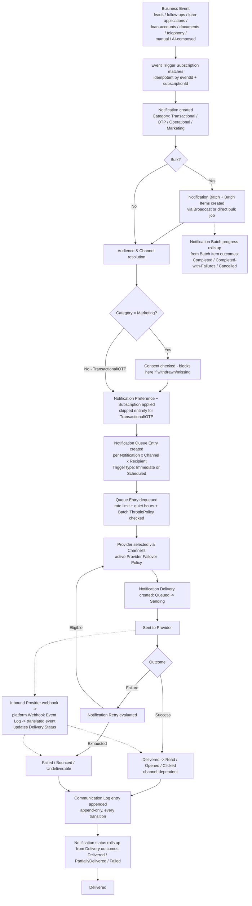

# 0008 — Notifications & Communications: Aggregate Boundaries and Provider Abstraction

| | |
| --- | --- |
| **Status** | Accepted |
| **Date** | 2026-07-24 |

## Context

CRM Core (ADR 0004), Loan Management (ADR 0005), Telephony & Call Center
(ADR 0006), and Document Management (ADR 0007) are accepted and are not
revisited by this decision. Following their approval, the Notifications &
Communications bounded context was designed and reviewed, covering:
Notification, Notification Batch, Notification Batch Item, Notification
Template, Notification Channel, Notification Preference, Notification
Subscription, Notification Delivery, Notification Retry, Notification Queue,
Delivery Status, Communication Log, Email, SMS, WhatsApp, Push Notification,
In-App Notification, Broadcast, Campaign Notification, Scheduled
Notification, Event Trigger, future Webhook, Provider, and Provider
Failover. Ten unresolved modeling questions were identified in the initial
review, plus one follow-up question raised after Notification Batch was
introduced to support enterprise-scale bulk sends:

1. Whether Notification should represent the business intent to communicate
   or the physical message actually sent.
2. How Notification Delivery should be modeled — child entity, separate
   Aggregate, or external process.
3. Whether Email, SMS, WhatsApp, Push, and In-App should be separate
   entities or channel strategies behind one Notification model.
4. How templates should work — Global, Organization-specific, versioned, or
   all of the above.
5. How retries should work, and whether Retry is a child entity, a separate
   Aggregate, or a pure queue concern.
6. How Notification Preferences should work across User, Customer, Channel,
   and Event dimensions.
7. How to design a Provider abstraction supporting Twilio, MSG91, Gupshup,
   Meta WhatsApp, AWS SES, SendGrid, Firebase, and future providers without
   redesign.
8. How scheduled notifications should work.
9. What the complete notification lifecycle looks like end-to-end, from
   business event to delivered message.
10. What weaknesses exist in the above design and how they should be
    addressed before finalizing.
11. (Raised after initial review) How to support enterprise-scale bulk
    notifications — EMI reminders, festival greetings, marketing campaigns,
    organization announcements — including progress tracking, partial
    failures, batch-level retry, cancellation, pause/resume, and future rate
    limiting, without redesigning Notification, Broadcast, or Delivery.

Leaving any of these unresolved risked the same class of problem every prior
bounded context in this codebase has already had to resolve once: two
aggregates writing the same fact, a vendor SDK baked directly into domain
logic, an inability to prove what was sent to whom and when, or a future
capability (multi-provider failover, provider health monitoring, rate
limiting, webhooks, read/delivery receipts, WhatsApp template approval, OTP,
consent management, AI-generated content) forcing a disruptive redesign
because today's model gave it no seam to attach to.

## Decision

### Notification represents business intent; Notification Delivery is the physical send

**Notification** is the business fact — "Lead assigned to Caller X," "EMI
due in 3 days," "OTP for login" — decided once. **Notification Delivery** is
a separate concept: one physical send attempt on one Channel through one
Provider, with its own timeline and technical outcome. This mirrors the
Loan Application/Loan Account split (ADR 0005, intent vs. execution) and the
Call Attempt/"Call" distinction (ADR 0006). Collapsing intent and execution
would force a multi-channel fallback (try WhatsApp, fail over to SMS) or a
transient-error retry to masquerade as a brand-new business event, corrupting
every downstream report that needs to answer "how many *distinct things*
did we tell this Customer" versus "how many *send attempts* did the system
make." A Notification is immutable once queued; a correction always creates
a new Notification and cancels the old one, never an in-place edit — the
same discipline already applied to Eligibility Snapshot and Commission.

### Notification Delivery is an independent Aggregate Root

**Notification Delivery** is its own Aggregate Root — not a Notification
child and not merely an opaque external process with no domain state. Its
dominant queries — "every Delivery pending retry system-wide right now,"
"delivery success rate by Provider today," "everything bounced this hour" —
are portfolio-wide, never naturally scoped to one Notification, the same
independent-lifecycle test that already promoted Follow-up (ADR 0004),
Agent Session (ADR 0006), and Document Verification (ADR 0007) out of their
natural parents. It must carry real domain state (not be pure
infrastructure) because Provider selection, retry history, and status
transitions are business-relevant, auditable facts that Communication Log
and compliance reporting depend on. **Delivery Status**
(`Queued`/`Sending`/`Sent`/`Delivered`/`Read`/`Opened`/`Clicked`/`Failed`/
`Bounced`/`Undeliverable`/`Expired`) is a Value Object catalog on Notification
Delivery, not its own entity; each Channel Type uses only the subset
meaningful to it.

### Email, SMS, WhatsApp, Push, and In-App are channel strategies, not separate entities

`notifications` owns **Notification Channel** and **Provider**, each with a
`ChannelType`/`ProviderType` discriminator (`Email` | `SMS` | `WhatsApp` |
`Push` | `InApp` | `Webhook`[future]) — the identical discriminator pattern
already accepted for `TrunkType` (Telephony, ADR 0006) and
`StorageProviderType` (Documents, ADR 0007). Email, SMS, WhatsApp, Push, and
In-App differ only in configuration shape and which Delivery Status values
apply; none of that difference justifies five parallel aggregate families,
each with its own Delivery/Retry/Queue/Preference implementation to keep in
sync forever. A sixth channel (the future Webhook) is one new discriminator
value, never a structural addition.

### Templates are Global, Organization-specific, and versioned — all three, layered

**Notification Template** is Global by default, with an **Organization-
specific override by reference** (never embedded, never a silent full
replacement) — the identical Global/Loan-Product split already accepted for
Document Checklist Template (ADR 0007). Every content edit produces a new,
append-only **Template Version**, the same pattern as Commission Policy
Version (ADR 0005). A live Notification always pins the exact Template
Version it used, so a later template edit never retroactively changes the
meaning of a message already sent — the same defense-in-depth Commission
already applies by snapshotting policy versions. WhatsApp's provider-side
template approval state (Meta) is an attribute on the Template Version, not
a new entity.

### Retry is a child entity of Notification Delivery, never a mutation of the failed attempt

**Notification Retry** is a child entity of Notification Delivery, owning
only the attempt counter, backoff schedule, and next-eligible-time — the
identical shape as **Dialer Retry** (a child entity of a Dialer Queue Entry,
ADR 0006). It holds no delivery facts of its own and, critically, never
mutates the Delivery it retries from: a retry always produces a **new**
Notification Delivery record, linked by an additive `retryOfDeliveryId`
reference, the same discipline already mandatory for Call Attempt retries.
It is not a Separate Aggregate because it has no query pattern independent
of the Delivery/Queue it is scoped to, and it is not a pure, unmodeled Queue
concern because attempt count and backoff timing are business-visible SLA
facts that must remain queryable.

### Notification Preference, Notification Subscription, and Consent are three separate concerns with a strict precedence order

Preferences are resolved across four layers, kept permanently distinct —
extending, not contradicting, the future **Consent**/**Communication
Preference** split already recorded in `docs/domain/domain-model.md`:

1. **Consent** (future, separate compliance Aggregate, not owned by
   `notifications`) is checked first and can only block `Marketing`-category
   sends; it is never bypassed.
2. **Category** on the Notification itself (`Transactional` / `OTP` /
   `Operational` / `Marketing`) determines whether Preference applies at
   all — `Transactional`/`OTP` always deliver regardless of Preference,
   because a Customer cannot opt out of an OTP or a legally mandated
   statement.
3. **Notification Preference** — the concrete realization of the future
   "Communication Preference" stub, now owned by `notifications` exactly as
   that stub anticipated — is scoped per-Recipient (User or Customer) and
   per-EventCategory, optionally narrowed per-Channel, and governs
   `Operational`/`Marketing` sends only.
4. **Notification Subscription** is a fourth, independent axis: per-Topic
   opt-in/opt-out specifically for Broadcast content, never collapsed into
   Preference — the "status catalogs stay separate" discipline used
   throughout this codebase (Application/Loan/EMI status, ADR 0005; Call
   Disposition/Call Feedback Status, ADR 0006; Retention/Archive/workflow
   state, ADR 0007).

### Provider abstraction: one port, one discriminator, adapters own the vendor SDKs

`notifications` owns **Provider** as an Aggregate Root with a `ProviderType`
discriminator (`Twilio` | `MSG91` | `Gupshup` | `MetaWhatsApp` | `AWSSES` |
`SendGrid` | `Firebase` | future), behind a single `INotificationProvider`
port (`send` / `checkStatus` / `handleWebhook`) — structurally identical to
Trunk + `ITelephonyProvider` (ADR 0006) and Storage Location +
`IStorageProvider` (ADR 0007), both of which have already proven this
pattern absorbs new vendors with zero domain redesign. Every vendor SDK call
lives in `src/integrations/notifications/*`, never in the domain layer. A
Provider belongs to exactly one Channel Type (Twilio-SMS and Twilio-WhatsApp
are two separate Provider records). **Provider Failover Policy** (child of
Notification Channel, versioned/append-only like Commission Policy Version)
holds an ordered Provider priority list and a health-threshold switch rule,
fed by append-only **Provider Health Check** records (system-written only, no
domain command allows a human to fake a health signal). Adding a new
provider is one new adapter + one new `ProviderType` value + one Provider
record — zero change to Notification, Delivery, Channel, or Retry.

### Notification Queue Entry carries scheduling; "Scheduled Notification" is not a separate entity

**Notification Queue** (Aggregate Root, the standing work queue per
Channel/priority) and **Notification Queue Entry** (its child, one resolved
"send Notification N on Channel C to Recipient R" work item) are deliberately
distinct from Notification itself — the identical Dialer Queue-vs-Call-
Attempt split already accepted in ADR 0006. A Queue Entry carries a
`TriggerType` discriminator (`Immediate` / `Scheduled`) and a `scheduledFor`
timestamp; the worker only dequeues entries whose `scheduledFor` has passed.
This is the entire "Scheduled Notification" capability — not a new entity,
just a populated field on an already-necessary work item, the same shape
already used for Follow-up's "due today" queries and Dialer Queue's pacing.
A retried attempt creates a new Queue Entry, never mutating a resolved one.

### Broadcast fans out into individual Notifications; "Campaign Notification" is a Broadcast specialization

**Broadcast** is an Aggregate Root representing one message sent to a
resolved audience/segment rather than a single recipient. It references a
Notification Template and an `AudienceSource` discriminator
(`ExplicitList` / `CampaignSegment` / `LeadFilter` / `CustomerSegment`),
resolving `CampaignSegment`/`LeadFilter` by identity against
`campaigns`/`leads` — never duplicating their data, the same
reference-never-duplicate discipline used throughout this codebase. It fans
out into one Notification per resolved recipient at dispatch time.
**"Campaign Notification" is not modeled as a separate entity** — it is a
Broadcast whose `AudienceSource = CampaignSegment`. Every fan-out
Notification still individually respects Notification Preference,
Subscription, and Consent; a Broadcast cannot bypass per-recipient
suppression.

### Notification Batch is a new, independent Aggregate Root for enterprise-scale bulk execution

**Notification Batch** is introduced as an Aggregate Root to answer the
follow-up question raised after initial review: how to support
enterprise-scale bulk sends (EMI reminders, festival greetings, marketing
campaigns, organization announcements) with combined progress tracking,
partial-failure visibility, pause/resume, coarse retry, and future rate
limiting as one governable unit. It passes the same independent-lifecycle
test already used for Notification Delivery above: "show every batch
running right now," "what's the failure rate on yesterday's EMI batch,"
"pause the festival-greeting send" are batch-centric queries with no natural
home on a single Notification or as a passive property of Broadcast.

- **Not an Aggregate Root debate — settled in favor of Aggregate Root.**
  Notification Batch owns real invariants (only one active run per batch,
  exact-checkpoint resumability, its own throttle policy) that would
  distort any existing aggregate if bolted on.
- **Relationship with Notification:** Notification Batch owns many
  **Notification Batch Item** children — one immutable work-item row per
  target recipient plus its personalization data, recorded *before* any
  Notification exists, the identical shape as `Import Row` existing before
  `Lead` creation (Leads bounded context). Each Batch Item, once processed,
  produces exactly one `Notification`, which carries the `batchId`/
  `batchItemId` back as an **additive, optional** field — Notification's own
  definition and lifecycle are unchanged; most Notifications simply have
  `batchId = null`.
- **Relationship with Broadcast:** unchanged in Broadcast's own definition.
  A `SourceType` discriminator on Notification Batch (`Broadcast` |
  `ScheduledJob` | `BulkEventTrigger` | `BulkAdminAction`) distinguishes two
  paths: **content-uniform** bulk sends (festival greetings, marketing,
  announcements) dispatch through the existing Broadcast path, which
  additionally materializes exactly one Notification Batch
  (`Broadcast.resultingBatchId`, additive field) for execution tracking;
  **content-personalized** bulk sends (EMI reminders, where every recipient
  has a different due amount/date) are created directly as a Notification
  Batch (`SourceType = ScheduledJob`/`BulkEventTrigger`) because Broadcast's
  model assumes one shared template resolved against an audience, not
  per-recipient distinct data.
- **Progress tracking** is always a derived rollup over Batch Item statuses
  (`Total`/`Processed`/`Notified`/`Failed`/`Skipped`/`Pending`/`Retrying`) —
  never an independently maintained counter that could drift, the same
  discipline already applied to Document Bundle completeness (ADR 0007).
- **Partial failures** are a first-class, expected terminal outcome: each
  Batch Item fails or succeeds independently, with no all-or-nothing batch
  transaction. Notification Batch has two distinct success terminal states —
  `Completed` (every item Notified) and `Completed-with-Failures` (some
  items `Failed`/`Skipped`) — so a degraded run is visible from the batch's
  own status without diffing every item. `Skipped` (bad data, never
  attempted) is kept distinct from `Failed` (a send was attempted and
  failed).
- **Retry strategy** operates at two levels, kept separate: the existing
  per-Notification `Notification Retry` (unchanged) handles transient
  send-level failures; a new, coarser **batch-level retry** re-drives only
  `Failed` Batch Items (never `Skipped`, which needs a data fix first) back
  to `Pending`, generating new Notifications/Deliveries — never mutating the
  originals, tracked by a `RetryRound` counter for auditability.
- **Cancellation** is forward-only: cancelling a Batch moves every
  still-`Pending` Batch Item to a terminal `Cancelled` state but never
  touches items already `Notified`, `Failed`, or mid-flight `Processing` (an
  in-flight send always finishes). `Cancelled` cannot be resumed; sending the
  remainder later requires a new Batch.
- **Pause/Resume** is a distinct, resumable, non-terminal state pair,
  deliberately separate from Cancel: `Running -> Paused` stops new dequeues
  while in-flight items finish; `Paused -> Running` resumes from the next
  `Pending` item with no reprocessing, because Batch Item status is the
  single source of truth for progress — the same idempotency discipline
  already required of Disbursement processing (ADR 0005).
- **Future rate limiting** reuses the already-designed Notification
  Channel-wide limit rather than inventing a second mechanism: Notification
  Batch gets its own optional `ThrottlePolicy` (items/sec or items/minute for
  that batch only), and the processor always honors the **lower** of the
  Channel-wide ceiling and the Batch's own policy, so no single batch can
  ever starve concurrent transactional traffic (OTPs, EMI alerts) sharing the
  same Channel/Provider.

### Communication Log is a structurally append-only, platform-level record

**Communication Log** is a platform-level Aggregate Root — the same
treatment as Audit Trail (ADR 0007) — recording every significant
Notification/Delivery lifecycle transition, designed from day one with **no
update or delete use-case exposed at the domain layer**. It is deliberately
separate from the live, mutable Notification Delivery/Retry operational
state: Delivery records may eventually be archived/pruned for storage cost,
Communication Log never is — it is the permanent compliance and Customer-
history source of truth. `reports` (out of scope here) derives
communication-history views from Communication Log, exactly as Campaign
Analytics is derived by `reports` rather than owned by `campaigns` (ADR
0004) — `notifications` does not own its own analytics entity.

### Event Trigger Subscription is the one-directional seam other modules use

**Event Trigger Subscription** is an admin-configured Aggregate Root
mapping one domain event (`Follow-up.Escalated`, `LoanApplication.Approved`,
`LoanAccount.EmiDueSoon`, etc.) to a Template, an audience-resolution rule,
and a Channel policy. Other modules (`leads`, `follow-ups`,
`loan-applications`, `loan-accounts`, `documents`, `telephony`) publish
domain events; `notifications` only consumes them — never the reverse,
preserving this codebase's established one-directional dependency discipline
(`campaigns -> leads`, `telephony -> leads`). Creating a Notification from an
inbound event is always idempotent by `(eventId, triggerSubscriptionId)`, the
same idempotency discipline already required of Disbursement processing (ADR
0005) and the future Webhook Event Log.

### Webhook (future): outbound is a Channel Type, inbound reuses the platform Webhook Event Log

Outbound **Webhook** delivery is not a new aggregate — it is a future
`ChannelType = Webhook` value on the existing Notification Channel/Provider
discriminator, requiring no structural change when it ships. Inbound
provider webhooks (delivery receipts, read receipts, WhatsApp status
callbacks) are never parsed directly by `notifications`' domain layer —
they land first in the already-approved, platform-level future **Webhook
Event Log** (`docs/domain/domain-model.md`), are translated into a domain
event/command, and only then update the matching Notification Delivery's
Delivery Status. This is the identical "consuming business modules receive
translated domain commands/events rather than raw payloads" rule the
Webhook Event Log stub already established.

### Complete notification lifecycle

The complete, canonical set of lifecycle and aggregate-boundary diagrams is
maintained in `docs/modules/notifications.md`.

## Consequences

- Notification (intent) and Notification Delivery (execution) can each
  evolve independently; multi-channel fallback and retries never masquerade
  as new business events.
- Delivery success rate, retry backlog, and bounce/failure queues are
  queryable portfolio-wide without scanning every Notification.
- Adding a channel (the future Webhook) or a provider (a new SMS aggregator,
  a new push service) is a new discriminator value and adapter — zero
  structural change to Notification, Delivery, Channel, Retry, or Queue.
- Templates can evolve per Organization and over time without ever
  rewriting the meaning of a historical message already sent.
- Retry history is fully auditable and never overwrites a failed attempt's
  record.
- Consent, Category, Preference, and Subscription resolve in one
  centralized, non-contradictable order — no channel-specific send path can
  independently decide "this is allowed" differently from another.
- Multi-provider failover, provider health monitoring, and rate limiting are
  configuration/adapter additions, never redesigns.
- Scheduled and immediate sends share one mechanism (Queue Entry), so a
  future Recurring Notification is a scheduler change, not a new entity.
- Enterprise-scale bulk sends (EMI reminders, festival greetings, marketing
  campaigns, organization announcements) get first-class progress tracking,
  partial-failure visibility, pause/resume, and batch-level retry without
  requiring an all-or-nothing transaction over potentially millions of
  recipients.
- Communication Log gives compliance and Customer-history views a
  structural guarantee (no update/delete use-case), independent of
  operational Delivery data that may later be archived for cost.
- Other modules cause Notifications only by publishing domain events to
  Event Trigger Subscription or calling `notifications`' public API — never
  by writing Notification state directly, preserving the one-directional
  dependency discipline already established for `campaigns -> leads` and
  `telephony -> leads`.

## Alternatives Considered

- **Model Notification as the physical message sent**: rejected — a
  multi-channel fallback or a retry would then look like a brand-new
  business event, corrupting "how many distinct things did we tell this
  Customer" reporting.
- **Model Notification Delivery as a child entity of Notification**:
  rejected — its dominant queries (system-wide retry backlog, per-Provider
  success rate) are portfolio-wide, the same reasoning that pulled Follow-up
  out of Lead and kept Agent Session independent of Call Attempt.
- **Model Notification Delivery as an opaque external process with no
  domain state**: rejected — Provider selection, retry history, and status
  transitions are business-relevant, auditable facts Communication Log and
  compliance reporting need to query directly.
- **Model Email, SMS, WhatsApp, Push, and In-App as five separate entity
  families**: rejected — repeats the exact anti-pattern already avoided for
  Telephony's Trunk types and Documents' storage providers; a sixth channel
  would force a structural addition instead of one discriminator value.
- **Keep templates Global-only or Organization-only, never both**: rejected
  — Global-only cannot support per-Organization branding/compliance
  variance; Organization-only duplicates every shared template needlessly.
  Both, layered and versioned, is the same pattern already accepted for
  Document Checklist Template.
- **Model Retry as a Separate Aggregate**: rejected — has no query pattern
  independent of the Delivery/Queue it is scoped to.
- **Model Retry as a pure, unmodeled queue concern**: rejected — attempt
  count and backoff timing are business-visible SLA facts that must remain
  queryable, not buried inside worker infrastructure.
- **Let Notification Preference alone govern Marketing suppression, with no
  separate Consent check**: rejected — conflates legal permission with
  operational choice, the same collapse already rejected for
  Consent/Communication Preference in `docs/domain/domain-model.md`.
- **Bind Notification/Delivery directly to a specific vendor SDK**: rejected
  — repeats the exact risk already avoided for Telephony (ADR 0006) and
  Storage (ADR 0007) providers.
- **Model "Scheduled Notification" as a separate entity from Notification
  Queue Entry**: rejected — a `TriggerType` discriminator and `scheduledFor`
  field on the already-necessary Queue Entry fully covers it with no new
  aggregate.
- **Model "Campaign Notification" as a separate entity from Broadcast**:
  rejected — it is fully expressible as a Broadcast whose `AudienceSource =
  CampaignSegment`.
- **Fold Notification Batch's execution tracking into Broadcast itself**:
  rejected — Broadcast's model assumes one shared template resolved against
  an audience; EMI-reminder-style bulk sends need per-recipient
  personalized content with no shared template, which Broadcast cannot
  represent without becoming two different things at once.
- **Give Notification Batch all-or-nothing transactional semantics**:
  rejected — at enterprise scale (hundreds of thousands of recipients), one
  bad phone number blocking the entire run is operationally unacceptable;
  partial failure must be a first-class, independently-tracked outcome per
  item.
- **Allow batch-level retry to mutate the original failed Delivery**:
  rejected — repeats the exact anti-pattern already rejected for Dialer
  Retry and Call Attempt retries; a retry always creates new records.
- **Collapse Pause and Cancel into one "stopped" flag**: rejected — Ops
  needs to react to a transient Provider outage without losing progress or
  needing a full cancel-and-restart; the two must remain independently
  resumable/terminal states.
- **Invent a second, batch-specific rate-limiting mechanism instead of
  reusing Notification Channel's**: rejected — would create two ceilings
  that could disagree; the batch processor always honors the lower of the
  two.
- **Let `notifications` parse raw provider webhook payloads directly**:
  rejected — repeats the exact risk the future Webhook Event Log stub
  already exists to prevent; inbound payloads are always translated first.

## Open Questions

- Whether In-App Notification needs its own lightweight, directly-queryable
  "inbox" read model (unread counts, mark-as-read UX) beyond what
  Notification Delivery's `Read` status already provides — likely a
  `reports`/read-model concern rather than a new domain entity, consistent
  with how Campaign Analytics was kept out of `campaigns` (ADR 0004), but
  not resolved here.
- Whether Notification Batch Item needs its own pinned Template Version
  snapshot (distinct from the Notification it later produces) for
  personalization auditability at enterprise scale — deferred to
  implementation-time design.
- Whether a future AI-generated-content source needs its own `SourceType`
  value on Notification (alongside Event Trigger Subscription, manual
  composer, and Broadcast) or can be folded into the manual composer path —
  deferred until AI-generated notifications are actually scoped.

This ADR defines architecture only. It does not authorize database tables,
Prisma models, SQL, APIs, or UI.
