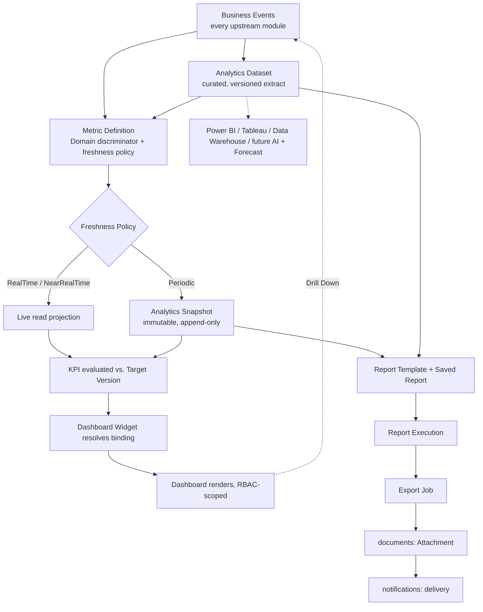

# 0009 — Reports & Analytics: Aggregate Boundaries and Dataset/BI Abstraction

| | |
| --- | --- |
| **Status** | Accepted |
| **Date** | 2026-07-24 |

## Context

CRM Core (ADR 0004), Loan Management (ADR 0005), Telephony & Call Center
(ADR 0006), Document Management (ADR 0007), and Notifications &
Communications (ADR 0008) are accepted and are not revisited by this
decision. Following their approval, the Reports & Analytics bounded context
was designed and reviewed, covering: Dashboard, Dashboard Widget, KPI, Metric
Definition, Analytics Snapshot, Report, Report Template, Saved Report,
Scheduled Report, Report Execution, Export Job, Export Format, Report
Filter, Drill Down, and the domain-scoped reporting surfaces already implied
by earlier ADRs and by the Business Requirements Document §15 (Audit
Analytics, Organization Analytics, User Analytics, Lead Analytics, Loan
Analytics, Telephony Analytics, Document Analytics). Ten unresolved modeling
questions were identified, plus one follow-up question raised after initial
review to support future BI/Data-Warehouse/AI requirements:

1. Whether Reports should own business data or only read other bounded
   contexts.
2. Whether KPI should be an Aggregate Root, a Value Object, or a Child
   Entity.
3. Whether Dashboard should store data or only widget configuration.
4. How Analytics Snapshot should work — live calculation, snapshot, or
   hybrid.
5. Whether Report Execution should be independent.
6. How Scheduled Reports should work, including ownership and lifecycle.
7. How Export Jobs should work.
8. How Drill Down should work.
9. What the complete reporting lifecycle looks like end-to-end, from business
   event to export.
10. What weaknesses exist in the above design and how they should be
    addressed before finalizing.
11. (Raised after initial review, to support Executive/Branch Dashboards,
    Real-time KPIs, Scheduled PDF Reports, Excel/CSV Exports, BI Integration
    with Power BI/Tableau, a future Data Warehouse, Historical Trends, and
    Forecasting) How a reusable analytical data source — distinct from a
    database table — should be modeled so that Metric Definition, Report
    Template, and external BI tools can all draw from one governed source
    without each re-deriving its own extraction/join logic, and without
    turning Reports into a generic, platform-wide data-access layer.

Leaving any of these unresolved risked the same class of problem every prior
bounded context in this codebase has already had to resolve once: two
modules independently computing (and potentially disagreeing on) the same
number, a Dashboard silently becoming a second source of truth for business
data, an external BI tool bypassing RBAC-scoped visibility by connecting
directly to internal storage, or a future capability (real-time KPIs,
forecasting, Power BI/Tableau, a Data Warehouse) forcing a disruptive
redesign because today's model gave it no seam to attach to.

## Decision

### Reports is a derived, read-only bounded context that owns only its own derived data

`reports` never becomes the source of truth for a Lead, Loan Application,
Loan Account, Call Attempt, Document, or Notification. It consumes domain
events published by `leads`, `campaigns`, `loan-applications`,
`loan-accounts`, `disbursements`, `banks`, `loan-products`, `telephony`,
`documents`, and `notifications` — the identical one-directional dependency
discipline already established for `campaigns -> leads` and `* ->
notifications` — and never performs a live cross-module join or writes state
back into any of them. It does, legitimately, own its own derived data:
Analytics Dataset, Analytics Snapshot, Report Execution results, and Export
Job output are not duplicates of another module's truth, the same way
Communication Log (ADR 0008) is `notifications`' own record despite
summarizing six other modules' events. This extends
`docs/domain/domain-model.md` rule 12 ("Campaign Analytics is owned only by
`reports`... does not own a derived analytics entity") to every other module
uniformly, and folds the previously-referenced "Campaign Analytics" into this
same discriminator-based model (see below) rather than leaving it as a
one-off exception.

### Dashboard stores only widget configuration, never data

**Dashboard** is an Aggregate Root storing only layout, widget bindings, and
visibility scope. **Dashboard Widget** is its child, binding a visualization
type to exactly one Metric Definition or KPI plus an embedded Report Filter.
Neither stores computed values. If a Dashboard stored data, every metric
change would require writing to every Dashboard displaying it, multiple
Dashboards showing overlapping KPIs would drift out of sync, and the future
**Real-time KPIs** requirement would be structurally impossible. Values are
always resolved at render time against the freshest Analytics Snapshot or a
live query, per the owning Metric Definition's freshness policy.

### KPI is an independent Aggregate Root, not a Value Object or Child Entity

**KPI** is promoted to an Aggregate Root, applying the same
independent-lifecycle test already used to pull Follow-up out of Lead (ADR
0004), keep Agent Session independent of Call Attempt (ADR 0006), and
promote Notification Delivery out of Notification (ADR 0008): the same KPI
is referenced by many Dashboards simultaneously (ruling out embedding it as
a Value Object or a child of one Dashboard/Widget, which would force
duplication and drift), and its target/threshold history is revised on its
own cadence, independent of any Dashboard's edit cycle, and must be versioned
and auditable (mirroring Commission Policy Version) rather than silently
overwritten. KPI wraps exactly one **Metric Definition** by reference —
never duplicating its formula — the same small-dedicated-Aggregate-Root
pattern already used for Loan Offer sitting between Eligibility Snapshot and
Loan Application (ADR 0005). KPI status (On-Track/At-Risk/Off-Track) is
always derived at evaluation time against the currently-effective Target
Version, never hand-set.

### Metric Definition is the single reusable calculation source, Domain-discriminated

**Metric Definition** is an Aggregate Root and the single source of formula
truth, carrying a `Domain` discriminator (`Lead` / `Loan` / `Telephony` /
`Document` / `User` / `Organization` / `Audit`) — the same
discriminator-not-parallel-entity-families pattern already accepted for
`TrunkType` (ADR 0006), `StorageProviderType` (ADR 0007), and
`ChannelType`/`ProviderType` (ADR 0008). This is the entire realization of
Audit Analytics, Organization Analytics, User Analytics, Lead Analytics,
Loan Analytics, Telephony Analytics, and Document Analytics: **none of them
is a separate entity or entity family** — each is a `Domain` value applied to
Metric Definition and Analytics Snapshot. A seven-way parallel entity family
(`LeadAnalyticsRecord`, `LoanAnalyticsRecord`, ...) was explicitly considered
and rejected (see Alternatives Considered). Formula edits are versioned,
append-only (Metric Definition Version), so a later change never rewrites
what an existing Analytics Snapshot means.

### Analytics Snapshot is Hybrid — live for real-time metrics, periodic and append-only for everything historical

**Analytics Snapshot** is an Aggregate Root, structurally append-only (no
update/delete use-case, the same guarantee already established for Audit
Trail and Communication Log). Every Metric Definition declares its own
freshness policy: `RealTime` / `NearRealTime(interval)` / `Periodic`. Pure
Live fails once Executive/Branch dashboards, historical trends, and
forecasting exist — re-aggregating years of events on every page view does
not scale, and BI tools expect a stable, queryable historical series. Pure
Snapshot fails the explicit **Real-time KPIs** requirement — a live
agent-availability counter cannot wait for a nightly batch. Hybrid resolves
both: slow-changing, high-volume metrics run on a Periodic Snapshot cadence;
low-latency, operationally urgent metrics compute live/near-real-time
directly from the event-driven read projection. Analytics Snapshot is always
the backbone for anything historical/trend/forecast-facing, since only a
persisted, immutable series can be trended or forecast against; it always
pins the Metric Definition Version it used.

### "Report" is not a persisted entity

**Report** is business language only, realized structurally by **Report
Template** (definition) + **Saved Report** (parameterization) + **Report
Execution** (one run) — never a fourth wrapper entity. This applies the
identical test already used to reject a wrapping "Call" aggregate (ADR 0006,
where every real dial-out is exactly one Call Attempt) and an independent
Campaign Analytics aggregate (ADR 0004): a wrapping "Report" would be
redundant given Template + Saved Report + Execution already exist and would
carry no invariant of its own.

**Report Template** is an Aggregate Root, Global by default with an
Organization-specific override **by reference** (never embedded) — the
identical Global/override pattern already accepted for Notification Template
and Document Checklist Template — and references one or more Metric
Definitions and/or an Analytics Dataset (for row-level/tabular output).
**Saved Report** is an Aggregate Root — a named, owned, reusable
parameterization of a Report Template plus an embedded **Report Filter** —
the reporting analogue of BRD §16.1's saved lead views, with independent
identity because it is shareable, referenced by Scheduled Report, and
outlives any single execution. **Report Filter** remains a Value Object,
embedded wherever a query needs scoping, with no identity or lifecycle of
its own — the same test that kept Queue Strategy and Delivery Status as
Value Objects rather than entities. It supports both absolute and
relative/dynamic expressions (e.g. `RollingLast(30, Days)`) resolved at
execution time, while a completed Report Execution always freezes the
resolved absolute values it actually used, preserving audit integrity
without sacrificing recurring-report usability.

### Report Execution is an independent Aggregate Root

**Report Execution** is an independent Aggregate Root, applying the
identical intent/execution split already used for Loan Application/Loan
Account (ADR 0005), Call Attempt/"Call" (ADR 0006), and Notification/
Notification Delivery (ADR 0008). Its dominant queries — "every execution
running right now," "average run time by Template," "everything that failed
today" — are portfolio-wide across all Templates/Saved Reports, not scoped
under one parent; it has its own state machine (`Queued -> Running ->
Completed/Failed/Cancelled`) independent of its Template's own
`Draft/Published/Retired` lifecycle; and it must remain immutable and
auditable — exactly what ran, with which Template Version and resolved
Filter — regardless of what the definition looks like today. Making it a
child of Saved Report would also break ad hoc, non-saved, one-off report
runs, which have no Saved Report parent to live under. Ad hoc and
Scheduled-triggered executions share one state machine — no parallel "ad hoc
report" concept.

### Scheduled Report references exactly one Saved Report and fires independently

**Scheduled Report** is an independent Aggregate Root referencing exactly
one **Saved Report** (reuse, never a duplicated inline Template+Filter — the
same discipline used everywhere else in this codebase) plus cadence,
recipients, and Export Format(s). Its lifecycle (`Active -> Paused ->
Cancelled`) mirrors Notification Batch's Pause/Resume-kept-distinct-from-
Cancel discipline (ADR 0008): a temporary pause must not discard the
schedule's configuration the way cancellation would. Each fire is completely
independent — it creates one Report Execution, then on completion one or
more Export Jobs, then hands delivery off to `notifications` via the same
seam every other module already uses; Scheduled Report never re-implements
send/retry/delivery-proof logic. A missed or failed fire never blocks the
next scheduled fire. Cadence/recipient/filter edits are prospective-only, the
same discipline already applied to Notification Preference and Commission
Policy Version changes.

### Export Job is an independent Aggregate Root that reuses Documents' Attachment and delegates delivery to Notifications

**Export Job** is an independent Aggregate Root, created only against an
already-Completed Report Execution — rendering is strictly downstream of,
and never triggers, computation. One Report Execution can fan out into
several Export Jobs (PDF for the Board, CSV for a data team) — the same
one-to-many, portfolio-wide-query reasoning that keeps Notification Delivery
independent of Notification. Its lifecycle (`Queued -> Rendering ->
Completed/Failed`) mirrors Notification Delivery/Notification Retry and
Dialer Retry precisely: a failed job's retry always creates a **new**,
linked Export Job, never mutating the failed one. The rendered artifact is
registered as a `documents`-owned **Attachment** (reusing Document
Management's generic file-registration primitive for storage mechanics
only) — never promoted to a compliance-classified Document, since export
exhaust carries no KYC classification, checklist, or loan-retention
obligation; Reports owns its own, separate, lightweight retention rule for
export artifacts. **Export Format** (`PDF` / `Excel` / `CSV` / `PowerBIFeed`
/ `TableauFeed` / `DataWarehouseFeed` / future `JSON`) is a discriminator
value on Export Job, not a separate entity — the same pattern already
accepted for `TrunkType` and `StorageProviderType`. Delivery of the finished
export is always handed off to `notifications`, never re-implemented here.

### Drill Down is a runtime capability, not a persisted entity

**Drill Down** is not stored state — a runtime navigation capability
identical in kind to Click-to-Call (ADR 0006). It walks from an aggregated
Metric Definition/Analytics Snapshot dimension down through progressively
less-aggregated breakdowns, terminating at a reference to the authoritative
owning module's own record (a Lead, Loan Application, Call Attempt,
Document) — `reports` resolves and displays that reference but never copies
the record-level detail into its own store. RBAC scope is re-checked at
every hop, not only at the top-level Dashboard. Drilling from a
Snapshot-backed widget resolves against that Snapshot's frozen filter/
time-window; drilling from a Live widget resolves against current data — the
widget's freshness policy determines which, and the two must never be
visually conflated.

### Analytics Dataset is a new, independent Aggregate Root — the governed semantic layer beneath Metric Definition, Report Template, and every external consumer

**Analytics Dataset** is introduced as an Aggregate Root answering the
follow-up question raised after initial review: how to model a reusable
analytical data source — distinct from a database table — that Metric
Definition, Report Template, and external BI tools can all draw from without
each re-deriving the same extraction/join logic. It represents a named,
versioned, denormalized row-level or dimensional extract built from
published domain events, sitting between raw events and everything that
consumes analytical data.

- **Aggregate Root, not Value Object or Child Entity**, applying the same
  independent-lifecycle test used throughout this document: stable, shared
  identity referenced by many Metric Definitions, Report Templates, and
  external BI connections simultaneously; an independent versioning
  discipline (schema/grain changes are append-only, the same pattern as
  Metric Definition Version and Commission Policy Version); and
  portfolio-wide dominant queries ("every Dataset currently exposed to Power
  BI," "what breaks downstream if this Dataset's schema changes") with no
  single natural parent.
- **Relationship with Metric Definition:** additive and optional. A Metric
  Definition may continue to declare its source event stream directly for
  simple, single-source metrics; for metrics needing a shared, cross-module,
  or pre-joined source, it instead references exactly one Analytics Dataset
  by identity, so join/extraction logic is defined once and reused.
- **Relationship with KPI:** none, intentionally. KPI continues to reference
  only a Metric Definition; it reaches a Dataset only transitively, avoiding
  two parallel paths into the same KPI's source data.
- **Relationship with Dashboard:** none, intentionally. Dashboard/Widget
  remain unaware Dataset exists, preserving "Dashboard stores only
  configuration."
- **Relationship with Report Template:** additive. A Report Template may
  reference a Dataset directly for row-level/tabular reports, alongside its
  existing Metric Definition references for aggregated columns.
- **Relationship with Export Job:** for BI-oriented Export Format values
  only (`PowerBIFeed` / `TableauFeed` / `DataWarehouseFeed`), an Export Job's
  source is the Dataset itself — a scoped, revocable access grant — rather
  than a static rendered Report Execution result; Export Job's own state
  machine and retry discipline are unchanged.
- **Relationship with Power BI/Tableau:** Dataset is the exact contract
  boundary. External BI tools connect only to a **published** Analytics
  Dataset through the Export Job seam — never directly to internal Metric
  Definition calculation logic, the Analytics Snapshot store, or raw
  published domain events — mirroring how these tools already think in terms
  of "datasets"/"data sources" as their unit of connection. RBAC scoping is
  enforced once, at the Dataset access-grant level, never re-implemented
  inside the BI tool.
- **Relationship with future AI analytics:** AI/ML capabilities (forecasting,
  anomaly detection, recommendation scoring) consume one or more named
  Analytics Datasets (and Analytics Snapshot's historical series) as feature
  sources, through the same governed seam as Power BI/Tableau — never raw
  domain events or another module's live tables directly. This also gives
  the future **Forecast** capability a concrete data-sourcing home without
  designing it now: a forecast model trains against a specific Dataset
  version, and a versioned forecast output could itself later be exposed as
  a new Dataset for downstream consumption.
- **Why Dataset belongs to `reports`, not a generic data-access layer:**
  Dataset is analytical and read-scoped by definition, governed by Reports'
  own RBAC-scoping, freshness, and versioning discipline — a fundamentally
  different problem from a platform-wide transactional data-access layer.
  Promoting it to shared infrastructure would let other modules bypass their
  own aggregate boundaries with ad hoc "just query the Dataset" shortcuts —
  the exact anti-pattern this domain model has consistently rejected (no
  live cross-module DB joins, reference by identity, one-directional
  dependencies) — and would invert the one-directional dependency discipline
  already established for `campaigns -> leads` and `* -> notifications`.
  Trunk (ADR 0006) and Storage Location (ADR 0007) follow the identical
  discipline: an abstraction owned by the module that needs it, never
  promoted to a shared platform service.

### Complete reporting lifecycle

The complete, canonical set of lifecycle, aggregate-boundary, pipeline, and
dashboard-flow diagrams is maintained in `docs/modules/reports.md`.

## Consequences

- Reports can serve Executive, Branch, Team, and Personal Dashboards from one
  consistent Metric Definition/KPI model without any Dashboard becoming a
  second source of truth for business data.
- Real-time KPIs, historical trends, and forecasting are all satisfied by one
  Hybrid Analytics Snapshot model rather than three competing mechanisms.
- Scheduled PDF Reports, Excel exports, and CSV exports are all the same
  Export Job entity with a different discriminator value — never three
  parallel pipelines.
- BI Integration (Power BI, Tableau) and a future Data Warehouse are
  configuration/connection exercises against an already-governed Analytics
  Dataset contract, never a structural redesign, and can never bypass
  RBAC-scoped visibility.
- A future Forecast capability has a concrete, already-designed
  data-sourcing seam (Analytics Dataset + Analytics Snapshot) to attach to
  without redesigning either.
- "Campaign Analytics" and every other domain-scoped analytics need (Lead,
  Loan, Telephony, Document, User, Organization, Audit) are satisfied by one
  discriminator pattern instead of eight independently-evolving entity
  families.
- Report Execution and Export Job retries are always new, linked records —
  never in-place mutations — preserving a complete, auditable history of
  every run and every rendered artifact.

## Alternatives Considered

- **Let Reports read other modules' write-side tables directly**: rejected —
  breaks the one-directional dependency discipline already established
  throughout this codebase and risks Reports disagreeing with the module
  that actually owns a fact.
- **Model KPI as a Value Object embedded on Dashboard Widget**: rejected — a
  KPI's identity and target history must survive independent of any one
  Widget/Dashboard; a Value Object has neither.
- **Model KPI as a child entity of Metric Definition**: rejected — a Metric
  Definition may back multiple KPIs with different targets for different
  audiences (Branch target vs. Executive target on the same underlying
  metric), which a single child slot cannot represent.
- **Let Dashboard store the numbers it displays**: rejected — makes
  Real-time KPIs structurally impossible and risks multiple Dashboards
  drifting out of sync on the same metric.
- **Pure Live Analytics Snapshot (never precomputed)**: rejected — does not
  scale to Executive/Branch dashboards, historical trends, or BI tools
  expecting a stable historical series.
- **Pure Snapshot Analytics Snapshot (never live)**: rejected — cannot
  satisfy the explicit Real-time KPIs requirement.
- **Model "Report" as its own persisted Aggregate Root**: rejected — Report
  Template, Saved Report, and Report Execution already fully express the
  concept; a fourth wrapper would carry no invariant of its own, the same
  test already applied to reject a wrapping "Call" aggregate.
- **Model Report Execution as a child of Report Template or Saved Report**:
  rejected — its dominant queries are portfolio-wide, and a child of Saved
  Report cannot host ad hoc, non-saved executions.
- **Model Export Job as an attribute of Report Execution rather than its own
  Aggregate Root**: rejected — one Execution can fan out into several
  Export Jobs (multiple formats), and portfolio-wide "everything pending
  render/delivery" queries need their own aggregate.
- **Store Export Job output as a new, Reports-owned file-storage concept**:
  rejected — duplicates Document Management's already-accepted Storage
  Location/Attachment abstraction for no benefit.
- **Model Drill Down as a persisted entity**: rejected — it has no state of
  its own; it is a query/navigation capability, the same reasoning already
  applied to Click-to-Call.
- **Model Audit/Organization/User/Lead/Loan/Telephony/Document Analytics as
  seven separate entity families**: rejected — repeats the exact anti-pattern
  already avoided for Telephony's Trunk types and Documents' storage
  providers; a `Domain` discriminator on Metric Definition/Analytics
  Snapshot covers all seven (and any future domain) with zero structural
  change.
- **Skip Analytics Dataset and let every Metric Definition/Report
  Template/BI connection independently re-derive its own extraction/join
  logic from raw events**: rejected — guarantees drift between metrics that
  should share one definition of "Loan Portfolio by Branch by Month" and
  gives external BI tools no stable, governed connection point.
- **Promote Analytics Dataset to a generic, platform-wide data-access
  layer**: rejected — would invite other modules to bypass their own
  aggregate boundaries and invert this codebase's one-directional dependency
  discipline; Dataset's RBAC-scoping and freshness governance belong with
  Reports, not with shared infrastructure.
- **Let Power BI/Tableau connect directly to internal Analytics Snapshot
  storage or a service-account database connection**: rejected — bypasses
  per-Dashboard/per-Report RBAC-scoped visibility that Reports otherwise
  enforces everywhere else.
- **Fold Forecast's future data directly into Analytics Snapshot**: rejected
  — would corrupt "what actually happened" (Snapshot) with "what we predict"
  (Forecast); Forecast is left as a named future extension point sourcing
  from Analytics Dataset/Analytics Snapshot instead.

## Open Questions

- Whether Report Filter needs a first-class, named, versioned "Filter
  Preset" beyond a purely per-consumer embedded Value Object.
- Whether Scheduled Report needs Notification-Batch-style bulk delivery
  tracking for very large recipient lists.
- How the pre-existing `src/modules/analytics` code scaffold should be
  reconciled with the single-owner-module (`reports`) decision recorded
  here — an implementation-time, code-only concern.
- Whether Forecast, once actually scoped, needs its own Aggregate Root or
  can be expressed as a specialized Analytics Dataset with a `SourceType =
  Model` discriminator.

This ADR defines architecture only. It does not authorize database tables,
Prisma models, SQL, APIs, or UI.
