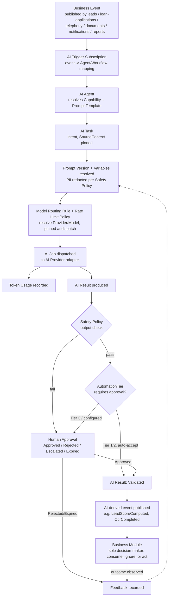

# 0010 — AI Platform: Intelligence Layer, Governance, and Provider Abstraction

| | |
| --- | --- |
| **Status** | Accepted |
| **Date** | 2026-07-24 |

## Context

CRM Core (ADR 0004), Loan Management (ADR 0005), Telephony & Call Center
(ADR 0006), Document Management (ADR 0007), Notifications & Communications
(ADR 0008), and Reports & Analytics (ADR 0009) are accepted and are not
revisited by this decision. Following their approval, a seventh bounded
context — the AI Platform — was designed and reviewed, covering: AI
Provider, AI Model, AI Capability, AI Agent, AI Workflow, AI Task, AI Job,
AI Result, AI Configuration, Prompt Template, Prompt Version, Prompt
Variable, Token Usage, AI Cost, AI Audit Log (Core AI); OCR Request, OCR
Result, Extracted Entity, Document Classification, future Face Match
(Document AI); Transcription Job, Call Transcript, Call Summary, Sentiment
Analysis, Quality Score (Telephony AI); Lead Score, Lead Recommendation,
Next Best Action, Duplicate Detection (CRM AI); Forecast, Prediction, Trend
Analysis, Anomaly Detection (Analytics AI); and Model Routing, Provider
Failover, Rate Limits, Safety Policy, Human Approval, and Feedback Loop
(Platform). Eleven questions were identified in review, the eleventh raised
as a follow-up once the first ten were resolved:

1. Whether AI should own business decisions or only produce recommendations.
2. Whether Prompt Template should be an Aggregate Root.
3. Whether Prompt Version should be immutable.
4. How to design an AI Provider abstraction supporting OpenAI, Anthropic,
   Gemini, Azure OpenAI, Local models, Ollama, and future providers without
   redesign.
5. Whether AI Job should be a separate entity from AI Task.
6. How Human Approval should work.
7. How Feedback should improve Prompts over time.
8. How Token Usage and AI Cost should be modeled.
9. What the complete AI lifecycle looks like end-to-end, from a business
   event to a business module acting on an AI-derived result.
10. What weaknesses exist in the above design and how they should be
    addressed before finalizing.
11. (Raised as a follow-up after the first ten were resolved) How to support
    Prompt A/B testing, Prompt Version comparison, Model comparison,
    Provider comparison, Temperature comparison, and Routing strategy
    comparison as a single governed capability, without redesigning Prompt
    Version, AI Job, or Feedback.

Leaving any of these unresolved risked the same class of problem every
prior bounded context in this codebase has already had to resolve once: a
second aggregate silently becoming a second writer of another module's
business fact (the exact risk this codebase has structurally avoided since
ADR 0004's `campaigns -> leads` decision), a vendor SDK baked directly into
domain logic, an inability to prove what configuration produced a given AI
output, or a future capability (autonomous agents, multi-agent workflows,
MCP tool use, RAG/Knowledge Base, fine-tuned and local models, GPU
inference, voice/vision AI, AI governance, cost optimization, prompt
experimentation) forcing a disruptive redesign because today's model gave
it no seam to attach to.

## Decision

### AI Platform is a pure intelligence layer; it owns no business data

The AI Platform never owns Customer, Lead, Loan, Telephony, Document, or
Notification business data. It consumes domain events already published by
`leads`, `customers`, `loan-applications`, `loan-accounts`, `disbursements`,
`telephony`, `documents`, and `notifications`, and consumes `reports`'
published Analytics Dataset through the existing Export Job seam (rule 58)
— the identical one-directional dependency discipline already established
for `campaigns -> leads` (ADR 0004) and `* -> notifications` (ADR 0008). It
never performs a live query or writes state back into any of them. It
legitimately owns only its own derived artifacts: AI Result and every
domain-specific specialization of it, Token Usage/AI Cost, and AI Audit
Log — the same owned-by-the-module-that-needs-it treatment `reports`
already established for Analytics Dataset (ADR 0009). All entities live
under a single `ai-platform` top-level boundary, structurally parallel to
`src/modules/*`, split into six modules: `ai-core`, `ai-documents`,
`ai-telephony`, `ai-crm`, `ai-analytics`, and `ai-governance`.

### AI owns only recommendations; a risk-tiered envelope allows future autonomy without AI ever becoming the decision-maker

AI never owns a business decision — only a recommendation, classification,
prediction, or summary. A decision that changes money, compliance status,
or a Customer's identity must always have exactly one accountable, auditable
owner (`loan-applications` decides Application Status, `customers` decides
Customer Merge, `disbursements` decides Commission); an LLM's probabilistic
output cannot satisfy the reproducibility guarantee this codebase already
demands of Eligibility Snapshot and Commission. This does not block future
autonomous agents: every AI Task/Safety Policy carries an `AutomationTier`
— **Tier 1** (fully autonomous, reversible, zero-cost-to-undo outputs, e.g.
drafting a Lead Recommendation), **Tier 2** (bounded-risk actions executing
inside a pre-approved, revocable Safety Policy + Rate Limit envelope a
human authorized once in advance, sampled for post-hoc audit), and **Tier
3** (money/compliance/identity-affecting actions, which always require a
live, case-by-case Human Approval). Even a "fully autonomous" agent's
actions always execute inside a scope a human pre-approved and can revoke —
the accountable decision-maker is never the AI itself.

### AI Task and AI Job are separate Aggregate Roots (intent vs. execution)

**AI Task** is the durable business intent — *what* needs doing and *why*
— referencing its trigger via a `SourceContext = {sourceType, sourceId}`
discriminator, the same idiom already used for Document's `OwnerContext`
(ADR 0007). **AI Job** is one concrete execution attempt against one
specific AI Provider/AI Model, owning Token Usage and producing at most one
AI Result. This is the identical intent/execution split already applied
four times in this codebase: Loan Application/Loan Account (ADR 0005), Call
Attempt retries (ADR 0006), Notification/Notification Delivery (ADR 0008),
and Report Execution (ADR 0009). A Task is immutable in intent once
Requested — a correction always creates a new Task. A Job retry never
mutates a completed/failed Job; it always creates a new Job linked by an
additive `retryOfJobId` reference, mirroring Call Attempt retries. Without
this split, a Provider failover retry would either lose the original
business intent's stable identity or force an attempt-history array onto a
single row, making per-attempt cost/audit querying awkward.

### AI Result is generic and advisory; domain-specific entities reference it, never replace a business module's own records

**AI Result** is the single, generic, provider-agnostic output envelope of
an AI Job — a child entity, immutable once produced. Every domain-specific
result (OCR Result, Call Summary, Lead Score, Forecast, and the rest)
references it via `sourceAiResultId` rather than duplicating it, and is
itself always advisory: it never auto-writes into another module's trusted
state without an explicit human/confirmation step, extending rule 34's
Extracted-Field discipline (ADR 0007) platform-wide. This is the resolution
to the sharpest boundary risk in this design: `ai-documents`' OCR
Request/Result/Extracted Entity and future Face Match are AI execution
detail only — `documents` remains the sole owner and sole writer of its own
OCR Job, Extracted Field, and future Face Match Result (ADR 0007), never
bypassed. `ai-crm`'s Duplicate Detection is a probabilistic signal only —
`customers` remains the sole owner and sole writer of Customer Duplicate
Candidate and Customer Merge (ADR 0004); AI Duplicate Detection never
merges or writes a Customer record. `ai-telephony`'s Call Summary never
auto-writes `leads`' Follow-up; `ai-crm`'s Lead Score/Lead
Recommendation/Next Best Action never change Lead Stage, Lead Assignment,
or create a Loan Application/Offer directly.

### Prompt Template is an Aggregate Root; Prompt Version is immutable once Published

**Prompt Template** is an Aggregate Root — reused across many AI Agents and
AI Tasks, with its own governance cadence decoupled from any one Agent's
routing/capability configuration — Global by default with an
Organization-specific override by reference, the same pattern already
accepted for Notification Template (ADR 0008) and Report Template (ADR
0009). **Prompt Version** is immutable once Published; any change creates a
new Version, the identical discipline already applied to Commission Policy
Version and IVR Flow Version (ADR 0005/0006) and Report Template Version
(ADR 0009), so every AI Job can always prove exactly what prompt produced
its Result — a hard requirement for a lending business subject to audit.
Mutability is scoped to the pre-publish Draft state only. **Prompt
Variable**, a child of Prompt Version, declares each named, typed
placeholder; a PII-flagged Variable is always redacted/tokenized before
leaving the AI Platform boundary, and a Job fails closed on an unresolved
required Variable.

### AI Provider abstraction: one port, one discriminator, adapters own the vendor SDKs

**AI Provider** is the single Aggregate Root through which every vendor and
runtime is reached, distinguished only by a `ProviderType` discriminator
(`OpenAI` | `Anthropic` | `Gemini` | `AzureOpenAI` | `Local` | `Ollama` |
future) and a type-specific connection configuration — structurally
identical to Trunk (ADR 0006), Storage Location (ADR 0007), and
Notification Provider (ADR 0008), all of which have already proven this
pattern absorbs new vendors with zero domain redesign. Domain logic depends
only on a single `IAIProviderAdapter` port (`generate` / `embed` /
`transcribe` / `classify` / `functionCall` / `visionInput`, plus mandatory
`meterUsage` and `healthCheck` hooks); vendor SDK code lives exclusively in
`src/integrations/ai-providers/*`. **AI Model** is its own Aggregate Root
referencing AI Provider by identity — never embedded, mirroring "Bank
offers Loan Products" (ADR 0005) — declaring which AI Capability values it
supports and carrying its own versioned, effective-dated pricing (never
edited in place, mirroring Commission Policy Version). Local models and
Ollama are simply a `ProviderType` value with a local-endpoint/GPU-device
configuration instead of an API key; a future provider (Bedrock, Mistral,
Cohere, an in-house fine-tuned model server) is one new `ProviderType`
value plus one new adapter — zero change to AI Task, AI Job, Prompt
Template, or Model Routing Rule. **Model Routing Rule** (declarative
Capability/preference/tenant -> ordered candidate Model list) and **Rate
Limit Policy** (per Provider/Agent/Organization ceilings, checked
pre-flight, before Model Routing resolves a Provider) are both resolved and
pinned onto the AI Job at dispatch time and never re-resolved
retroactively, mirroring Eligibility Snapshot (ADR 0005) and the immutable
Report Filter (ADR 0009). **Provider Failover Policy** (ordered
Provider/Model priority list plus a health-threshold switch rule) and
**Provider Health Check** (append-only probe signal) mirror the identical
shape already accepted for Notifications' Provider Failover Policy (ADR
0008); failover never silently degrades below a Capability's minimum-
quality floor — with no eligible fallback, the Job fails closed. **Safety
Policy** is versioned and immutable per version, applied to every Job's
input and output; an input violation blocks dispatch, an output violation
marks the AI Result `Rejected` and forces Human Approval regardless of the
Task's normal auto-accept configuration.

### Human Approval gates outcomes by risk tier, never by uniform default

**Human Approval** is an Aggregate Root referencing the AI Result (or, for
pre-execution gates, the AI Task itself). It is raised by a Safety Policy
violation/borderline output, a Task/Agent/Capability configuration mandate,
a missed confidence threshold, or a crossed monetary/compliance-risk
threshold (the Tier-3 boundary above). Its lifecycle is `Pending ->
Approved / Rejected / Escalated / Expired`; Escalated may reference
`organization`'s existing Escalation Rule by identity for SLA timeout
routing rather than duplicating an escalation engine; an Expired approval
always defaults to Rejected, never to silent auto-approval. Approval never
performs the business action itself — it only moves the AI Result to
`Validated`, after which `ai-core` may publish the AI-derived event a
business module can choose to consume; the actual business action still
runs through that module's own normal workflow.

### Feedback closes the loop into Prompt improvement, never self-promotion

**Feedback** captures every point a human judges an AI output — a Human
Approval rejection reason, an end-user accept/dismiss, a
Prediction-vs.-realized-outcome delta, a QA override of a Quality Score —
and aggregates into a rolling quality metric per Prompt Version, Model, and
Agent. A degraded metric, or a deliberate improvement attempt, always
produces a new candidate Prompt Version (never an edit, per Prompt
Version's immutability rule above), optionally run as an AI Experiment
(below); a human Prompt Owner, never the system, explicitly promotes the
winning candidate. AI never governs decisions about its own configuration.

### Token Usage and AI Cost: raw metering vs. computed, immutable valuation

**Token Usage** is the raw, immutable, append-only metering fact, child of
AI Job, generalized with a `UsageUnit` discriminator (`Tokens` today;
`GpuSeconds` / `AudioSeconds` / `Images` as Local, Voice, and Vision AI
land) — recorded even on a Failed Job if the Provider billed partial usage.
**AI Cost** is a computed, immutable valuation of Token Usage against the
AI Model's effective-dated pricing snapshot at the time of the Job, the
same "immutable inline snapshot" discipline Commission already applies to
its policy version (ADR 0005); Local/Ollama models still produce a
non-zero AI Cost via a computed infra-amortization rate so cross-provider
cost comparison stays meaningful. Cost rollups (by Agent, Workflow,
Organization, day/month) are always a derived read projection, never an
independently mutable counter, the same discipline already applied to
Notification Batch progress (ADR 0008) and Dashboard/Widget's
never-stores-computed-values rule (ADR 0009).

### AI Trigger Subscription is the one-directional seam that starts the lifecycle

**AI Trigger Subscription**, owned by `ai-governance`, maps a consumed
domain event type to the AI Agent/Workflow that should react — the
identical pattern already accepted for Notifications' Event Trigger
Subscription (ADR 0008). It is the only mechanism other bounded contexts'
published events use to cause an AI Agent to run; `ai-platform` never polls
or queries a business module directly.

### Complete AI lifecycle

The complete, canonical set of aggregate-boundary, execution-pipeline,
Prompt Version, Experiment, Human Approval, and Provider-routing diagrams
is maintained in `docs/modules/ai-platform.md`.

### AI Experiment governs Prompt A/B testing, Model/Provider/Temperature/Routing comparison as one construct

**AI Experiment** (Aggregate Root, owned by `ai-governance`) and **AI
Experiment Variant** (its child) resolve the follow-up question: rather
than six parallel comparison-entity families, one Experiment owns many
Variants, each overriding only the configuration field(s) it varies
(`promptVersionId`, `modelId`, `providerId`, `samplingParams`,
`routingStrategyId`) — the same discriminator-generalization discipline
already applied to Metric Definition's `Domain` value (ADR 0009). It passes
the same independent-lifecycle test already used for Follow-up (ADR 0004)
and Agent Session (ADR 0006): an Experiment spans many Jobs over days or
weeks, with invariants (traffic sums to 100%, promotion requires
statistical significance) unrelated to any single Prompt Version or Job.

- **Relationship with Prompt Version:** a Variant only references an
  existing, already-Published, already-immutable Prompt Version — an
  Experiment never creates, edits, or forks one.
- **Relationship with AI Job:** two purely additive, optional fields,
  `experimentId` and `variantId`, are added to AI Job — the same
  non-invasive pattern already used for `retryOfJobId`. Model Routing Rule
  performs the actual traffic-split across Variants at dispatch time.
- **Relationship with Feedback:** the same two additive, optional fields
  are added to Feedback, enabling per-Variant statistical rollups without
  changing Feedback's existing shape or its references to Prompt
  Version/Model/Agent.
- **Promotion workflow:** `Draft -> Running -> Concluded -> Promoted /
  Rejected`. Concluded requires either the declared minimum sample size and
  statistical significance threshold to be met, or an explicit, logged
  human override. Promotion is always a manual, explicit human decision
  that creates a **new version** of whatever downstream configuration won
  (a new Prompt Template pointer, a new Model Routing Rule version, a new
  AI Configuration version) — never an in-place mutation.
- **Rollback workflow:** because Promotion never overwrites anything in
  place, rollback is inherently safe and symmetric — it simply re-promotes
  the prior, still-intact configuration, referencing `rolledBackExperimentId`
  and logged identically to a Promotion.
- **Statistical evaluation:** each Variant's rollup (Feedback + AI Result
  signals: acceptance rate, confidence, cost, latency) is a computed
  projection against the Experiment's declared primary metric, minimum
  sample size, and significance threshold — never a persisted mutable
  field. The design generically supports N-way, not just binary,
  comparisons.
- **Governance:** experimental Variants still pass the same Safety Policy
  and Rate Limit Policy checks as any other AI Job; Tier-3
  (compliance-sensitive) Experiments require Human Approval on every
  Result during the run and a second human sign-off distinct from the
  Experiment Owner at Promotion (four-eyes control); every lifecycle
  transition is written to AI Audit Log; every Experiment must be
  attributable to a named human Experiment Owner.

## Consequences

- No AI Platform entity is ever the accountable decision-maker for a
  business outcome; the owning business module always remains the sole
  writer of its own trusted state.
- Adding a Provider (a new cloud vendor, a local/self-hosted model) or a
  Capability (Voice AI, Vision AI) is a configuration/adapter addition,
  never a structural redesign.
- Every AI-influenced historical outcome can be fully reconstructed: exact
  Prompt Version, Model, Provider, Routing decision, and Safety Policy
  version are all pinned at the Job that produced it.
- Prompt quality can improve continuously through Feedback and AI
  Experiment without ever risking an unreviewed, silently-applied prompt
  change reaching production traffic.
- Autonomous and multi-agent automation can be introduced later purely as
  new `AutomationTier`/Workflow configuration, never a redesign of Task,
  Job, or Human Approval.
- `documents`, `telephony`, and `customers`/`leads` retain undisputed,
  singular ownership of their own business records; AI Platform can never
  become a second, disagreeing writer of the same fact.
- Cost is fully attributable and comparable across cloud and local/Ollama
  providers, supporting the future cost-optimization requirement without a
  new modeling concept.
- RAG/Knowledge Base, AI Memory, and MCP tool-calling all have a concrete,
  non-breaking seam to attach to later (a new Prompt Variable resolution
  source, a `SourceContext`/`conversationId` correlation, and a new AI
  Tool catalog alongside AI Capability, respectively) without redesigning
  Prompt Template, AI Task, or AI Job.

## Alternatives Considered

- **Let AI directly write business-module state for high-confidence
  results**: rejected — collapses the accountable-decision-maker guarantee
  this codebase has maintained since ADR 0004 and makes AI a second,
  potentially disagreeing writer of the same fact.
- **Model Prompt Template as a child entity of AI Agent**: rejected — would
  force duplicate copies of shared prompt logic the moment two Agents
  needed the same template, with no single place to run experiments or
  audits across all its consumers.
- **Allow Prompt Version to be edited in place**: rejected — makes a
  historical AI-influenced outcome (e.g. a rejected Loan Recommendation)
  permanently unexplainable and breaks reproducibility and A/B measurement.
- **Bind AI Task/Job directly to a specific vendor SDK**: rejected —
  repeats the exact risk already avoided for Telephony (ADR 0006), Storage
  (ADR 0007), and Notifications (ADR 0008) providers.
- **Collapse AI Task and AI Job into one entity**: rejected — loses either
  the stable business-intent identity across Provider-failover retries, or
  forces an unqueryable attempt-history array onto a single row.
- **Model domain-specific AI Result specializations (OCR Result, Lead
  Score, Call Summary, etc.) as fully independent entities with no
  reference back to a generic AI Result**: rejected — would duplicate the
  execution/audit envelope per domain and make platform-wide cost/audit
  reporting impossible without a redesign.
- **Let `ai-documents`/`ai-telephony`/`ai-crm` write directly into
  `documents`/`telephony`/`customers`/`leads`' own records**: rejected —
  the single most likely accidental boundary violation in this design;
  every domain-specific AI module only ever publishes an event the owning
  business module chooses to consume.
- **Uniform Human Approval on every AI Result regardless of risk**:
  rejected — does not scale to autonomous, multi-agent workflows; replaced
  by the risk-tiered `AutomationTier` model.
- **Let Feedback edit a Prompt Version directly, or let the system
  self-promote a winning Experiment Variant**: rejected — removes human
  accountability from prompt governance, the same principle already
  applied to every other business decision in this codebase.
- **Build six separate comparison-entity families for Prompt A/B, Prompt
  Version, Model, Provider, Temperature, and Routing strategy
  comparison**: rejected — repeats the exact anti-pattern already avoided
  for Metric Definition (seven analytics-entity families, ADR 0009) and
  Notification Channel/Provider (five channel entities, ADR 0008); one
  generic AI Experiment + AI Experiment Variant pair, discriminated by
  which configuration field each Variant overrides, covers all six.
- **Invent a bespoke "AI Job Retry" or "Rollback" entity**: rejected — an
  additive `retryOfJobId`/`rolledBackExperimentId` reference on the
  existing entities, mirroring Call Attempt retries (ADR 0006), fully
  covers both without new aggregate types.

## Open Questions

- Whether Forecast, Prediction, Trend Analysis, and Anomaly Detection
  should be consolidated into one discriminated "Analytics Insight" entity
  (an `InsightType` value) at implementation time, applying the same
  Metric Definition discriminator pattern — recommended but not mandated
  by this ADR; all four are documented individually in
  `docs/modules/ai-platform.md` pending that decision.
- Whether AI Workflow needs a dedicated "Workflow Run" Aggregate Root once
  multi-agent workflows require dominant, workflow-run-centric queries
  independent of any single Task — deferred until multi-agent workflows are
  actually scoped, using the same independent-lifecycle test already
  applied to Follow-up (ADR 0004) and Agent Session (ADR 0006).
- Whether a dedicated "AI Tool" catalog (siblings to AI Capability) is
  needed once MCP/function-calling integration is scoped in detail, versus
  reusing AI Capability's existing `FunctionCalling` value — deferred until
  that integration work begins.
- Whether AI Memory needs its own persisted entity beyond
  `SourceContext`/`conversationId` correlation once multi-turn agent
  conversations are scoped — deferred until that capability is prioritized.

This ADR defines architecture only. It does not authorize database tables,
Prisma models, SQL, APIs, or UI.
