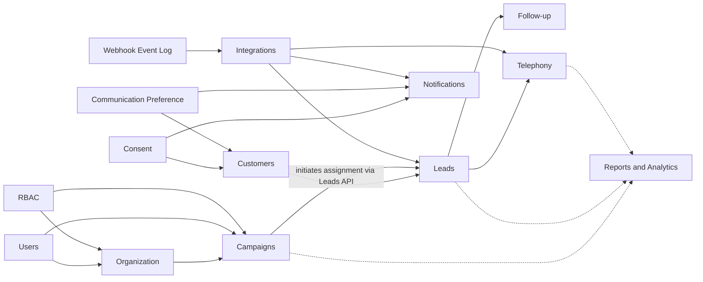

# Mudrax CRM Domain Model — Accepted Ownership Addendum

This document records accepted changes to the business domain model,
including the CRM Core bounded-context decisions in
[ADR 0004](../adr/0004-crm-core-customer-identity-and-lead-ownership.md). It
is an architecture artifact only: it does not define database tables, Prisma
models, SQL, APIs, UI, or implementation code.

## Organization Bounded Context

Owner module: `src/modules/organization`

| Entity | Business responsibility |
| --- | --- |
| Team | Operational grouping of Users for supervision, allocation, and reporting |
| Branch | Physical/operational office and future data/reporting scope |
| Region | Geographic/managerial grouping of Branches |
| Department | Functional grouping such as Sales, Operations, Recovery, or HR |
| Holiday Calendar | Defines non-working dates for scheduling and SLA calculations |
| Working Hours | Defines valid operating windows for follow-ups, telephony, and SLAs |
| Escalation Rule | Defines trigger timing and Role/scope recipients for overdue obligations |

`users` continues to own User identity and `rbac` continues to own Roles,
Permissions, and authorization. Organizational membership and job authorization
are related but distinct: moving a User between Teams or Branches does not
replace the User and does not automatically redefine the User's Permissions.

## Customers Bounded Context

Owner module: `src/modules/customers`

| Entity | Business responsibility |
| --- | --- |
| Customer | Permanent identity record for a person, anchored on a weighted set of identifiers rather than any single mutable contact field |
| Customer Identifier | One identity/contact proof (PAN, Aadhaar, Phone, or Email) held by a Customer, with its own verification state and history |
| Identity Confidence | Computed tier (Unverified -> Declared -> Verified) reflecting how strong the current evidence of a Customer's identity is |
| Customer Duplicate Candidate | Flags two or more Customer records that probably represent the same real person, pending human review |
| Customer Merge | Permanent, auditable record of a manual decision to combine two Customer identities, with a tombstone/redirect so no historical reference is ever orphaned |

### Identity Strategy

Phone number is explicitly **not** the identity anchor. A Customer's identity
is resolved from a weighted waterfall of identifiers:

1. **PAN** — primary anchor when available; unique across the Customer base.
2. **Aadhaar** — secondary strong anchor when available; the full number is
   never stored — only a one-way salted hash (for matching) and a masked
   display value (last 4 digits only), consistent with UIDAI storage
   restrictions.
3. **Phone numbers (multiple, including historical/superseded values) and
   email addresses (multiple)** — supporting, non-exclusive signals. Neither
   is unique across Customers; either may legitimately be shared (e.g. a
   family phone) or reused. A match on phone/email alone links a Customer
   probabilistically, never with the same certainty as a PAN/Aadhaar match.

A Customer is created at **first Lead capture** (Excel row, API webhook,
WhatsApp inbound) — never deferred to Loan Application or "Won." Because most
Leads arrive with only a name, phone, and/or email (PAN/Aadhaar typically
surface later, during document collection), most Customers start at
**Unverified** Identity Confidence and are expected to strengthen over time:
whenever a stronger identifier (PAN/Aadhaar) is added to an existing
Customer, the system re-checks it against the whole Customer base. A new
match against a *different* existing Customer raises a Customer Duplicate
Candidate rather than an automatic merge, because both records may have
already accumulated independent history. Merging is always a manual,
additive decision; the merged-away Customer ID becomes a permanent
tombstone/redirect so no Lead (or future Loan Application) reference is ever
orphaned.

This strategy exists so the CRM recognizes the same Customer years later
even after their phone number, email, or name has changed — the baseline
requirement for a business built on multi-year loan relationships, and one
that aligns Mudrax's identity model with how the banks/NBFCs it originates
loans for already identify a person (PAN/Aadhaar).

## Leads Bounded Context

Owner module: `src/modules/leads`

| Entity | Business responsibility |
| --- | --- |
| Lead | Inbound sales inquiry; owns qualification, pipeline stage, and conversion; belongs to exactly one Customer from the moment it is created |
| Lead Assignment | Current assignee and auditable assignment history for a Lead; the sole write path for who owns a Lead |
| Lead Source | Structured, reportable channel a Lead originated from (Excel Upload, Facebook, Website, Google Ads, WhatsApp) |
| Lead Stage | Admin-configurable pipeline position of a Lead (Fresh, Interested, Follow-up, Won, Lost, etc.) |
| Lost Reason | Admin-configurable sub-classification of why a Lead was marked Lost; required whenever Lead Stage moves into the Closed-Lost bucket |
| Call Feedback Status | Admin-configurable outcome of one specific call attempt (Connected, No Answer, Switched Off, etc.); a distinct concept from Lead Stage |
| Follow-up | Scheduled callback/reminder task with its own lifecycle (Scheduled -> Due -> Completed/Missed -> Escalated); its own Aggregate Root, not a child entity of Lead |
| Import Batch | Auditable unit of one bulk lead-intake operation (e.g. an Excel upload), from receipt through duplicate resolution to Lead creation |
| Import Row | One raw intake record within an Import Batch, immutable once parsed |
| Duplicate Match | Records an Import Row's match against existing Customer/Lead history and the human resolution decision made about it |

### Lead Assignment Ownership

`leads` is the sole owner and sole writer of Lead Assignment. `campaigns` may
**initiate** an assignment operation (bulk equal/percentage allocation, or a
Team Leader/Manager's ad hoc reassignment) by calling the `leads` public API
— it never writes Lead state directly. This keeps the dependency strictly
one-directional (`campaigns` -> `leads`) and avoids a circular dependency
between the two modules.

### Follow-up as an Independent Aggregate

Follow-up is modeled as its own Aggregate Root within the `leads`-owned CRM
Core boundary, referencing a Lead by identity rather than living inside the
Lead aggregate. Its dominant queries — "what's due today across my whole
portfolio," "reassign this absent Caller's follow-ups" — are Follow-up
-centric, not Lead-centric, and its lifecycle transitions do not need to
share the Lead aggregate's consistency boundary. Lead retains only a
denormalized "next action" projection, updated exclusively by a Follow-up
domain-event listener.

### Import Batch Workflow

The Excel-upload-to-Lead-creation workflow follows a fixed shape: **Import
Batch -> Import Row -> Duplicate Match -> Human Resolution -> Allocation (via
`campaigns`) -> Lead Creation**. Duplicate detection runs two layers: (1)
automatic Customer-identity resolution by the identity strategy above, and
(2) presentation of that Customer's existing Lead history grouped by
disposition for an Admin/Manager to resolve per BRD §9.4 (selective delete,
delete-all, ignore, or reload-as-fresh). Import Batch and Import Row are
immutable audit records once committed; a Duplicate Match resolution is
never silently overwritten.

### Lead Stage vs. Call Feedback Status

These remain permanently separate catalogs. Lead Stage answers "where is
this Lead in the pipeline right now" (one value at a time, changed
deliberately). Call Feedback Status answers "what happened on this specific
call attempt" (one new record per attempt, accumulating over the Lead's
life). A Lead can accumulate several Call Feedback records — e.g. `NUMBER
BUSY -> NUMBER BUSY -> CONNECTED -> NO ANSWER` — while its Lead Stage stays
at "Follow-up" throughout; conversely a "Connected" call may resolve to
Stage = Interested, Follow-up, or Lost depending on what was discussed, not
on the fact that the call connected. Collapsing the two would corrupt BRD's
"Connected when duration > 0s" default rule into a Stage-changing side
effect and would make independent connectivity-rate and pipeline-conversion
reporting impossible to compute cleanly.

## Campaigns Bounded Context

Owner module: `src/modules/campaigns`

| Entity | Business responsibility |
| --- | --- |
| Campaign | Named business initiative grouping Leads for assignment and calling |
| Campaign Membership | Which Users may work the Campaign and their allocation configuration |
| Campaign Assignment | Auditable allocation *decision* distributing Campaign Leads; executed by initiating an assignment command against `leads`, never by writing Lead state directly |

`leads` owns Lead identity, qualification, stage, and conversion — including
Lead Assignment. `campaigns` owns campaign-level membership and allocation
*decisions* (how to split Leads among members) but never mutates Lead state
itself. `telephony` owns call execution and any Dialer Campaign
configuration; a CRM Campaign and Dialer Campaign are related but are not the
same entity.

**Campaign Analytics is owned by `reports`, not by `campaigns`.** Campaign
performance metrics — assignment distribution, calling progress,
connectivity, Lead outcomes, conversion — are a derived, read-only view
computed by `reports` from the authoritative facts that `campaigns`, `leads`,
and `telephony` publish. `campaigns` remains a pure transactional/write-side
module; centralizing analytics in `reports` avoids two modules independently
computing, and potentially disagreeing on, the same performance numbers.

## Future Platform Entities

The following entities are approved for the future domain model but are not
implemented.

### Consent

- **Purpose:** legal and auditable evidence that a Customer permitted a
  specific communication or data-processing purpose.
- **Business Responsibility:** records what was consented to, the purpose,
  channel, capture source, timestamp, policy/version presented, and withdrawal
  history.
- **Future Owner:** a future compliance/platform capability; it must remain
  separate from ordinary notification preferences because consent is legal
  evidence.
- **Relationships:** belongs to a Customer; may reference a Lead, communication
  channel, capture source, policy version, and evidence artifact.
- **Lifecycle:** Requested -> Granted -> Withdrawn / Expired / Superseded.
- **Business Rules:** consent must be purpose-specific, provable, and
  append-only in history; withdrawal stops future communication where legally
  required but does not erase the evidence record.
- **Future Expansion:** DNC/DND registry checks, consent-policy versioning,
  jurisdiction-specific retention, and consent synchronization with external
  communication providers.

### Communication Preference

- **Purpose:** records how and when a Customer prefers to be contacted.
- **Business Responsibility:** captures preferred channels, contact times,
  language, frequency, and opt-down choices to reduce unwanted outreach.
- **Future Owner:** `notifications`, with legal eligibility checked against
  Consent before delivery.
- **Relationships:** belongs to a Customer; references one or more supported
  notification/communication channels.
- **Lifecycle:** Created -> Updated -> Inactive.
- **Business Rules:** a preference cannot override a missing, expired, or
  withdrawn Consent; mandatory service communications must be classified
  separately from marketing preferences.
- **Future Expansion:** per-product preferences, quiet hours, channel fallback
  order, branch-specific contact windows, and AI-assisted best contact time.

### Webhook Event Log

- **Purpose:** immutable operational evidence of every inbound webhook received
  from Facebook, WhatsApp, Google, telephony providers, and future
  integrations.
- **Business Responsibility:** supports idempotency, replay, reconciliation,
  troubleshooting, and proof of what an external provider delivered.
- **Future Owner:** platform/integration infrastructure; consuming business
  modules receive translated domain commands/events rather than raw payloads.
- **Relationships:** references an Integration configuration, provider event
  identifier, processing attempt(s), and any resulting Lead, Message, Call, or
  other business entity.
- **Lifecycle:** Received -> Validated -> Processing -> Processed / Failed ->
  Retried / Dead-lettered.
- **Business Rules:** provider event IDs must be idempotent; raw payload access
  must be restricted and sensitive values protected; failed events must remain
  diagnosable and replayable without creating duplicate business entities.
- **Future Expansion:** automated retry policies, dead-letter queues, payload
  retention rules, signature-verification evidence, provider health analytics,
  and operational alerting.

## Relationships

## Domain Boundary Rules

1. User identity is owned only by `users`.
2. Authorization is owned only by `rbac`.
3. Organizational structure and operating policy are owned only by
   `organization`.
4. Campaign grouping, membership, and allocation *decisions* are owned only
   by `campaigns`. `campaigns` never writes Lead state directly and does not
   own an analytics entity (see rule 12).
5. Lead identity and sales-pipeline lifecycle, including Lead Assignment
   (current assignee and history), remain owned by `leads`.
6. Call execution and Dialer Campaign behavior remain owned by `telephony`.
7. Future Consent is legal evidence; Communication Preference is operational
   choice. They must not be collapsed into one entity.
8. Webhook Event Log is integration evidence, not a business aggregate and not
   a substitute for Timeline or Audit Log.
9. Customer identity is owned only by `customers`, anchored on a weighted set
   of identifiers (PAN and Aadhaar as strong anchors when available, phone
   and email as supporting, non-exclusive signals). No single mutable
   contact field is ever the sole identity anchor.
10. Every Lead belongs to exactly one Customer from the moment it is
    created; there is no orphan Lead.
11. Lead Assignment is owned only by `leads`. `campaigns` may initiate an
    assignment operation through the `leads` public API; it never writes
    Lead state directly.
12. Campaign Analytics is owned only by `reports`; `campaigns` supplies the
    underlying facts but does not itself own a derived analytics entity.
13. Follow-up is its own Aggregate Root within the `leads`-owned CRM Core
    boundary; it is not a child entity of Lead.
14. Lead Stage and Call Feedback Status are distinct catalogs and must never
    be collapsed into one concept.
