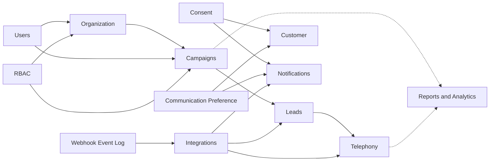

# Mudrax CRM Domain Model — Accepted Ownership Addendum

This document records accepted changes to the business domain model. It is an
architecture artifact only: it does not define database tables, Prisma models,
SQL, APIs, UI, or implementation code.

## Organization Bounded Context

Owner module: `src/modules/organization`

| Entity | Business responsibility |
| --- | --- |
| Team | Operational grouping of Users for supervision, allocation, and reporting |
| Branch | Physical/operational office and future data/reporting scope |
| Region | Geographic/managerial grouping of Branches |
| Department | Functional grouping such as Sales, Operations, Recovery, or HR |
| Holiday Calendar | Defines non-working dates for scheduling and SLA calculations |
| Working Hours | Defines valid operating windows for follow-ups, telephony, and SLAs |
| Escalation Rule | Defines trigger timing and Role/scope recipients for overdue obligations |

`users` continues to own User identity and `rbac` continues to own Roles,
Permissions, and authorization. Organizational membership and job authorization
are related but distinct: moving a User between Teams or Branches does not
replace the User and does not automatically redefine the User's Permissions.

## Campaigns Bounded Context

Owner module: `src/modules/campaigns`

| Entity | Business responsibility |
| --- | --- |
| Campaign | Named business initiative grouping Leads for assignment and calling |
| Campaign Membership | Which Users may work the Campaign and their allocation configuration |
| Campaign Assignment | Auditable allocation operation distributing Campaign Leads |
| Campaign Analytics | Read-only performance view derived from Campaign, Lead, Call, and outcome data |

`leads` owns Lead identity, qualification, stage, and conversion. `campaigns`
owns campaign-level membership and allocation decisions. `telephony` owns call
execution and any Dialer Campaign configuration; a CRM Campaign and Dialer
Campaign are related but are not the same entity.

## Future Platform Entities

The following entities are approved for the future domain model but are not
implemented.

### Consent

- **Purpose:** legal and auditable evidence that a Customer permitted a
  specific communication or data-processing purpose.
- **Business Responsibility:** records what was consented to, the purpose,
  channel, capture source, timestamp, policy/version presented, and withdrawal
  history.
- **Future Owner:** a future compliance/platform capability; it must remain
  separate from ordinary notification preferences because consent is legal
  evidence.
- **Relationships:** belongs to a Customer; may reference a Lead, communication
  channel, capture source, policy version, and evidence artifact.
- **Lifecycle:** Requested -> Granted -> Withdrawn / Expired / Superseded.
- **Business Rules:** consent must be purpose-specific, provable, and
  append-only in history; withdrawal stops future communication where legally
  required but does not erase the evidence record.
- **Future Expansion:** DNC/DND registry checks, consent-policy versioning,
  jurisdiction-specific retention, and consent synchronization with external
  communication providers.

### Communication Preference

- **Purpose:** records how and when a Customer prefers to be contacted.
- **Business Responsibility:** captures preferred channels, contact times,
  language, frequency, and opt-down choices to reduce unwanted outreach.
- **Future Owner:** `notifications`, with legal eligibility checked against
  Consent before delivery.
- **Relationships:** belongs to a Customer; references one or more supported
  notification/communication channels.
- **Lifecycle:** Created -> Updated -> Inactive.
- **Business Rules:** a preference cannot override a missing, expired, or
  withdrawn Consent; mandatory service communications must be classified
  separately from marketing preferences.
- **Future Expansion:** per-product preferences, quiet hours, channel fallback
  order, branch-specific contact windows, and AI-assisted best contact time.

### Webhook Event Log

- **Purpose:** immutable operational evidence of every inbound webhook received
  from Facebook, WhatsApp, Google, telephony providers, and future
  integrations.
- **Business Responsibility:** supports idempotency, replay, reconciliation,
  troubleshooting, and proof of what an external provider delivered.
- **Future Owner:** platform/integration infrastructure; consuming business
  modules receive translated domain commands/events rather than raw payloads.
- **Relationships:** references an Integration configuration, provider event
  identifier, processing attempt(s), and any resulting Lead, Message, Call, or
  other business entity.
- **Lifecycle:** Received -> Validated -> Processing -> Processed / Failed ->
  Retried / Dead-lettered.
- **Business Rules:** provider event IDs must be idempotent; raw payload access
  must be restricted and sensitive values protected; failed events must remain
  diagnosable and replayable without creating duplicate business entities.
- **Future Expansion:** automated retry policies, dead-letter queues, payload
  retention rules, signature-verification evidence, provider health analytics,
  and operational alerting.

## Relationships

## Domain Boundary Rules

1. User identity is owned only by `users`.
2. Authorization is owned only by `rbac`.
3. Organizational structure and operating policy are owned only by
   `organization`.
4. Campaign grouping, membership, allocation, and campaign analytics are owned
   only by `campaigns`.
5. Lead identity and sales-pipeline lifecycle remain owned by `leads`.
6. Call execution and Dialer Campaign behavior remain owned by `telephony`.
7. Future Consent is legal evidence; Communication Preference is operational
   choice. They must not be collapsed into one entity.
8. Webhook Event Log is integration evidence, not a business aggregate and not
   a substitute for Timeline or Audit Log.
