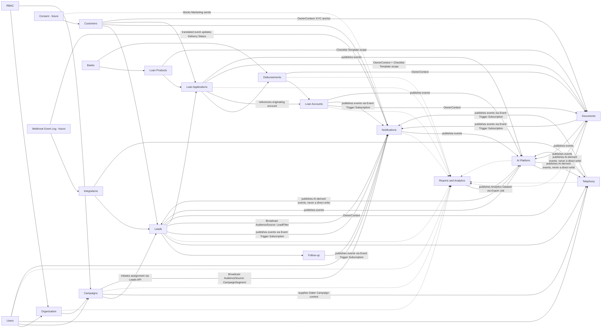

# Mudrax CRM Domain Model — Accepted Ownership Addendum

This document records accepted changes to the business domain model,
including the CRM Core bounded-context decisions in
[ADR 0004](../adr/0004-crm-core-customer-identity-and-lead-ownership.md). It
is an architecture artifact only: it does not define database tables, Prisma
models, SQL, APIs, UI, or implementation code.

## Organization Bounded Context

Owner module: `src/modules/organization`

| Entity | Business responsibility |
| --- | --- |
| Team | Operational grouping of Users for supervision, allocation, and reporting |
| Branch | Physical/operational office and future data/reporting scope |
| Region | Geographic/managerial grouping of Branches |
| Department | Functional grouping such as Sales, Operations, Recovery, or HR |
| Holiday Calendar | Defines non-working dates for scheduling and SLA calculations |
| Working Hours | Defines valid operating windows for follow-ups, telephony, and SLAs |
| Escalation Rule | Defines trigger timing and Role/scope recipients for overdue obligations |

`users` continues to own User identity and `rbac` continues to own Roles,
Permissions, and authorization. Organizational membership and job authorization
are related but distinct: moving a User between Teams or Branches does not
replace the User and does not automatically redefine the User's Permissions.

## Customers Bounded Context

Owner module: `src/modules/customers`

| Entity | Business responsibility |
| --- | --- |
| Customer | Permanent identity record for a person, anchored on a weighted set of identifiers rather than any single mutable contact field |
| Customer Identifier | One identity/contact proof (PAN, Aadhaar, Phone, or Email) held by a Customer, with its own verification state and history |
| Identity Confidence | Computed tier (Unverified -> Declared -> Verified) reflecting how strong the current evidence of a Customer's identity is |
| Customer Duplicate Candidate | Flags two or more Customer records that probably represent the same real person, pending human review |
| Customer Merge | Permanent, auditable record of a manual decision to combine two Customer identities, with a tombstone/redirect so no historical reference is ever orphaned |

### Identity Strategy

Phone number is explicitly **not** the identity anchor. A Customer's identity
is resolved from a weighted waterfall of identifiers:

1. **PAN** — primary anchor when available; unique across the Customer base.
2. **Aadhaar** — secondary strong anchor when available; the full number is
   never stored — only a one-way salted hash (for matching) and a masked
   display value (last 4 digits only), consistent with UIDAI storage
   restrictions.
3. **Phone numbers (multiple, including historical/superseded values) and
   email addresses (multiple)** — supporting, non-exclusive signals. Neither
   is unique across Customers; either may legitimately be shared (e.g. a
   family phone) or reused. A match on phone/email alone links a Customer
   probabilistically, never with the same certainty as a PAN/Aadhaar match.

A Customer is created at **first Lead capture** (Excel row, API webhook,
WhatsApp inbound) — never deferred to Loan Application or "Won." Because most
Leads arrive with only a name, phone, and/or email (PAN/Aadhaar typically
surface later, during document collection), most Customers start at
**Unverified** Identity Confidence and are expected to strengthen over time:
whenever a stronger identifier (PAN/Aadhaar) is added to an existing
Customer, the system re-checks it against the whole Customer base. A new
match against a *different* existing Customer raises a Customer Duplicate
Candidate rather than an automatic merge, because both records may have
already accumulated independent history. Merging is always a manual,
additive decision; the merged-away Customer ID becomes a permanent
tombstone/redirect so no Lead (or future Loan Application) reference is ever
orphaned.

This strategy exists so the CRM recognizes the same Customer years later
even after their phone number, email, or name has changed — the baseline
requirement for a business built on multi-year loan relationships, and one
that aligns Mudrax's identity model with how the banks/NBFCs it originates
loans for already identify a person (PAN/Aadhaar).

## Leads Bounded Context

Owner module: `src/modules/leads`

| Entity | Business responsibility |
| --- | --- |
| Lead | Inbound sales inquiry; owns qualification, pipeline stage, and conversion; belongs to exactly one Customer from the moment it is created |
| Lead Assignment | Current assignee and auditable assignment history for a Lead; the sole write path for who owns a Lead |
| Lead Source | Structured, reportable channel a Lead originated from (Excel Upload, Facebook, Website, Google Ads, WhatsApp) |
| Lead Stage | Admin-configurable pipeline position of a Lead (Fresh, Interested, Follow-up, Won, Lost, etc.) |
| Lost Reason | Admin-configurable sub-classification of why a Lead was marked Lost; required whenever Lead Stage moves into the Closed-Lost bucket |
| Call Feedback Status | Admin-configurable outcome of one specific call attempt (Connected, No Answer, Switched Off, etc.); a distinct concept from Lead Stage |
| Follow-up | Scheduled callback/reminder task with its own lifecycle (Scheduled -> Due -> Completed/Missed -> Escalated); its own Aggregate Root, not a child entity of Lead |
| Import Batch | Auditable unit of one bulk lead-intake operation (e.g. an Excel upload), from receipt through duplicate resolution to Lead creation |
| Import Row | One raw intake record within an Import Batch, immutable once parsed |
| Duplicate Match | Records an Import Row's match against existing Customer/Lead history and the human resolution decision made about it |

### Lead Assignment Ownership

`leads` is the sole owner and sole writer of Lead Assignment. `campaigns` may
**initiate** an assignment operation (bulk equal/percentage allocation, or a
Team Leader/Manager's ad hoc reassignment) by calling the `leads` public API
— it never writes Lead state directly. This keeps the dependency strictly
one-directional (`campaigns` -> `leads`) and avoids a circular dependency
between the two modules.

### Follow-up as an Independent Aggregate

Follow-up is modeled as its own Aggregate Root within the `leads`-owned CRM
Core boundary, referencing a Lead by identity rather than living inside the
Lead aggregate. Its dominant queries — "what's due today across my whole
portfolio," "reassign this absent Caller's follow-ups" — are Follow-up
-centric, not Lead-centric, and its lifecycle transitions do not need to
share the Lead aggregate's consistency boundary. Lead retains only a
denormalized "next action" projection, updated exclusively by a Follow-up
domain-event listener.

### Import Batch Workflow

The Excel-upload-to-Lead-creation workflow follows a fixed shape: **Import
Batch -> Import Row -> Duplicate Match -> Human Resolution -> Allocation (via
`campaigns`) -> Lead Creation**. Duplicate detection runs two layers: (1)
automatic Customer-identity resolution by the identity strategy above, and
(2) presentation of that Customer's existing Lead history grouped by
disposition for an Admin/Manager to resolve per BRD §9.4 (selective delete,
delete-all, ignore, or reload-as-fresh). Import Batch and Import Row are
immutable audit records once committed; a Duplicate Match resolution is
never silently overwritten.

### Lead Stage vs. Call Feedback Status

These remain permanently separate catalogs. Lead Stage answers "where is
this Lead in the pipeline right now" (one value at a time, changed
deliberately). Call Feedback Status answers "what happened on this specific
call attempt" (one new record per attempt, accumulating over the Lead's
life). A Lead can accumulate several Call Feedback records — e.g. `NUMBER
BUSY -> NUMBER BUSY -> CONNECTED -> NO ANSWER` — while its Lead Stage stays
at "Follow-up" throughout; conversely a "Connected" call may resolve to
Stage = Interested, Follow-up, or Lost depending on what was discussed, not
on the fact that the call connected. Collapsing the two would corrupt BRD's
"Connected when duration > 0s" default rule into a Stage-changing side
effect and would make independent connectivity-rate and pipeline-conversion
reporting impossible to compute cleanly.

## Campaigns Bounded Context

Owner module: `src/modules/campaigns`

| Entity | Business responsibility |
| --- | --- |
| Campaign | Named business initiative grouping Leads for assignment and calling |
| Campaign Membership | Which Users may work the Campaign and their allocation configuration |
| Campaign Assignment | Auditable allocation *decision* distributing Campaign Leads; executed by initiating an assignment command against `leads`, never by writing Lead state directly |

`leads` owns Lead identity, qualification, stage, and conversion — including
Lead Assignment. `campaigns` owns campaign-level membership and allocation
*decisions* (how to split Leads among members) but never mutates Lead state
itself. `telephony` owns call execution and any Dialer Campaign
configuration; a CRM Campaign and Dialer Campaign are related but are not the
same entity.

**Campaign Analytics is owned by `reports`, not by `campaigns`.** Campaign
performance metrics — assignment distribution, calling progress,
connectivity, Lead outcomes, conversion — are a derived, read-only view
computed by `reports` from the authoritative facts that `campaigns`, `leads`,
and `telephony` publish. `campaigns` remains a pure transactional/write-side
module; centralizing analytics in `reports` avoids two modules independently
computing, and potentially disagreeing on, the same performance numbers.

## Loan Management Bounded Context

This bounded context records accepted decisions from
[ADR 0005](../adr/0005-loan-management-aggregate-boundaries-and-lifecycle.md).
It picks up exactly where CRM Core leaves off: a Lead converts into a Loan
Application, and everything from there through EMI servicing, foreclosure,
and closure is owned by the five modules below.

### Banks

Owner module: `banks`

| Entity | Business responsibility |
| --- | --- |
| Bank | Lending partner/NBFC master record — identity and active status |
| Bank Branch | One operating location of a Bank used for case login/processing; child entity of Bank |
| Commission Policy Version | Versioned, immutable ruleset governing commission calculation for a Bank (optionally scoped to one Loan Product); a policy change always creates a new version, never edits an existing one |

### Loan Products

Owner module: `loan-products`

| Entity | Business responsibility |
| --- | --- |
| Loan Product | One lending product definition (Car, Home, Personal, Business, LAP, Top-Up/BT variants) belonging to exactly one Bank |

### Loan Applications

Owner module: `loan-applications`

| Entity | Business responsibility |
| --- | --- |
| Loan Application | Central transactional record of one loan request, from Lead conversion through decision |
| Application Status | Admin-configurable catalog for "where is this Application in the decisioning pipeline" |
| Eligibility Snapshot | Immutable, timestamped record of what a Customer/Co-applicant combination qualified for at a point in time |
| Co-applicant | Application-scoped facts about a second/third person jointly responsible for the loan; references a Customer for identity |
| Loan Offer | Small Aggregate Root representing one concrete, comparable loan proposal derived from an Eligibility Snapshot, sitting between Eligibility and Loan Application |

### Loan Accounts

Owner module: `loan-accounts`

| Entity | Business responsibility |
| --- | --- |
| Loan Account | Post-disbursement financial obligation a Customer holds with a Bank; created once per Approved, Disbursed Loan Application |
| Loan Status | Admin-configurable catalog for "what state is this Loan Account in" |
| EMI Schedule | Full repayment plan for a Loan Account; lives inside the Loan Account aggregate |
| EMI Installment | One due repayment line, child of EMI Schedule |
| Foreclosure | Early full payoff event for a Loan Account |

### Disbursements

Owner module: `disbursements`

| Entity | Business responsibility |
| --- | --- |
| Disbursement | One funds-release event against a Loan Application; a Loan Application/Account may have many over time |
| Commission | DSA commission earned from one specific Disbursement, snapshotting the Commission Policy Version applied at that time |

### Loan Application / Loan Account Separation

Loan Application and Loan Account are deliberately separate Aggregate Roots
owned by separate modules. Loan Application is a pre-money decisioning
workflow (multi-step, amendable, and able to die without ever creating a
financial obligation); Loan Account is a post-money financial-servicing
record (a real outstanding balance, an EMI Schedule, a multi-year lifecycle).
They connect at exactly one point: `disbursements`' first Disbursement event
against an Approved Loan Application creates exactly one Loan Account, via
an immutable `originatingApplicationId` reference — never in-place mutation
of one aggregate into the other.

### Bank Offers Loan Products

Loan Product is its own Aggregate Root, owned by `loan-products`, that
references Bank by identity — Bank does not own Loan Product as an embedded
child collection. Loan Products change far more often and independently of
Bank master data; embedding them inside Bank would force loading and
effectively locking the whole Bank aggregate on every product edit.

### Top-up and Balance Transfer as New Loan Applications

Top-up and Balance Transfer are not separate entities. Both are ordinary Loan
Applications carrying an Application Type discriminator
(`Top-up` / `Balance-Transfer-In`) and a contextual reference: for Top-up, the
existing Loan Account being added to; for Balance Transfer, either an
existing Mudrax-known Loan Account or an External Loan Reference value object
(Bank name, masked account number, outstanding amount, as-of date) for a loan
Mudrax never previously touched. Both follow the identical Loan Application
workflow — eligibility, submission, decision, disbursement — rather than a
duplicated parallel state machine. On conversion, a Top-up opens a new Loan
Account and marks the prior one "Superseded-by-Topup"; a Balance Transfer-In
opens a new Loan Account and, where an internal Loan Account was referenced,
marks it "Transferred-Out."

### EMI Schedule Ownership

EMI Schedule (and EMI Installment) live inside the Loan Account aggregate's
consistency boundary, owned by `loan-accounts` — they are not an independent
Aggregate Root. EMI Schedule has no existence or invariants independent of
its Loan Account, unlike Follow-up (pulled out of Lead precisely because its
dominant queries were portfolio-wide, not Lead-centric). Portfolio-wide
"due today across every account" queries are served by a lightweight read
projection owned by `loan-accounts`, not by promoting EMI Schedule to its own
aggregate.

### Multiple Partial Disbursements

Disbursement supports a one-to-many relationship: one Loan Application/Loan
Account may accumulate many immutable Disbursement records over time,
matching real tranche-based disbursal practice (LAP, construction-linked Home
Loans, Business Loans). Only the *first* Disbursement against an Approved
Loan Application creates the Loan Account; Disbursement processing must be
idempotent by Bank reference number so a retried event can never create a
second account for the same Application.

### Commission and Commission Policy Version

Commission is owned by `disbursements` as a child of Disbursement — never by
Loan Application (nothing is earned until money moves) or Loan Account
(would lose per-tranche traceability needed for clawback calculations).
`banks` owns a versioned, append-only Commission Policy Version per Bank
(optionally per Loan Product); a policy change creates a new version and
never edits a prior one. Each Commission references the Commission Policy
Version effective at the time of its Disbursement *and* carries its own
immutable inline snapshot of the rate/slab, computed amount, and clawback
rule actually applied — so historical Commission remains correct and
self-contained even as Banks freely evolve their commission terms going
forward, and a clawback is always evaluated against the rule captured at
accrual time, never against whatever the Bank's current policy says today.

### Eligibility Snapshot

Eligibility is modeled as an immutable, timestamped snapshot value object,
appended to the Loan Application (or referenced by a Loan Offer) that
computed it — never a permanent mutable entity, a throwaway calculation, or
a separate Aggregate Root. A changed input (income, product, Bank policy)
never edits an old snapshot; it produces a new one, preserving a full audit
trail of every eligibility judgment ever made. Each snapshot carries a method
discriminator (Manual / Rule-based / future automated scoring) — the seam
that lets a future automated scoring capability plug in later as just another
snapshot method, with no structural redesign.

### Loan Offer

Loan Offer is a small, dedicated Aggregate Root — owned by
`loan-applications`, a sibling to Loan Application rather than a child of
it — sitting between Eligibility Snapshot and Loan Application. It is
generated from an Eligibility Snapshot, one per candidate Bank/Loan Product,
so multiple concurrent Loan Offers per Lead directly support multi-bank
comparison. It carries its own status lifecycle (Generated -> Presented ->
Selected / Declined / Expired / Superseded) so a Customer's selection is a
durable, auditable fact rather than a recomputed projection, and it is the
natural attachment point for a future recommendation score without changing
its own or Loan Application's shape. It integrates with Loan Application
through exactly one additive, optional reference field — Loan Application's
Application Status machine, Co-applicant, and Eligibility ownership are
otherwise unaffected.

### Co-applicant

Co-applicant is a child entity of the Loan Application aggregate, owned by
`loan-applications` — not a standalone Aggregate Root (its facts only have
meaning scoped to one Application) and not a Value Object (a Co-applicant is
a specific, identifiable person, not an interchangeable value). The person
behind a Co-applicant always resolves through `customers`, exactly like the
primary applicant; `loan-applications` never duplicates identity-resolution
logic.

### Status Catalogs Stay Separate

Application Status (owned by `loan-applications`), Loan Status (owned by
`loan-accounts`), and EMI Installment pay-status (owned by `loan-accounts`)
are three permanently separate catalogs answering different questions at
different lifecycle phases — pipeline-before-money, obligation-after-money,
and per-installment-payment-event, respectively. They must never be
collapsed into one concept, the same discipline ADR 0004 established for
Lead Stage vs. Call Feedback Status.

## Telephony & Call Center Bounded Context

This bounded context records accepted decisions from
[ADR 0006](../adr/0006-telephony-call-center-aggregate-boundaries.md). It
covers call execution and everything needed to route, place, receive,
monitor, record, and staff calls — starting from a Lead's Click-to-Call and
ending at the Call Feedback Status handoff back to CRM Core. All entities
below are owned by a single module, `telephony`.

### Connectivity & Carrier Layer

| Entity | Business responsibility |
| --- | --- |
| Trunk | Aggregate Root unifying PRI, GSM Gateway, and SIP behind one `TrunkType` discriminator, so adding or replacing a provider never requires redesigning call execution |
| Telephony Line | One addressable channel/circuit/registration within a Trunk; bound to at most one live Call Attempt at a time |
| SIM Inventory | Physical/eSIM asset master record (carrier, MSISDN, plan, activation state), referenced by identity from a GSM Gateway-backed Telephony Line, never embedded |
| DID Numbers | Registry of owned/leased inbound numbers; resolves to exactly one routing target (IVR, Call Queue, or Extension) at a time |
| Caller ID | Outbound-presented-number policy attached to a Trunk, Telephony Line, or Dialer Campaign; supports rotation without editing historical Call Attempts |
| Extension | Aggregate Root for an Agent's dial-able endpoint; references a User by identity; modeled device/location-agnostic to support Remote Agents without redesign |

### Call Execution

| Entity | Business responsibility |
| --- | --- |
| Call Attempt | **Aggregate Root.** The atomic unit of telephony execution — one dial-out or inbound ring, from initiation to termination, hosting every live feature (recording, transfer, conference, monitoring) that occurs within it |
| Call Status | Value Object on Call Attempt: Queued / Ringing / Answered / OnHold / Transferring / Conferencing / Completed / Missed / Failed / Abandoned |
| Call Direction | Value Object on Call Attempt: Inbound / Outbound / Internal |
| Call Disposition | Value Object on Call Attempt: a small, fixed, system-detected technical outcome (Answered / No-Answer / Busy / Failed / Voicemail / Congestion) — permanently distinct from `leads`' Call Feedback Status |
| Click-to-Call | Not a persisted entity — the command/use-case that creates a new Call Attempt from a Lead |

**Call is not modeled as a stored aggregate.** It exists only as business
language for "a phone conversation"; where a grouping view across multiple
Call Attempts is needed (e.g. "how many attempts to reach this Lead"), it is
served by a derived read projection, never a persisted parent aggregate. See
ADR 0006 for the full reasoning.

### Live Call Features

| Entity | Business responsibility |
| --- | --- |
| Call Recording | Child entity of Call Attempt for metadata and an access-audit trail; the audio payload is always an external reference, never inlined |
| Call Monitoring Session | Child entity of Call Attempt with a `Mode` of Listen / Whisper / Barge; every mode transition is a mandatory, individually logged event |
| Call Transfer | Child entity of Call Attempt recording one Blind or Warm transfer event; multiple per Call Attempt are append-only, never overwritten |
| Call Conference | Child entity of Call Attempt recording added-participant join/leave events; Barge is realized as a supervisor joining this same mechanism |
| IVR | Aggregate Root for a configured voice-menu flow, versioned (IVR Flow Version) so a completed Call Attempt always references the exact flow that routed it |

### Queueing & Agent Workforce

| Entity | Business responsibility |
| --- | --- |
| Call Queue | Aggregate Root for a live-call holding pool; owned by `telephony`, not `users`/`organization` |
| Queue Strategy | Value Object embedded on Call Queue: ring-all / round-robin / skill-based / longest-idle-agent, plus overflow/timeout rules |
| Queue Membership | Historical, append-only child entity of Call Queue recording Agent eligibility over time (`effectiveFrom`/`effectiveTo`); never a single mutable "current members" field |
| Agent Session | **Aggregate Root, independent of Call Attempt.** One Agent's continuous work session (Login to Logout): assigned Extension, availability state (Available/Break/Idle/Busy/After Call Work), Queue Participation, Remote Agent context |
| Queue Participation | Child entity of Agent Session recording the live, session-scoped fact that an already-eligible Agent joined/left a Queue's active pool; distinct from Queue Membership's eligibility roster |

### Outbound Dialing

| Entity | Business responsibility |
| --- | --- |
| Dialer Campaign | Aggregate Root; independent execution configuration (pacing, Trunk/Line pool, Caller ID policy, retry defaults) that optionally references a CRM Campaign by identity — never a replacement for it |
| Dialer Queue | Aggregate Root; the outbound *work* queue of numbers still to be dialed — deliberately distinct from Call Queue, the live-call *holding* pool |
| Dialer Retry | Child entity of a Dialer Queue Entry owning only the retry counter/backoff/next-eligible-time policy; never holds telephony facts itself, and never mutates a prior Call Attempt |

### Call Attempt as the Aggregate Root

`telephony` owns Call Attempt as the Aggregate Root for all call execution,
not "Call." Every real dial-out or inbound ring is exactly one telephony
session with one provider call identifier, one timeline, one recording, and
one disposition — that is Call Attempt. A wrapping "Call" aggregate would be
redundant in the common single-attempt case and would carry no invariant of
its own in the multi-attempt case, the same test already applied to reject
EMI Schedule and Campaign Analytics as independent aggregates. Outbound
retries always create a new Call Attempt, linked to its predecessor by an
additive `retryOfCallAttemptId` reference — never a mutation of a completed
one.

### Trunk Abstraction

Trunk is the single Aggregate Root through which `telephony` reaches PRI,
GSM Gateway, and SIP connectivity, distinguished only by a `TrunkType`
discriminator and a type-specific configuration value — the same pattern
already used for Loan Application's Top-up/Balance-Transfer Application Type
(ADR 0005). Domain logic depends only on the `ITelephonyProvider` port;
vendor/protocol-specific code lives in `src/integrations/telephony/*`. This
is what lets Multi-PRI, Multiple GSM Gateways, additional SIP Providers, and
Failover/High Availability be added later as new Trunk records and adapters,
never as a redesign of Call Attempt, Call Queue, or Dialer logic.

### Agent Session is Independent of Call Attempt

Agent Session exists as its own Aggregate Root because it has a different
lifespan (a whole shift vs. one call), a one-to-many relationship to Call
Attempt that includes zero (Login with no call, Break, Idle time), and
invariants (one Active Session per Extension, the availability state
machine) with no relationship to a Call Attempt's own invariants — the same
independent-lifecycle test already applied to Follow-up vs. Lead (ADR 0004).
Call Queue routing and Dialer Campaign pacing both require Agent
availability to be queryable *before* any call exists, which is impossible if
availability were a property of Call Attempt itself. `OnCall` and `After Call
Work` are system-derived from the bound Call Attempt's lifecycle; Agent
Session never sets them manually.

### Queue Ownership and Queue Membership History

Call Queue, Queue Strategy, and Queue Membership are owned by `telephony`,
not `users`/`organization`: a Queue is a live-call routing construct with no
meaning outside a telephony session, and ownership by an identity/org-
structure module would invert this codebase's established one-directional
dependency discipline (`campaigns -> leads`, never the reverse). Queue
Membership is historical and append-only, the same discipline already used
for Lead Assignment history and Commission Policy Version, because staffing,
SLA post-mortems, and utilization reporting all require reconstructing who
was eligible on a Queue at a past point in time. Queue Participation (owned
by Agent Session, not Call Queue) is the separate, live, session-scoped fact
of an eligible Agent actually working a Queue during one session — the two
must never be collapsed.

### Dialer Campaign References, Never Replaces, CRM Campaign

`telephony` owns Dialer Campaign as independent execution configuration that
optionally references a CRM Campaign (owned by `campaigns`) by identity. This
formalizes, at the entity level, the decision already recorded in
`docs/modules/campaigns.md`: CRM Campaign answers *which Leads and which
Callers*; Dialer Campaign answers *how the phone system dials through them*.
Dialer Queue (the outbound work queue) is deliberately named and modeled
distinctly from Call Queue (the live-call holding pool) despite the shared
word "Queue."

### Call Disposition vs. Call Feedback Status

Call Disposition (owned by `telephony`) is a small, fixed, system-detected
technical outcome of a Call Attempt, set automatically at termination. It is
permanently distinct from `leads`' Call Feedback Status (admin-configurable,
human-entered business outcome) — the same discipline already established
for Lead Stage vs. Call Feedback Status (ADR 0004). On completion,
`telephony` publishes a domain event; `leads` remains the sole writer of the
resulting Call Feedback Status record, mirroring the one-directional
`campaigns -> leads` dependency already established for Lead Assignment.

## Document Management Bounded Context

This bounded context records accepted decisions from
[ADR 0007](../adr/0007-document-management-aggregate-boundaries-and-storage-abstraction.md).
It covers everything required to receive, classify, version, extract data
from, verify, package, retain, and safely expose every file Mudrax Capitals
collects — KYC evidence, income proof, collateral papers, loan execution
documents — independent of, and referenced by identity from, CRM Core, Loan
Management, and Telephony. All entities below are owned by a single module,
`documents`.

### Core File Entities

| Entity | Business responsibility |
| --- | --- |
| Attachment | Generic registration of any raw uploaded file, before any business meaning is attached to it; used by any module, not only compliance documents |
| Document | Business-classified, workflow-bearing wrapper around one Attachment's version lineage; the entity that enters KYC/loan/compliance workflows |
| Document Version | Child entity of Document; one immutable file revision; file bytes are always an external Storage Reference, never inlined |

### Classification Catalogs

| Entity | Business responsibility |
| --- | --- |
| Document Type | Admin catalog entry ("PAN Card," "Aadhaar," "Salary Slip," "Bank Statement," "Photo," "Signature") |
| Document Category | Admin catalog grouping Document Types (KYC, Income Proof, Collateral, Loan Execution, Compliance, Other) |

### Checklist & Bundling

| Entity | Business responsibility |
| --- | --- |
| Document Checklist Template | Reusable definition of required Document Types; Global by default or scoped to one Loan Product by reference |
| Checklist Template Item | Child entity of Document Checklist Template; one required Document Type entry with a mandatory/optional flag |
| Document Checklist | Independent Aggregate Root; the materialized, per-case tracking instance generated from the applicable templates |
| Checklist Item | Child entity of Document Checklist; one required-item tracking row referencing a fulfilling Document |
| Document Bundle | Independent Aggregate Root; a complete, presentable, verifiable, shareable package of Documents for one business process ("Loan Application Documents," "KYC Package," "Property Documents," "Co-applicant Documents") |
| Bundle Member | Child entity of Document Bundle; links one Document (and its fulfilled Checklist Item, if any) into the Bundle |

### Verification & Extraction

| Entity | Business responsibility |
| --- | --- |
| Document Verification | Independent Aggregate Root; one decision cycle confirming a specific, pinned Document Version is genuine, legible, and correct |
| OCR Job | Child entity of Document Version; one background text/data extraction run, carrying an engine/type discriminator |
| Extracted Field | Child entity of OCR Job; one recognized key/value with a confidence score, always advisory |

### Storage & Upload

| Entity | Business responsibility |
| --- | --- |
| Storage Location | One configured storage backend binding (Local Disk, NAS, S3, Azure Blob) behind an `IStorageProvider` port |
| Upload Session | One resumable/chunked/multi-file upload operation, idempotent by session token |

### Retention & Sharing

| Entity | Business responsibility |
| --- | --- |
| Retention Policy | Versioned, append-only rule set for how long a Document Category/Type must be retained and under what trigger |
| Document Sharing | Independent Aggregate Root; one controlled, time-boxed exposure of a Document or Document Bundle, pinned to specific Versions |
| Share Access Log Entry | Child entity of Document Sharing; one recorded access event, append-only |
| Audit Trail | Platform-level Aggregate Root; immutable, append-only record of every significant action across this bounded context |

### Future Entities

| Entity | Business responsibility |
| --- | --- |
| Digital Signature | Cryptographically verifiable execution of a pinned Document Version by a named signatory; permanently distinct from Watermark |
| eKYC Verification | Automated identity-proofing session producing a Document Verification with `method = eKYC` |
| Face Match Result | Child entity of eKYC Verification; one biometric comparison outcome |

### Attachment vs. Document

Attachment and Document are deliberately separate entities. Attachment is
the generic, low-level registration of any raw uploaded file — an Excel
import file, a WhatsApp media capture, an export — that carries no business
meaning by itself and never needs KYC-grade classification, verification,
checklist linkage, or retention rules. Document is the business-classified
wrapper, built on one Attachment's version lineage, that participates in
KYC/loan/compliance workflows. Not every Attachment is promoted to a
Document; every Document traces back to exactly one Attachment lineage. A
file must pass virus/malware scanning before it may be promoted, OCR'd, or
shared.

### Document Version, OCR, and Extracted Fields Stay Child Entities

Document Version and OCR Job are child entities — of Document and Document
Version respectively — never independent Aggregate Roots, because neither
has dominant queries or invariants outside its immediate parent, the same
test that rejected EMI Schedule and Campaign Analytics as standalone
aggregates. OCR execution itself is background-job orchestration, not domain
state; the domain only records the Job's lifecycle and its Extracted Field
children. Extracted Fields are permanently advisory and never auto-write
into another module's trusted state (e.g., `customers`' Customer Identifier)
without an explicit human/Verification confirmation step.

### Document Verification, Document Bundle, and Document Sharing Are Independent Aggregate Roots

Document Verification, Document Bundle, and Document Sharing are each
promoted to independent Aggregate Roots, applying the same
independent-lifecycle test already used to pull Follow-up out of Lead (ADR
0004) and keep Agent Session independent of Call Attempt (ADR 0006): each
has dominant, portfolio-wide queries (a verification queue, packages awaiting
lock, everything shared externally this quarter) that a parent-scoped
child entity could not efficiently answer. Document Verification and
Document Sharing always pin the exact Document Version(s) they act on —
never "the current version" — the same defense-in-depth Commission applies
by snapshotting Commission Policy Version (ADR 0005).

### Document Checklist and Document Bundle

Document Checklist Template can be Global or scoped to one Loan Product **by
reference**, never embedded — the identical "Bank offers Loan Product"
pattern from ADR 0005. Document Checklist is the per-case materialized
tracking instance. Document Bundle is an additive grouping layer on top:
Checklist defines *what's required*; Bundle curates *how required items are
grouped and delivered* into a presentable, lockable, shareable package (one
case can have one Checklist but several Bundles — KYC Package, Property
Documents, Co-applicant Documents, Loan Execution Documents). Bundle
completeness is always a derived rollup over its members' existing Document
Verification outcomes — never a parallel or shortcut verification path.
Multiple applicants are supported through Document Bundle's optional
`Subject` reference (`PrimaryApplicant` / `CoApplicant` / `Asset` / `None`),
with `CoApplicant` resolving by identity against `loan-applications`'
existing Co-applicant entity.

### Documents Are Polymorphic Through a Single Owner Context

Every Document carries exactly one `OwnerContext = {ownerType: Customer |
Lead | LoanApplication | LoanAccount | Disbursement, ownerId}` — the same
discriminator pattern already accepted for `TrunkType` and Application Type.
Customer is the permanent anchor for KYC-classified Documents, mirroring
`customers`' own principle that Customer is the durable identity anchor;
cross-case reuse is always an explicit Link (a Checklist Item or Bundle
Member referencing an existing Document), never a re-parenting of `Owner
Context`. Customer Documents, Loan Documents, and KYC Documents are
therefore not separate entity types — they are a Document classified by
`OwnerContext.ownerType` and/or `Document Category`. A Customer Merge
redirect (ADR 0004) must resolve every Document that pointed at the
merged-away Customer — never orphaned.

### Storage Abstraction

Storage Location is the single Aggregate Root through which `documents`
reaches Local Disk, NAS, S3, and Azure Blob, distinguished only by a
`StorageProviderType` discriminator — the same pattern already used for
Telephony's Trunk (ADR 0006). Domain logic depends only on the
`IStorageProvider` port; vendor-specific code lives in
`src/integrations/storage/*`. This is what lets S3-compatible providers,
GCS, or a NAS replacement be added later as new Storage Location records and
adapters, never as a redesign of Attachment, Document, or Document Version.

### Retention, Archive, and Document Workflow State Stay Separate

Retention Policy (owned by `documents`, versioned and append-only) answers
"how long must this be kept." Archive is a storage-tier lifecycle state on
Document/Document Version, not a new entity duplicating Document data.
Document's own workflow state (Draft/Active/Superseded/Verified/Rejected)
is a third, separate concern. These three must never be collapsed into one
concept, the same discipline already applied to Application Status vs. Loan
Status vs. EMI Installment pay-status (ADR 0005) and Call Disposition vs.
Call Feedback Status (ADR 0006). Purge is the only hard, irreversible
action and requires policy eligibility, no active Legal Hold, and no open
Verification/Sharing/Bundle-lock referencing the Document.

### Watermark vs. Digital Signature

Watermark is a declarative rendering policy applied at view/export time, not
a persisted per-view entity. It is permanently distinct from the future
Digital Signature capability — cosmetic overlay versus legally binding
cryptographic execution — and the two must never be collapsed into one
concept.

## Notifications & Communications Bounded Context

This bounded context records accepted decisions from
[ADR 0008](../adr/0008-notifications-communications-aggregate-boundaries-and-provider-abstraction.md).
It covers everything required to decide, template, queue, send, retry, and
prove delivery of every communication Mudrax Capitals sends or receives —
Email, SMS, WhatsApp, Push, In-App, and future Webhook — from a business
event through to a provable delivered/failed outcome, including
enterprise-scale bulk sends. All entities below are owned by a single
module, `notifications`.

### Core Intent & Execution

| Entity | Business responsibility |
| --- | --- |
| Notification | Aggregate Root; the business intent to communicate something to someone, independent of how many channels or attempts it takes to deliver it |
| Notification Delivery | Independent Aggregate Root; one physical send attempt against one Provider |
| Delivery Status | Value Object catalog on Notification Delivery (Queued/Sending/Sent/Delivered/Read/Opened/Clicked/Failed/Bounced/Undeliverable/Expired) |
| Notification Retry | Child entity of Notification Delivery; owns only the attempt counter, backoff, and next-eligible-time |

### Templates & Channels

| Entity | Business responsibility |
| --- | --- |
| Notification Template | Aggregate Root; versioned, reusable content definition. Global by default, with an Organization-specific override by reference |
| Notification Channel | Aggregate Root; Organization-level configuration of one medium (Email/SMS/WhatsApp/Push/In-App/future Webhook) |

### Provider Abstraction

| Entity | Business responsibility |
| --- | --- |
| Provider | Aggregate Root; one vendor integration (Twilio, MSG91, Gupshup, Meta WhatsApp, AWS SES, SendGrid, Firebase, future) behind a single port |
| Provider Failover Policy | Child entity of Notification Channel; ordered Provider priority list plus a health-threshold switch rule |
| Provider Health Check | Child entity of Provider, append-only; recorded health-probe signal feeding failover decisions |

### Preferences, Subscriptions & Consent Boundary

| Entity | Business responsibility |
| --- | --- |
| Notification Preference | Aggregate Root; the concrete realization of the "Communication Preference" concept, owned by `notifications`; per-Recipient, per-EventCategory, optionally per-Channel |
| Notification Subscription | Aggregate Root; per-Topic opt-in/opt-out for Broadcast content, independent of Preference |

### Queueing & Scheduling

| Entity | Business responsibility |
| --- | --- |
| Notification Queue | Aggregate Root; the standing outbound work queue per Channel/priority |
| Notification Queue Entry | Child entity of Notification Queue; one resolved work item, carrying the `TriggerType`/`scheduledFor` that realizes "Scheduled Notification" |

### Bulk Execution

| Entity | Business responsibility |
| --- | --- |
| Broadcast | Aggregate Root; one message fanned out to a resolved audience/segment; "Campaign Notification" is a Broadcast with `AudienceSource = CampaignSegment`, not a separate entity |
| Notification Batch | Independent Aggregate Root; execution/tracking envelope for enterprise-scale bulk sends (EMI reminders, festival greetings, marketing campaigns, organization announcements) |
| Notification Batch Item | Child entity of Notification Batch; one immutable work-item row recorded before any Notification exists |

### History & Event Sourcing

| Entity | Business responsibility |
| --- | --- |
| Communication Log | Aggregate Root, platform-level, structurally append-only; permanent record of every significant Notification/Delivery transition |
| Event Trigger Subscription | Aggregate Root; admin-configured mapping from a domain event to a Template, audience rule, and Channel policy — the seam other bounded contexts use to cause a Notification |

### Notification Represents Intent; Notification Delivery Represents Execution

Notification is the business fact, decided once; Notification Delivery is a
separate, independent Aggregate Root representing one physical send attempt
against one Provider — the identical intent/execution split already applied
to Loan Application/Loan Account (ADR 0005) and Call Attempt/"Call" (ADR
0006). A Notification is immutable once Queued; a correction always creates
a new Notification and cancels the old one. Notification Retry is a child
entity of Notification Delivery, mirroring Dialer Retry (ADR 0006): it never
mutates the Delivery it retries from, always producing a new Delivery linked
by an additive `retryOfDeliveryId` reference.

### Channels and Providers Are Discriminated, Never Duplicated Per Vendor

Email, SMS, WhatsApp, Push, and In-App are `ChannelType` values on
Notification Channel, not separate entities; Twilio, MSG91, Gupshup, Meta
WhatsApp, AWS SES, SendGrid, and Firebase are `ProviderType` values on
Provider, behind a single `INotificationProvider` port — the identical
discriminator-and-port pattern already accepted for Telephony's Trunk (ADR
0006) and Documents' Storage Location (ADR 0007). Provider Failover Policy
(versioned, append-only) and Provider Health Check (system-written,
append-only) let multi-provider failover and health monitoring ship as
configuration and adapters, never a redesign.

### Preference Resolution Is a Strict, Centralized Four-Layer Order

Consent (future, separate compliance Aggregate) blocks `Marketing`-category
sends only and is checked first; `Transactional`/`OTP`-category
Notifications always deliver regardless of Preference; Notification
Preference (per-Recipient, per-EventCategory) governs
`Operational`/`Marketing` sends; Notification Subscription (per-Topic)
governs Broadcast opt-in/opt-out independently. These four layers are
resolved once, centrally, at Notification/Queue Entry creation — never
re-derived independently per Channel — and must never be collapsed into one
concept, extending the Consent/Communication Preference split this document
already recorded.

### Notification Batch Supports Enterprise-Scale Bulk Sends Without an All-or-Nothing Transaction

Notification Batch is an independent Aggregate Root (same
independent-lifecycle test as Notification Delivery above) owning many
immutable Notification Batch Item children, created before any Notification
exists — the same shape as Import Batch/Import Row (`leads`) preceding Lead
creation. A `SourceType` discriminator distinguishes content-uniform bulk
sends (dispatched via Broadcast, which additively references its resulting
Batch) from content-personalized bulk sends (e.g. EMI reminders, created
directly from a scheduled job with no Broadcast involved). Batch progress is
always a derived rollup over Batch Item outcomes — never an independent
counter — the same discipline already applied to Document Bundle
completeness (ADR 0007). Partial failure is a first-class, expected outcome
(`Completed` vs. `Completed-with-Failures`); batch-level retry re-drives
only `Failed` items into new Notifications/Deliveries, never mutating the
originals; Cancellation is forward-only and never touches completed/
in-flight items; Pause/Resume is a distinct, non-terminal, idempotently
resumable state pair, never collapsed with Cancel; and a Batch's future
`ThrottlePolicy` is always bounded by its Notification Channel's own
rate limit.

### Communication Log Is the Permanent Record; Event Trigger Subscription Is the One-Directional Seam

Communication Log is a platform-level Aggregate Root with no update/delete
use-case exposed at the domain layer at all — the same structural,
not-merely-conventional append-only guarantee already applied to Audit Trail
(ADR 0007) — kept deliberately separate from prunable/archivable operational
Delivery data. Event Trigger Subscription is the only mechanism other
bounded contexts use to cause a Notification: `leads`, `follow-ups`,
`loan-applications`, `loan-accounts`, `documents`, and `telephony` publish
domain events; `notifications` only consumes them, preserving this
document's established one-directional dependency discipline
(`campaigns -> leads`, `telephony -> leads`). Outbound Webhook (future) is a
`ChannelType` value; inbound provider webhooks are never parsed directly by
`notifications` — they are always translated first through the
platform-level future Webhook Event Log below.

## Reports & Analytics Bounded Context

This bounded context records accepted decisions from
[ADR 0009](../adr/0009-reports-and-analytics-aggregate-boundaries-and-dataset-abstraction.md).
It covers everything required to turn the facts published by every other
bounded context into curated metrics, KPIs, dashboards, and reports, through
to scheduled delivery, export, and governed BI/Data-Warehouse/AI
consumption. `reports` is a **derived, read-side** bounded context: it never
becomes the source of truth for another module's business data. All entities
below are owned by a single module, `reports`.

| Entity | Business responsibility |
| --- | --- |
| Dashboard | A named, curated visual workspace composed of Dashboard Widgets, scoped to an audience (Executive, Branch, Team, Personal); stores only layout and bindings, never data |
| Dashboard Widget | Child entity of Dashboard; one visual tile binding a visualization type to exactly one Metric Definition or KPI, with its own embedded Report Filter |
| Metric Definition | The single reusable calculation source — source event stream or Analytics Dataset, aggregation, dimensions, freshness policy, and a `Domain` discriminator realizing every domain-scoped analytics need |
| KPI | Independent Aggregate Root; a business-curated indicator elevating one Metric Definition to leadership visibility with a versioned target/threshold and a derived status |
| Analytics Dataset | Independent Aggregate Root; a named, reusable, governed analytical data source — a curated extract from published domain events, never a database table or a live cross-module join |
| Analytics Snapshot | An immutable, timestamped, pre-computed rollup of one or more Metric Definitions, computed under a Hybrid live/periodic freshness policy; the backbone for historical/trend/forecast reporting |
| Report Template | Reusable, admin/system-defined report blueprint; Global by default with an Organization-specific override by reference; versioned |
| Saved Report | A named, owned, reusable parameterization of a Report Template plus a Report Filter |
| Scheduled Report | A recurring execution policy that runs a Saved Report on a cadence and routes output through Export Job |
| Report Filter | Value Object embedded on Dashboard Widget, Saved Report, and Report Execution; supports absolute and relative/dynamic expressions |
| Report Execution | Independent Aggregate Root; one concrete, immutable run of a Report Template Version plus a resolved Report Filter |
| Export Job | Independent Aggregate Root; one render operation producing a deliverable artifact (PDF/Excel/CSV) or a governed BI/Data-Warehouse feed connection from a Dataset |

`reports` also owns two concepts that are deliberately **not** modeled as
separate persisted entities:

- **Report** — business language only, fully realized by Report Template +
  Saved Report + Report Execution.
- **Drill Down** — a runtime navigation capability, not stored state.

And it realizes **Audit Analytics, Organization Analytics, User Analytics,
Lead Analytics, Loan Analytics, Telephony Analytics, and Document
Analytics** entirely as `Domain` discriminator values on Metric Definition
and Analytics Snapshot — never as seven independent entity families.

### Reports Never Owns Business Data; It Owns Its Own Derived Data

`reports` consumes domain events published by `leads`, `campaigns`,
`loan-applications`, `loan-accounts`, `disbursements`, `banks`,
`loan-products`, `telephony`, `documents`, and `notifications` — the
identical one-directional dependency discipline already established for
`campaigns -> leads` and `* -> notifications` — and never performs a live
cross-module join or writes state back into any of them. It legitimately
owns Analytics Dataset, Analytics Snapshot, Report Execution results, and
Export Job output as its own derived work product, the same way
Communication Log is `notifications`' own record despite summarizing six
other modules' events. This extends rule 12 below to every module uniformly.

### Dashboard Stores Only Configuration; KPI Is an Independent Aggregate Root

Dashboard and Dashboard Widget store only layout, bindings, and visibility
scope — never computed values, so Real-time KPIs remain structurally
possible and multiple Dashboards can never drift out of sync on the same
metric. KPI is promoted to an independent Aggregate Root — not a Value
Object or a Dashboard/Widget child — applying the same independent-lifecycle
test already used for Follow-up (this document, CRM Core section) and Agent
Session (Telephony section): the same KPI is referenced by many Dashboards,
and its versioned target/threshold history changes on its own cadence,
independent of any one Dashboard's edit cycle. KPI wraps exactly one Metric
Definition by reference, never duplicating its formula.

### Metric Definition Is Domain-Discriminated Instead of Seven Parallel Analytics Entities

Metric Definition carries a `Domain` discriminator (`Lead` / `Loan` /
`Telephony` / `Document` / `User` / `Organization` / `Audit`) — the same
discriminator pattern already accepted for `TrunkType`, `StorageProviderType`,
and `ChannelType`/`ProviderType`. Audit Analytics, Organization Analytics,
User Analytics, Lead Analytics, Loan Analytics, Telephony Analytics, and
Document Analytics are each fully realized as a `Domain` value on Metric
Definition and Analytics Snapshot — never as separate entities or entity
families, and never as eight independently-evolving schemas for what is
structurally the same computation-and-history shape.

### Analytics Snapshot Is Hybrid and Structurally Append-Only

Analytics Snapshot is structurally append-only (no update/delete use-case,
the same guarantee as Audit Trail and Communication Log) and computed under
a per-Metric-Definition freshness policy (`RealTime` / `NearRealTime` /
`Periodic`) — Hybrid, not purely live or purely batch. Slow-changing,
high-volume metrics run on a Periodic Snapshot cadence and back historical
trend/forecast reporting; low-latency, operationally urgent metrics compute
live/near-real-time directly from the event-driven read projection. Every
Snapshot pins the Metric Definition Version it used, so a later formula
change never rewrites history.

### Report Is Not a Persisted Entity; Report Execution and Export Job Are Independent Aggregate Roots

"Report" is business language only, realized by Report Template + Saved
Report + Report Execution — the same test already applied to reject a
wrapping "Call" aggregate (Telephony section) and an independent Campaign
Analytics aggregate (rule 12). Report Execution is an independent Aggregate
Root applying the identical intent/execution split already used for Loan
Application/Loan Account, Call Attempt/"Call", and Notification/Notification
Delivery — immutable once Completed, shared by both ad hoc and
Scheduled-Report-triggered runs. Export Job is a further independent
Aggregate Root, downstream of a completed Report Execution only, whose
rendered output is registered as a `documents`-owned Attachment (storage
mechanics only, never promoted to a compliance Document) and whose delivery
is always handed off to `notifications`. Scheduled Report always references
exactly one Saved Report and fires independently, with Pause kept distinct
from Cancel, mirroring Notification Batch's discipline.

### Analytics Dataset Is the Governed Semantic Layer for Metric Definition, Report Template, and Every External Consumer

Analytics Dataset is an independent Aggregate Root — a named, versioned,
reusable analytical data source assembled from published domain events,
never a database table or a live cross-module join. Metric Definition and
Report Template may each optionally reference a Dataset by identity instead
of independently re-deriving the same extraction/join logic; KPI and
Dashboard never reference a Dataset directly, reaching it only transitively
through Metric Definition, to keep a single path to source data. External
Power BI, Tableau, and any future Data Warehouse feed or AI/forecasting
capability connect only to a **published** Analytics Dataset through the
Export Job seam — never directly to internal Metric Definition calculation
logic, the Analytics Snapshot store, or raw domain events — so RBAC scoping
is enforced once, centrally, rather than re-implemented inside an external
tool. Analytics Dataset is deliberately not promoted to a generic,
platform-wide data-access layer: it remains governed by `reports`' own
RBAC-scoping, freshness, and versioning discipline, the same
owned-by-the-module-that-needs-it treatment already given to Trunk
(Telephony) and Storage Location (Documents).

## AI Platform Bounded Context

This bounded context records accepted decisions from
[ADR 0010](../adr/0010-ai-platform-intelligence-governance-and-provider-abstraction.md).
It covers the pure intelligence layer of Mudrax CRM: a bounded context that
consumes domain events already published by CRM Core, Loan Management,
Telephony, Document Management, Notifications, and Reports & Analytics, and
produces AI-derived artifacts — scores, summaries, classifications,
predictions, recommendations, and automation — without ever owning any of
those bounded contexts' business data. All entities below are owned by one
of six modules under a single `ai-platform` top-level boundary, structurally
parallel to `src/modules/*`: `ai-core`, `ai-documents`, `ai-telephony`,
`ai-crm`, `ai-analytics`, and `ai-governance`.

### Core AI

Owner module: `ai-core`

| Entity | Business responsibility |
| --- | --- |
| AI Provider | One vendor/runtime integration (OpenAI, Anthropic, Gemini, Azure OpenAI, Local, Ollama, future) behind a single `IAIProviderAdapter` port, discriminated by `ProviderType` |
| AI Model | One invokable model version offered by an AI Provider, referenced by identity, never embedded |
| AI Capability | Catalog of discrete AI function types (TextGeneration, Embedding, VisionOCR, SpeechToText, Classification, Scoring, Summarization, FunctionCalling, Reasoning), referenced many-to-many by Model, Agent, and Task |
| AI Agent | Named, role-scoped AI actor bundling Capability requirements, Prompt Template(s), a Safety Policy, and a routing preference; never writes business-module state directly |
| AI Workflow | Versioned orchestration definition — a sequence/graph of AI Tasks, single- or multi-agent; a running instance is a correlation over Task/Job records, never its own persisted aggregate |
| AI Task | The durable business intent for one unit of AI work, referencing its trigger via a `SourceContext`; immutable once Requested |
| AI Job | One concrete execution attempt of an AI Task against one Provider/Model; a retry always creates a new Job, never mutates a prior one |
| AI Result | Generic, provider-agnostic output envelope, child of AI Job; always advisory, never a business module's trusted fact |
| AI Configuration | Organization/environment defaults — provider preferences, budget ceilings, feature flags; Global by default with an Organization-specific override by reference |
| Prompt Template | Versioned, reusable, named prompt definition; Global by default with an Organization-specific override by reference |
| Prompt Version | Child of Prompt Template; one immutable, effective-dated snapshot of prompt content, pinned by every Job that used it |
| Prompt Variable | Child of Prompt Version; one named, typed placeholder — a PII-flagged Variable is always redacted/tokenized before leaving the AI Platform boundary |
| Token Usage | Append-only child of AI Job; the atomic metering fact (tokens today; GPU-seconds/audio-seconds/images via a `UsageUnit` discriminator as new modalities land) |
| AI Cost | Computed, immutable valuation of Token Usage against the AI Model's effective-dated pricing snapshot; rollups are always derived, never an independent counter |
| AI Audit Log | Platform-level, structurally append-only record of every significant AI Platform action |

### Document AI

Owner module: `ai-documents`

| Entity | Business responsibility |
| --- | --- |
| OCR Request | AI-side intent to extract text/data from one Document Version, raised in response to `documents`' published event |
| OCR Result | Child of OCR Request; document-domain-interpreted output — full text, structured layout, confidence |
| Extracted Entity | Child of OCR Result; one recognized field (PAN, Name, Amount, Date...) with type/value/location/confidence, always advisory |
| Document Classification | AI-predicted Document Type/Category with confidence, surfaced as a suggestion only |
| Face Match (future) | Biometric comparison score feeding `documents`' future eKYC Verification / Face Match Result |

### Telephony AI

Owner module: `ai-telephony`

| Entity | Business responsibility |
| --- | --- |
| Transcription Job | References a Call Attempt/Call Recording by identity; delegates execution to AI Task/AI Job |
| Call Transcript | Child of Transcription Job; diarized text transcript, external storage reference for large payloads |
| Call Summary | Abstractive summary of one call (discussion points, commitments, next steps); never auto-writes `leads`' Follow-up |
| Sentiment Analysis | Sentiment/tone/escalation-risk classification per call or segment |
| Quality Score | AI-computed QA/compliance score for a call; never auto-affects an Agent's HR/performance record |

### CRM AI

Owner module: `ai-crm`

| Entity | Business responsibility |
| --- | --- |
| Lead Score | AI-computed propensity/priority score for a Lead; never changes Lead Stage or Lead Assignment |
| Lead Recommendation | Suggested action/content for a Lead; never creates a Loan Application or Loan Offer directly |
| Next Best Action | Synthesis of Lead Score, Lead Recommendation, and Sentiment Analysis into cross-entity guidance; UI guidance only |
| Duplicate Detection | AI-assisted probabilistic/semantic match signal supplementing, never replacing, `customers`' deterministic identity resolution |

### Analytics AI

Owner module: `ai-analytics`

| Entity | Business responsibility |
| --- | --- |
| Forecast | AI-generated time-series projection of a future metric, consumed from `reports`' published Analytics Dataset |
| Prediction | Single-instance AI-predicted outcome for one business entity |
| Trend Analysis | AI-identified pattern/trend across a Dataset over time |
| Anomaly Detection | Flagged statistical outlier requiring human attention; compliance/fraud-adjacent anomalies always route through Human Approval |

### Platform Governance

Owner module: `ai-governance`

| Entity | Business responsibility |
| --- | --- |
| Model Routing Rule | Declarative (Capability, cost/latency/quality preference, Organization) -> ordered candidate Model list; resolved and pinned at Job dispatch |
| Provider Failover Policy | Ordered Provider/Model priority list plus a health-threshold switch rule |
| Provider Health Check | Child of AI Provider, append-only; recorded health-probe signal feeding failover decisions |
| Rate Limit Policy | Enforced ceilings (requests/min, tokens/day, cost/day) per Provider/Agent/Organization, checked pre-flight |
| Safety Policy | Versioned, immutable-per-version content-safety/PII/prompt-injection/topic rules applied to every Job's input and output |
| Human Approval | One discrete human review-and-decide gate on an AI Result/Task, risk-tiered by an `AutomationTier` |
| Feedback | Human correction/acceptance/rejection signal, aggregated per Prompt Version, Agent, and AI Experiment Variant |
| AI Trigger Subscription | Admin-configured mapping from a consumed domain event to the AI Agent/Workflow that should react |
| AI Experiment | Governed comparison of two or more configuration Variants (Prompt, Model, Provider, Temperature, Routing strategy) against a declared success metric |
| AI Experiment Variant | Child of AI Experiment; one arm's configuration-override bundle and traffic-allocation percentage |

### AI Platform Never Owns Business Data; It Owns Its Own Derived Artifacts

`ai-platform` consumes domain events published by `leads`, `customers`,
`loan-applications`, `loan-accounts`, `disbursements`, `telephony`,
`documents`, and `notifications`, and consumes `reports`' published
Analytics Dataset through the Export Job seam (rule 58) — the identical
one-directional dependency discipline already established for
`campaigns -> leads` (rule 11), `* -> notifications` (rule 48), and
`reports` (rule 49), extended uniformly to AI. It never performs a live
query or writes state back into any of them; it legitimately owns only its
own derived artifacts — AI Result and every domain-specific specialization
of it, Token Usage/AI Cost, and AI Audit Log — the same
owned-by-the-module-that-needs-it treatment already given to Analytics
Dataset (rule 58).

### AI Task and AI Job Are Separate Aggregate Roots

AI Task (the durable business intent) and AI Job (one concrete execution
attempt against one Provider/Model) are permanently separate Aggregate
Roots — the same intent/execution split already established for Loan
Application/Loan Account (rule 15), Call Attempt retries (rule 25),
Notification/Notification Delivery (rule 41), and Report Execution (rule
55). A Job retry never mutates a completed/failed Job; it always creates a
new Job linked by an additive `retryOfJobId` reference.

### AI Result Is Generic and Advisory; Domain-Specific Entities Reference It, Never Replace Business-Module Records

AI Result is the single, generic, provider-agnostic output envelope of an
AI Job. Every domain-specific specialization — OCR Result, Call Summary,
Lead Score, Forecast, and the rest — references it by `sourceAiResultId`
rather than duplicating it, and is itself always advisory: it never
auto-writes into another module's trusted state without an explicit
human/confirmation step, extending rule 34's Extracted-Field discipline
platform-wide. `ai-documents`' OCR Request/Result/Extracted Entity and
future Face Match are AI execution detail only — `documents` remains the
sole owner and sole writer of its own OCR Job, Extracted Field, and future
Face Match Result (ADR 0007). `ai-crm`'s Duplicate Detection is a
probabilistic signal only — `customers` remains the sole owner and sole
writer of Customer Duplicate Candidate and Customer Merge (rule 9).

### Prompt Template Is an Aggregate Root; Prompt Version Is Immutable Once Published

Prompt Template is an Aggregate Root, Global by default with an
Organization-specific override by reference — the same pattern already
accepted for Notification Template (ADR 0008) and Report Template (rule
50). Prompt Version is immutable once Published; any change creates a new
Version, the same discipline already applied to Commission Policy Version
(rule 20), IVR Flow Version, and Report Template Version (rule 55), so
every AI Job can always prove exactly what prompt produced its Result.

### Provider Abstraction Is a Single Discriminated Aggregate Root Behind One Port

AI Provider is the single Aggregate Root through which `ai-core` reaches
OpenAI, Anthropic, Gemini, Azure OpenAI, Local, and Ollama, distinguished
only by a `ProviderType` discriminator — the same pattern already accepted
for Trunk (rule 27), Storage Location (rule 38), and Notification Provider
(rule 43). Domain logic depends only on the `IAIProviderAdapter` port;
vendor-specific code lives in `src/integrations/ai-providers/*`. Model
Routing Rule, Rate Limit Policy, and Provider Failover Policy resolutions
are pinned onto the AI Job at dispatch time and never re-resolved
retroactively, mirroring Eligibility Snapshot (rule 21) and the immutable
Report Filter (rule 57).

### AI Never Owns a Business Decision; Human Approval and Feedback Govern Every Automation Boundary

Human Approval gates an AI Result by risk tier (`AutomationTier`) rather
than by uniform default, so autonomous automation is possible without AI
ever becoming the accountable decision-maker for money, compliance, or
identity outcomes; an expired Pending approval always defaults to Rejected,
never to silent auto-approval. Feedback never edits a Prompt Version — it
can only inform a new candidate Version, optionally run as an AI
Experiment, promoted only by an explicit human decision. AI Trigger
Subscription is the only mechanism other bounded contexts' published events
use to cause an AI Agent/Workflow to react, mirroring Notifications' Event
Trigger Subscription (rule 48).

### AI Experiment Governs Comparison Without Redesigning Prompt Version, AI Job, or Feedback

AI Experiment is an independent Aggregate Root owning many AI Experiment
Variant children, covering Prompt A/B testing, Prompt Version comparison,
Model comparison, Provider comparison, Temperature comparison, and Routing
strategy comparison as one generic construct rather than six parallel
entity families — the same discriminator-generalization discipline already
applied to Metric Definition (rule 53). It only ever references existing
Prompt Versions/Models/Providers, never edits or forks them; AI Job and
Feedback carry only additive, optional `experimentId`/`variantId`
references, leaving their own definitions and lifecycles unchanged.
Promotion is always an explicit human decision that creates a new version
of whatever downstream configuration won — never an in-place mutation —
which is what makes rollback symmetric and safe: it simply re-promotes the
still-intact prior configuration.

## Future Platform Entities

The following entities are approved for the future domain model but are not
implemented.

### Consent

- **Purpose:** legal and auditable evidence that a Customer permitted a
  specific communication or data-processing purpose. Per
  [ADR 0011](../adr/0011-platform-contracts-cross-cutting-architecture.md),
  this Consent entity governs **Marketing Consent** only — explicit,
  purpose-specific, provable permission for Marketing-category outreach.
  **Operational Consent** (the implicit permission to service a Customer's
  own request — a callback, a loan-status update) is a distinct concept
  already satisfied today by the accepted Notification Preference/Category
  logic (Transactional/OTP always deliver, ADR 0008) and is never gated by
  this entity.
- **Business Responsibility:** records what was consented to, the purpose,
  channel, capture source, timestamp, policy/version presented, and withdrawal
  history.
- **Future Owner:** a future compliance/platform capability; it must remain
  separate from `notifications`' Notification Preference because consent is
  legal evidence, not operational choice.
- **Relationships:** belongs to a Customer; may reference a Lead, communication
  channel, capture source, policy version, and evidence artifact. Referenced
  by identity from `notifications`' Notification Preference and checked
  before any Marketing-category send.
- **Lifecycle:** Requested -> Granted -> Withdrawn / Expired / Superseded.
- **Business Rules:** consent must be purpose-specific, provable, and
  append-only in history; withdrawal stops future communication where legally
  required but does not erase the evidence record; it always references a
  `policyVersion` by identity rather than embedding policy text, the same
  "reference a Version, never embed" discipline already used for Prompt
  Version and Commission Policy Version.
- **Future Expansion:** DNC/DND registry checks, jurisdiction-specific
  retention, and consent synchronization with external communication
  providers, plus non-communication purposes (Bank data-sharing consent,
  credit-bureau pull consent, AI-processing consent) added as new
  `ConsentPurpose` discriminator values — the same discriminator-
  generalization discipline already used for Metric Definition's `Domain` —
  never as new parallel consent-like entities per purpose.

### Communication Preference — Realized as Notification Preference

This concept is no longer future: it is realized as `Notification
Preference`, owned by `notifications` per
[ADR 0008](../adr/0008-notifications-communications-aggregate-boundaries-and-provider-abstraction.md)
and the Notifications & Communications Bounded Context section above, with
legal eligibility checked against the still-future Consent entity before any
Marketing-category delivery.

### Webhook Event Log

- **Purpose:** immutable operational evidence of every inbound webhook received
  from Facebook, WhatsApp, Google, telephony providers, and future
  integrations.
- **Business Responsibility:** supports idempotency, replay, reconciliation,
  troubleshooting, and proof of what an external provider delivered.
- **Future Owner:** platform/integration infrastructure; consuming business
  modules receive translated domain commands/events rather than raw payloads.
- **Relationships:** references an Integration configuration, provider event
  identifier, processing attempt(s), and any resulting Lead, Message, Call, or
  other business entity. Inbound provider delivery/read receipts for
  `notifications`' Notification Delivery are always translated through this
  log first — `notifications` never parses a raw provider webhook payload
  directly.
- **Lifecycle:** Received -> Validated -> Processing -> Processed / Failed ->
  Retried / Dead-lettered.
- **Business Rules:** provider event IDs must be idempotent; raw payload access
  must be restricted and sensitive values protected; failed events must remain
  diagnosable and replayable without creating duplicate business entities.
- **Future Expansion:** automated retry policies, dead-letter queues, payload
  retention rules, signature-verification evidence, provider health analytics,
  and operational alerting.

## Platform Contracts

Enterprise-wide, cross-cutting contracts — Event Platform (envelope,
naming, versioning, correlation/causation, idempotency, outbox, retry, dead
letter queue, ordering, retention), RBAC Data Scope (Self / Team / Branch /
Organization / System), Security & Identity (PAN/Aadhaar handling,
encryption, hashing, secrets management, key rotation, MFA/SSO seams),
Audit & Immutability (one canonical audit-record shape, tamper evidence,
retention/archival, read-only administrative access), Organization
terminology, Activity Timeline vs. Audit Log vs. Communication Log, Consent
(Operational vs. Marketing), and cross-cutting naming conventions — are
recorded in [ADR 0011](../adr/0011-platform-contracts-cross-cutting-architecture.md)
and detailed in full in
[`docs/platform/platform-contracts.md`](../platform/platform-contracts.md).
These contracts apply identically to every bounded context in this document;
they do not redefine any bounded context's ownership, aggregate boundaries,
or lifecycle recorded above.

## Relationships

## Domain Boundary Rules

1. User identity is owned only by `users`.
2. Authorization is owned only by `rbac`.
3. Organizational structure and operating policy are owned only by
   `organization`.
4. Campaign grouping, membership, and allocation *decisions* are owned only
   by `campaigns`. `campaigns` never writes Lead state directly and does not
   own an analytics entity (see rule 12).
5. Lead identity and sales-pipeline lifecycle, including Lead Assignment
   (current assignee and history), remain owned by `leads`.
6. Call execution and Dialer Campaign behavior remain owned by `telephony`.
7. Future Consent is legal evidence; Notification Preference (the realized
   form of the formerly-future "Communication Preference," owned by
   `notifications` per ADR 0008) is operational choice. They must not be
   collapsed into one entity.
8. Webhook Event Log is integration evidence, not a business aggregate and not
   a substitute for Timeline or Audit Log.
9. Customer identity is owned only by `customers`, anchored on a weighted set
   of identifiers (PAN and Aadhaar as strong anchors when available, phone
   and email as supporting, non-exclusive signals). No single mutable
   contact field is ever the sole identity anchor.
10. Every Lead belongs to exactly one Customer from the moment it is
    created; there is no orphan Lead.
11. Lead Assignment is owned only by `leads`. `campaigns` may initiate an
    assignment operation through the `leads` public API; it never writes
    Lead state directly.
12. Campaign Analytics is owned only by `reports`; `campaigns` supplies the
    underlying facts but does not itself own a derived analytics entity.
13. Follow-up is its own Aggregate Root within the `leads`-owned CRM Core
    boundary; it is not a child entity of Lead.
14. Lead Stage and Call Feedback Status are distinct catalogs and must never
    be collapsed into one concept.
15. Loan Application (owned by `loan-applications`) and Loan Account (owned
    by `loan-accounts`) are separate Aggregate Roots. A Loan Application
    converts into exactly one Loan Account only when `disbursements` records
    its first Disbursement — never in-place mutation of one into the other.
16. Bank offers Loan Products. Loan Product is its own Aggregate Root owned
    by `loan-products`, referencing Bank by identity; it is never embedded
    as a child collection inside the Bank aggregate owned by `banks`.
17. Top-up and Balance Transfer are never modeled as separate entities. Both
    are Loan Applications carrying an Application Type discriminator and a
    reference to an originating Loan Account or an External Loan Reference
    value object.
18. EMI Schedule and EMI Installment live inside the Loan Account aggregate
    boundary, owned by `loan-accounts`; neither has an independent lifecycle
    or Aggregate Root status.
19. Disbursement supports multiple partial tranches per Loan Application/
    Loan Account, owned by `disbursements`. Only the first Disbursement
    creates the Loan Account; Disbursement processing must be idempotent by
    Bank reference number.
20. Commission is owned by `disbursements` as a child of Disbursement —
    never by Loan Application or Loan Account. Each Commission snapshots the
    Commission Policy Version (owned by `banks`) effective at the time, and
    carries its own immutable inline computed values so historical
    Commission never depends on a live join to policy data that may later
    change.
21. Eligibility is modeled as an immutable, append-only Eligibility Snapshot
    value object owned by `loan-applications` — never a permanent mutable
    entity, a throwaway calculation, or a separate Aggregate Root.
22. Co-applicant is a child entity of Loan Application owned by
    `loan-applications`, referencing a Customer for identity from
    `customers` — never a standalone aggregate and never a duplicate
    identity record.
23. Loan Offer is its own Aggregate Root owned by `loan-applications`,
    sitting between Eligibility Snapshot and Loan Application, enabling
    multi-bank comparison and future recommendation scoring without altering
    Loan Application's own aggregate shape.
24. Loan Status (owned by `loan-accounts`), Application Status (owned by
    `loan-applications`), and EMI Installment pay-status (owned by
    `loan-accounts`) are three permanently separate catalogs and must never
    be collapsed into one concept.
25. Call Attempt (owned by `telephony`) is the Aggregate Root for all call
    execution; "Call" is never modeled as a separate stored aggregate. An
    outbound retry always creates a new Call Attempt, linked to its
    predecessor by an additive reference — never a mutation of a completed
    one.
26. Call Recording is a child entity of Call Attempt for metadata and an
    access-audit trail, owned by `telephony`; the audio payload is always an
    external reference, never inlined into the aggregate.
27. Trunk (owned by `telephony`) is the single Aggregate Root abstracting
    PRI, GSM Gateway, and SIP behind a `TrunkType` discriminator. Domain
    logic depends only on the `ITelephonyProvider` port; vendor/protocol code
    lives in `src/integrations/telephony/*`, never in the domain layer.
28. Listen, Whisper, and Barge are modes of one Call Monitoring Session
    child entity of Call Attempt, owned by `telephony`, never three separate
    entities. `rbac` owns who may start a session against a given Queue/Team
    scope.
29. Call Queue, Queue Strategy, and Queue Membership are owned by
    `telephony`, not `users`/`organization`. Queue Membership is historical
    and append-only, never a single mutable "current members" field.
30. Agent Session (owned by `telephony`) is an Aggregate Root independent of
    Call Attempt, modeling one Agent's Login-to-Logout work session and
    availability state. Queue Participation is a child entity of Agent
    Session, distinct from and never collapsed into Queue Membership.
31. Dialer Campaign, Dialer Queue, and Dialer Retry (owned by `telephony`)
    are independent of CRM Campaign (owned by `campaigns`); Dialer Campaign
    may reference a CRM Campaign by identity but never replaces or duplicates
    it. Dialer Queue (outbound work queue) is never conflated with Call
    Queue (live-call holding pool).
32. Call Disposition (owned by `telephony`, system-detected) and Call
    Feedback Status (owned by `leads`, human-entered) are permanently
    separate catalogs and must never be collapsed into one concept.
33. Attachment (generic raw-file registration) and Document (business-
    classified wrapper), both owned by `documents`, are permanently separate
    entities. Not every Attachment is promoted to a Document; a file must
    pass virus/malware scanning before promotion, OCR, or sharing.
34. Document Version and OCR Job (owned by `documents`) are child entities —
    of Document and Document Version respectively — never independent
    Aggregate Roots. File bytes are always an external Storage Reference,
    never inlined. Extracted Fields are always advisory and never auto-write
    into another module's trusted state without an explicit human/
    Verification confirmation step.
35. Document Verification, Document Bundle, and Document Sharing (owned by
    `documents`) are independent Aggregate Roots, each pinning the exact
    Document Version(s) they act on — never "the current version."
36. Document Checklist Template (owned by `documents`) can be Global or
    scoped to one Loan Product by reference — never embedded inside Loan
    Product. Document Bundle derives its required-item list from the case's
    Document Checklist and never invents its own; Bundle completeness is
    always a derived rollup over its members' Document Verification
    outcomes, never a parallel verification path.
37. Every Document (owned by `documents`) carries exactly one accountable
    `OwnerContext` (`Customer` / `Lead` / `LoanApplication` / `LoanAccount` /
    `Disbursement`) at a time. Customer is the permanent anchor for
    KYC-classified Documents; cross-case reuse is always an explicit Link,
    never a re-parenting of `OwnerContext`. Customer Documents, Loan
    Documents, and KYC Documents are classifications of Document, not
    separate entity types.
38. Storage Location (owned by `documents`) is the single Aggregate Root
    abstracting Local Disk, NAS, S3, and Azure Blob behind a
    `StorageProviderType` discriminator. Domain logic depends only on the
    `IStorageProvider` port; vendor-specific code lives in
    `src/integrations/storage/*`, never in the domain layer.
39. Retention Policy, Archive (a storage-tier lifecycle state, not an
    entity), and Document's own workflow state (owned by `documents`) are
    three permanently separate concerns and must never be collapsed. Purge
    is the only hard, irreversible action and requires policy eligibility,
    no active Legal Hold, and no open Verification/Sharing/Bundle-lock
    referencing the Document.
40. Watermark (a declarative rendering policy) and future Digital Signature
    (a legally binding cryptographic execution artifact), both owned by
    `documents`, are permanently separate concepts and must never be
    collapsed into one.
41. Notification (business intent) and Notification Delivery (one physical
    send attempt) are permanently separate Aggregate Roots, both owned by
    `notifications` — the same intent/execution split already established
    for Loan Application/Loan Account (rule 15) and Call Attempt/"Call"
    (rule 25). A Notification is immutable once Queued; a correction always
    creates a new Notification, never an in-place edit.
42. Notification Retry (owned by `notifications`) is a child entity of
    Notification Delivery that never mutates the Delivery it retries from —
    a retry always creates a new Notification Delivery, linked by an
    additive `retryOfDeliveryId` reference, mirroring Dialer Retry (rule
    25's discipline).
43. Email, SMS, WhatsApp, Push, In-App, and future Webhook are never
    separate entities. They are `ChannelType`/`ProviderType` discriminator
    values on Notification Channel and Provider (owned by `notifications`),
    behind a single `INotificationProvider` port — the same pattern already
    established for Trunk (rule 27) and Storage Location (rule 38). Vendor
    SDK code lives only in `src/integrations/notifications/*`.
44. Notification Preference resolution is centralized and strictly ordered:
    future Consent (blocks Marketing-category sends only) -> Category
    (Transactional/OTP always deliver) -> Notification Preference
    (Operational/Marketing) -> Notification Subscription (per-Topic,
    Broadcast-specific). These four layers, all referenced from
    `notifications`, must never be collapsed or independently re-derived
    per Channel.
45. "Scheduled Notification" and "Campaign Notification" are never modeled
    as separate entities. The former is a `TriggerType`/`scheduledFor` on
    Notification Queue Entry; the latter is a Broadcast with
    `AudienceSource = CampaignSegment` — both owned by `notifications`.
46. Notification Batch (owned by `notifications`) is an independent
    Aggregate Root owning many immutable Notification Batch Item children,
    created before any Notification exists — the same shape as Import
    Batch/Import Row (rule 10's Lead-creation workflow). Batch progress is
    always a derived rollup over Batch Item outcomes, never an independent
    counter. Partial failure is a first-class outcome
    (`Completed-with-Failures`); batch-level retry and Cancellation never
    mutate or touch already-completed/in-flight items; Pause/Resume is a
    distinct, non-terminal, idempotently resumable state pair, never
    collapsed with Cancel.
47. Communication Log (owned by `notifications`, platform-level) exposes no
    update/delete use-case at the domain layer at all — the same structural
    append-only guarantee already established for Audit Trail (rule 8's
    discipline, applied to Webhook Event Log, and ADR 0007's Audit Trail).
    It is kept separate from prunable/archivable operational Notification
    Delivery data.
48. Event Trigger Subscription (owned by `notifications`) is the only
    mechanism other bounded contexts use to cause a Notification. `leads`,
    `follow-ups`, `loan-applications`, `loan-accounts`, `documents`, and
    `telephony` publish domain events; `notifications` only consumes them —
    it never writes state in any of those modules, preserving the
    one-directional dependency discipline already established for
    `campaigns -> leads` (rule 11) and `telephony -> leads` (rule 25's
    event-publish pattern). Inbound provider webhooks are never parsed
    directly by `notifications`; they are always translated first through
    the platform-level future Webhook Event Log (rule 8).
49. `reports` never owns another module's business data. It consumes domain
    events published by `leads`, `campaigns`, `loan-applications`,
    `loan-accounts`, `disbursements`, `banks`, `loan-products`, `telephony`,
    `documents`, and `notifications` — the same one-directional dependency
    discipline already established for `campaigns -> leads` (rule 11) and
    `* -> notifications` (rule 48) — and never performs a live cross-module
    join or writes state back into any of them. It owns only its own derived
    data: Analytics Dataset, Analytics Snapshot, Report Execution results,
    and Export Job output, extending rule 12's Campaign Analytics discipline
    to every module uniformly.
50. "Report" is never modeled as a persisted Aggregate Root. It is fully
    realized by Report Template (definition), Saved Report
    (parameterization), and Report Execution (one run) — the same test
    already applied to reject a wrapping "Call" aggregate (rule 25).
51. KPI (owned by `reports`) is an independent Aggregate Root, never a Value
    Object or a child of Dashboard/Dashboard Widget/Metric Definition. It
    references exactly one Metric Definition by identity and owns an
    append-only KPI Target Version history; its On-Track/At-Risk/Off-Track
    status is always derived at evaluation time, never hand-set.
52. Dashboard and Dashboard Widget (owned by `reports`) store only layout,
    widget bindings, and visibility scope — never computed business data. A
    Widget's rendered value is always resolved at render time from its bound
    Metric Definition/KPI per that definition's freshness policy, never
    persisted on the Dashboard/Widget record itself.
53. Metric Definition (owned by `reports`) carries a `Domain` discriminator
    (`Lead` / `Loan` / `Telephony` / `Document` / `User` / `Organization` /
    `Audit`) — the same discriminator pattern already established for
    `TrunkType` (rule 27) and `StorageProviderType` (rule 38). Audit
    Analytics, Organization Analytics, User Analytics, Lead Analytics, Loan
    Analytics, Telephony Analytics, and Document Analytics are realized
    entirely as `Domain` values on Metric Definition and Analytics Snapshot
    and must never become seven separate entity families.
54. Analytics Snapshot (owned by `reports`) is structurally append-only — no
    update/delete use-case at the domain layer, the same guarantee already
    established for Audit Trail (rule 8) and Communication Log (rule 47) —
    and is computed under a Hybrid freshness policy (`RealTime` /
    `NearRealTime` / `Periodic`) declared per Metric Definition. Every
    Snapshot pins the Metric Definition Version it used; a later formula
    change never rewrites a historical Snapshot's meaning.
55. Report Execution (owned by `reports`) is an independent Aggregate Root,
    immutable once Completed — the same intent/execution split already
    established for Loan Application/Loan Account (rule 15), Call
    Attempt/"Call" (rule 25), and Notification/Notification Delivery (rule
    41). Ad hoc and Scheduled-Report-triggered executions share one state
    machine. Scheduled Report always references exactly one Saved Report and
    fires independently of prior fires' outcomes; its Pause/Resume is a
    distinct, non-terminal state pair, never collapsed with Cancel, mirroring
    Notification Batch (rule 46).
56. Export Job (owned by `reports`) is an independent Aggregate Root,
    downstream of an already-Completed Report Execution only. A retry always
    creates a new, linked Export Job — never mutating the failed one,
    mirroring Notification Retry (rule 42) and Dialer Retry (rule 25's
    discipline). Its rendered output is registered as a `documents`-owned
    Attachment (rule 33) for storage mechanics only — never promoted to a
    compliance-classified Document — and its delivery is always handed off
    to `notifications`, never re-implemented in `reports`. `Export Format`
    is a discriminator value on Export Job, never a separate entity.
57. Report Filter (owned by `reports`) is a Value Object embedded on
    Dashboard Widget, Saved Report, and Report Execution — it has no
    independent identity or lifecycle. It can only narrow, never widen, the
    requester's RBAC-scoped data boundary, and a Report Execution's Filter
    is immutable history even if its Saved Report's default Filter is later
    edited. Drill Down (owned by `reports`) is never a persisted entity — a
    runtime navigation capability, the same treatment already given to
    Click-to-Call (rule 25's Telephony section) — that re-checks RBAC scope
    at every hop and never copies record-level detail from the owning
    module into `reports`' own store.
58. Analytics Dataset (owned by `reports`) is an independent Aggregate Root
    representing a named, versioned, reusable analytical data source — never
    a database table and never a live cross-module join. Metric Definition
    and Report Template may each optionally reference a Dataset by identity;
    KPI and Dashboard never reference a Dataset directly, reaching it only
    transitively through Metric Definition. External Power BI, Tableau, any
    future Data Warehouse feed, and future AI/forecasting analytics connect
    only to a published Analytics Dataset through the Export Job seam —
    never directly to internal Metric Definition logic, the Analytics
    Snapshot store, or raw domain events. Analytics Dataset is never
    promoted to a generic, platform-wide data-access layer; it remains
    governed by `reports`' own RBAC-scoping, freshness, and versioning
    discipline, the same owned-by-the-module-that-needs-it treatment already
    given to Trunk (rule 27) and Storage Location (rule 38).
59. `ai-platform` owns no business data. It consumes domain events published
    by `leads`, `customers`, `loan-applications`, `loan-accounts`,
    `disbursements`, `telephony`, `documents`, and `notifications`, and
    `reports`' published Analytics Dataset — the same one-directional
    dependency discipline already established for `campaigns -> leads`
    (rule 11), `* -> notifications` (rule 48), and `reports` (rule 49) — and
    never performs a live query or a direct write against any of their
    aggregates.
60. AI Provider (owned by `ai-core`) is the single Aggregate Root
    abstracting OpenAI, Anthropic, Gemini, Azure OpenAI, Local, and Ollama
    behind a `ProviderType` discriminator and one `IAIProviderAdapter` port
    — the same pattern already established for Trunk (rule 27), Storage
    Location (rule 38), and Notification Provider (rule 43). Vendor-specific
    code lives only in `src/integrations/ai-providers/*`.
61. AI Model (owned by `ai-core`) is its own Aggregate Root referencing AI
    Provider by identity — never embedded, mirroring "Bank offers Loan
    Products" (rule 16). Pricing/context-window metadata is itself versioned
    and effective-dated; a price change creates a new pricing record, never
    edits history.
62. AI Task (intent) and AI Job (execution), both owned by `ai-core`, are
    permanently separate Aggregate Roots — the same intent/execution split
    already established for Loan Application/Loan Account (rule 15), Call
    Attempt retries (rule 25), Notification/Notification Delivery (rule 41),
    and Report Execution (rule 55). A Job retry never mutates a
    completed/failed Job; it creates a new Job linked by an additive
    `retryOfJobId` reference.
63. AI Result (owned by `ai-core`, child of AI Job) is always advisory and
    never auto-writes into another module's trusted state — extending rule
    34's Extracted-Field discipline platform-wide. Domain-specific result
    entities (OCR Result, Lead Score, Call Summary, Forecast, and the rest)
    reference it via `sourceAiResultId`, never duplicate it.
64. Prompt Template (owned by `ai-core`) is an Aggregate Root, Global by
    default with an Organization-specific override by reference — the same
    pattern as Notification Template (ADR 0008) and Report Template (rule
    50). Prompt Version is immutable once Published; any change creates a
    new Version, the same discipline as Commission Policy Version (rule 20)
    and IVR Flow Version.
65. Token Usage (owned by `ai-core`) is an append-only child of AI Job; AI
    Cost is a computed, immutable valuation pinned to the AI Model's
    effective-dated pricing at the time of the Job — never an independently
    mutable counter, the same discipline as Batch progress rollups (rule 46)
    and Dashboard's never-stores-computed-values rule (rule 52).
66. AI Audit Log (owned by `ai-core`, platform-level) exposes no
    update/delete use-case at the domain layer at all — the same structural
    append-only guarantee already established for Audit Trail (rule 8's
    discipline / ADR 0007) and Communication Log (rule 47).
67. `ai-documents`' OCR Request, OCR Result, Extracted Entity, and future
    Face Match are AI execution detail only. `documents` remains the sole
    owner and sole writer of its own OCR Job, Extracted Field (rule 34), and
    future Face Match Result — never bypassed, never duplicated. Document
    Classification never auto-sets `documents`' Document Type; it is always
    a suggestion.
68. `ai-telephony`'s Transcription Job never begins before a Call Recording
    is finalized, referencing it by external Storage Reference only (rule
    26's discipline). Call Summary, Sentiment Analysis, and Quality Score
    are advisory only: Call Summary never auto-writes `leads`' Follow-up,
    and Quality Score never auto-affects an Agent's HR/performance record
    owned by `organization`/`users`.
69. `ai-crm`'s Duplicate Detection is a probabilistic signal only.
    `customers` remains the sole owner and sole writer of Customer
    Duplicate Candidate and Customer Merge (rule 9) — AI never merges or
    writes a Customer record. Lead Score, Lead Recommendation, and Next
    Best Action never change Lead Stage, Lead Assignment, or create a Loan
    Application/Offer directly.
70. `ai-analytics` consumes only `reports`' published Analytics Dataset
    through the Export Job seam (rule 58) — never Analytics Snapshot
    internals or a live cross-module join. Any AI-derived metric
    re-surfaced to `reports` is a new Metric Definition with `Domain = AI`
    (rule 53), never a redesign of Metric Definition. Compliance/
    fraud-adjacent Anomaly Detection always routes through Human Approval
    before any downstream action.
71. Model Routing Rule and Rate Limit Policy (owned by `ai-governance`) are
    resolved and pinned onto the AI Job at dispatch time and never
    re-resolved retroactively — mirroring the Eligibility Snapshot (rule
    21) and immutable Report Filter (rule 57) discipline. Provider Failover
    Policy and Provider Health Check mirror the identical Notifications
    Provider Failover pattern (rule 43's section).
72. Safety Policy (owned by `ai-governance`) is versioned and immutable per
    version; every AI Job records which version applied. An input violation
    blocks dispatch; an output violation forces Human Approval regardless
    of the Task's normal auto-accept configuration.
73. Human Approval (owned by `ai-governance`) is risk-tiered by an
    `AutomationTier` value (autonomous / policy-pre-approved /
    always-live-approval) so AI is never the accountable decision-maker for
    a Tier-3 (money, compliance, identity) outcome. An expired Pending
    approval always defaults to Rejected, never to silent auto-approval.
74. Feedback (owned by `ai-governance`) never edits a Prompt Version; it can
    only inform the creation of a new candidate Prompt Version, optionally
    run as an AI Experiment, before a human Prompt Owner explicitly
    promotes it — AI never self-promotes its own configuration changes.
75. AI Trigger Subscription (owned by `ai-governance`) is the only
    mechanism other bounded contexts' published events use to cause an AI
    Agent/Workflow to react — the same one-directional seam already
    established for Notifications' Event Trigger Subscription (rule 48).
76. AI Experiment (owned by `ai-governance`) is an independent Aggregate
    Root owning many AI Experiment Variant children; it references, but
    never edits or forks, existing Prompt Versions, Models, and Providers.
    AI Job and Feedback carry only additive, optional
    `experimentId`/`variantId` references — their own definitions and
    lifecycles (rules 62 and 74) are otherwise unchanged.
77. AI Experiment promotion is always a manual, explicit human decision and
    always creates a new version of whatever downstream configuration won
    (a new Prompt Template pointer, a new Model Routing Rule version, a new
    AI Configuration version) — never an in-place mutation. Rollback is
    symmetric: it re-promotes the still-intact prior configuration, never
    deletes or overwrites Experiment history.
78. Tier-3 (compliance-sensitive) AI Experiments require Human Approval on
    every Result during the run and a second human sign-off distinct from
    the Experiment Owner at promotion — the same four-eyes discipline
    already implied by Escalation Rule's tiered routing in `organization`.
79. Every published domain event, from every module, uses one shared Event
    Envelope (`eventId`, `eventType`, `eventVersion`, `occurredAt`, `source`,
    `aggregateType`/`aggregateId`/`aggregateVersion`, `correlationId`,
    `causationId`, `actorContext`, `organizationId`, `payload`) — a platform
    contract with no owning module, defined in
    [ADR 0011](../adr/0011-platform-contracts-cross-cutting-architecture.md).
    Delivery is always at-least-once; every subscriber is responsible for
    its own idempotency by `eventId`. Ordering is guaranteed only within one
    aggregate, never across aggregates or modules.
80. Every `RolePermission` grant (ADR 0002) carries a Data Scope value —
    Self, Team, Branch, Organization, or System — resolved once, centrally,
    by `rbac` against `organization`'s current Team/Branch membership; no
    module re-implements its own scope filtering.
81. PAN and Aadhaar are masked by default everywhere displayed, encrypted at
    rest, and must never cross a module boundary unmasked — not in an event
    payload, a log, an exported Analytics Dataset (rule 58), or an AI Prompt
    Variable (rule 63) — extending rule 63's redaction discipline to every
    boundary crossing, not only AI's.
82. Every module-owned audit record (Audit Trail — rule 39's discipline;
    Communication Log — rule 47; AI Audit Log — rule 66) follows one
    canonical field shape and is structurally append-only with no
    update/delete use case at the domain layer; each additionally carries
    tamper-evidence (a hash chain or periodic signed checkpoint). Audit
    retention is decoupled from Event retention (rule 79) and Document
    Retention Policy (rule 39). Administrative Roles have read-only access
    to audit data, and viewing an audit record is itself audited.
83. "Organization" is the sole canonical term for company/company-unit scope
    across this codebase; "tenant" is retired platform-wide (ADR 0011).
84. Activity Timeline is a derived read projection, assembled from events
    (rule 79) plus each module's own Audit Trail and Communication Log, for
    one business record's chronological view. It is distinct from, and
    never a substitute for, Audit Log or Communication Log (rule 8), nor
    are they a substitute for it.
85. Consent (future) governs Marketing Consent only; Operational Consent is
    the implicit, already-governed permission to service a Customer's own
    request (rule 44's Category logic). Future non-communication consent
    purposes are added as new `ConsentPurpose` discriminator values, never
    new parallel entities.
