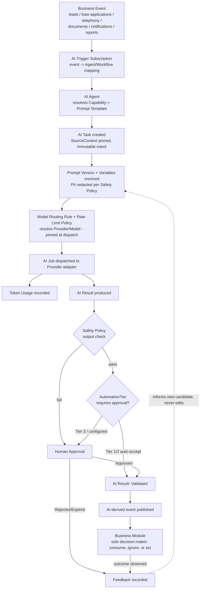
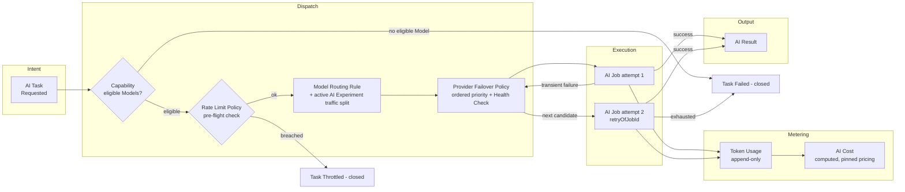
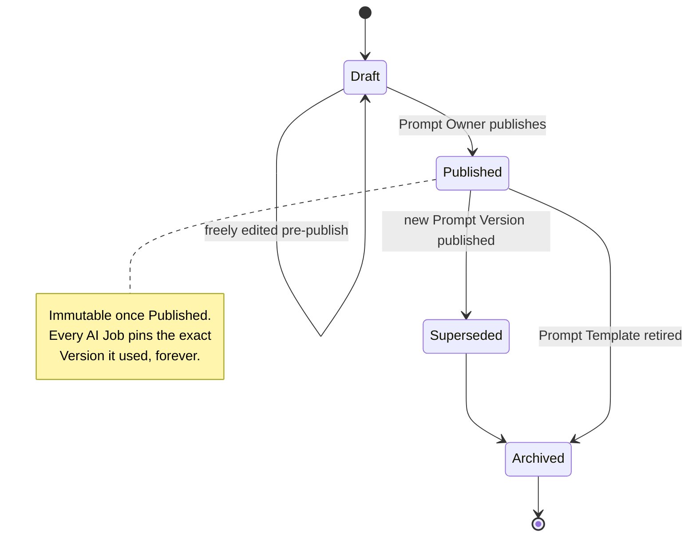
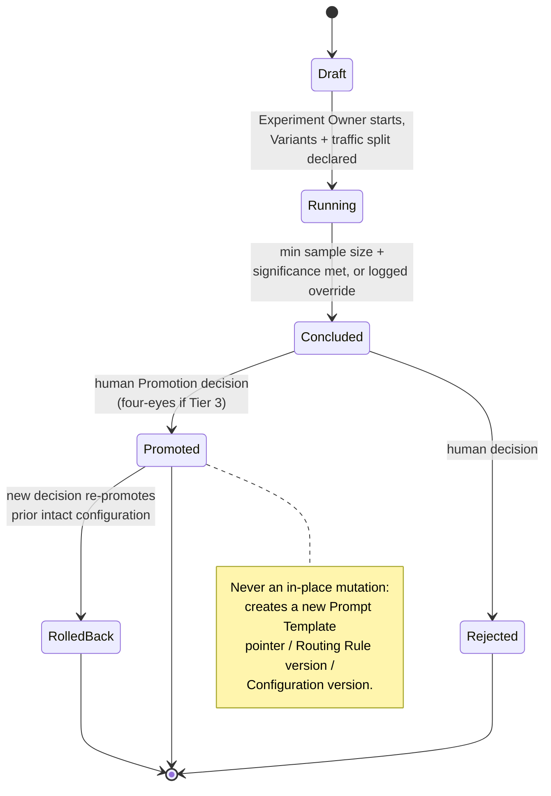
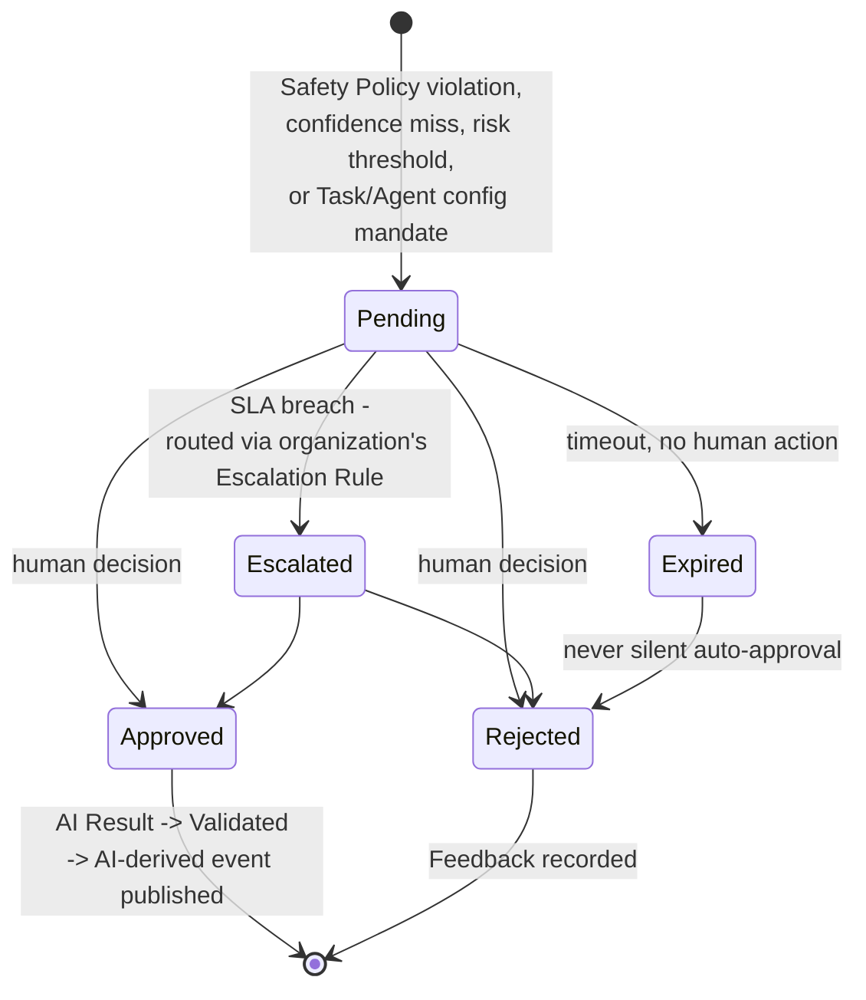
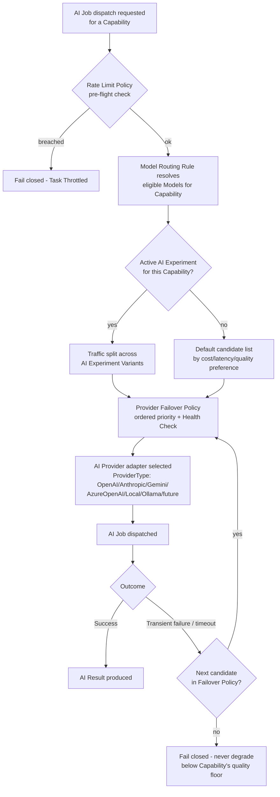
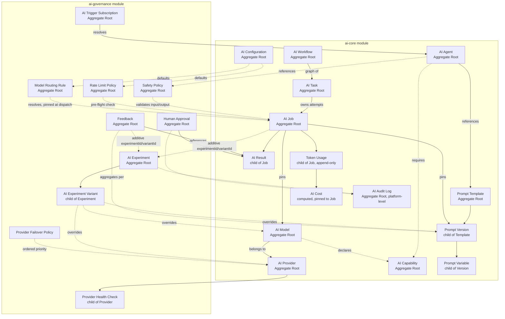

# AI Platform

## Purpose

Own the entire pure intelligence layer of Mudrax CRM: every AI Provider,
Model, Agent, Workflow, Task, Job, Result, Prompt, and governance construct
required to turn domain events already published by CRM Core, Loan
Management, Telephony, Document Management, Notifications, and Reports &
Analytics into AI-derived scores, summaries, classifications, predictions,
recommendations, and automation. `ai-platform` never owns Customer, Lead,
Loan, Telephony, Document, or Notification business data, never performs a
live query against another bounded context's aggregate, and never writes
business-module state directly — it only consumes published events and
publishes its own AI-derived events, which the owning business module may
choose to consume. See
[ADR 0010](../adr/0010-ai-platform-intelligence-governance-and-provider-abstraction.md)
for the full reasoning behind every decision below.

`ai-platform` is a single top-level boundary, structurally parallel to
`src/modules/*`, split into six modules: `ai-core`, `ai-documents`,
`ai-telephony`, `ai-crm`, `ai-analytics`, and `ai-governance`.

## Owned Entities

### Core AI (`ai-core`)

- `AI Provider` - Aggregate Root; one vendor/runtime integration behind a
  single `IAIProviderAdapter` port, discriminated by `ProviderType`
  (`OpenAI` / `Anthropic` / `Gemini` / `AzureOpenAI` / `Local` / `Ollama` /
  future). Lifecycle: Registered -> Active -> Degraded -> Suspended ->
  Retired.
- `AI Model` - Aggregate Root; one invokable model version offered by an AI
  Provider, referenced by identity, never embedded. Declares supported `AI
  Capability` values and carries versioned, effective-dated pricing.
  Lifecycle: Registered -> Available -> Deprecated -> Retired.
- `AI Capability` - Aggregate Root (lightweight catalog); a discrete AI
  function type (`TextGeneration` / `Embedding` / `VisionOCR` /
  `SpeechToText` / `Classification` / `Scoring` / `Summarization` /
  `FunctionCalling` / `Reasoning`), referenced many-to-many by Model, Agent,
  and Task.
- `AI Agent` - Aggregate Root; a named, role-scoped AI actor bundling
  Capability requirements, Prompt Template(s), a Safety Policy, and a
  routing preference. Lifecycle: Draft -> Active -> Paused -> Retired,
  versioned like a Template. Never has direct write access to any business
  module.
- `AI Workflow` - Aggregate Root; a versioned orchestration definition — a
  sequence/graph of AI Tasks, single- or multi-agent. Lifecycle: Draft ->
  Published (immutable) -> Deprecated. A running instance is a correlation
  over AI Task/AI Job records via `workflowRunId`, never its own persisted
  aggregate.
- `AI Task` - Aggregate Root (intent); one addressable, business-meaningful
  unit of AI work, referencing its trigger via `SourceContext =
  {sourceType, sourceId}`. Lifecycle: Requested -> Queued -> InProgress ->
  Completed / Failed / Cancelled. Immutable in intent once Requested; a
  correction always creates a new Task.
- `AI Job` - Aggregate Root (execution); one concrete execution attempt of
  an AI Task against one Provider/Model. Lifecycle: Queued -> Dispatched ->
  Running -> Succeeded / Failed / Timeout / Cancelled. A retry never
  mutates a completed/failed Job; it creates a new Job linked by an
  additive `retryOfJobId` reference.
- `AI Result` - child entity of AI Job; the generic, provider-agnostic
  output envelope. Lifecycle: Produced -> (optionally) Validated/Rejected
  via Human Approval -> Consumed -> Superseded. Always advisory; never a
  business module's trusted fact.
- `AI Configuration` - Aggregate Root; tenant/environment defaults —
  provider preferences, budget ceilings, feature flags. Global by default
  with an Organization-specific override by reference.
- `Prompt Template` - Aggregate Root; a versioned, reusable, named prompt
  definition. Global by default with an Organization-specific override by
  reference. Lifecycle: Draft -> Active -> Deprecated -> Retired.
- `Prompt Version` - child entity of Prompt Template; one immutable,
  effective-dated snapshot of prompt content. Lifecycle: Draft -> Published
  (immutable) -> Superseded -> Archived.
- `Prompt Variable` - child entity of Prompt Version; one named, typed
  placeholder. A PII-flagged Variable is always redacted/tokenized before
  leaving the AI Platform boundary; a Job fails closed if a required
  Variable cannot be resolved.
- `Token Usage` - child entity of AI Job, append-only; the atomic metering
  fact, generalized with a `UsageUnit` discriminator (`Tokens` /
  `GpuSeconds` / `AudioSeconds` / `Images`).
- `AI Cost` - computed, immutable valuation of Token Usage against the AI
  Model's effective-dated pricing snapshot at Job time. Rollups (by Agent,
  Workflow, Organization, day/month) are always a derived read projection,
  never an independent counter.
- `AI Audit Log` - Aggregate Root, platform-level, append-only; immutable
  record of every significant AI Platform action. No update/delete
  use-case is exposed at the domain layer.

### Document AI (`ai-documents`)

- `OCR Request` - Aggregate Root; the AI-side intent to extract text/data
  from one Document Version, raised in response to `documents`' published
  event. Lifecycle: Requested -> Processing -> Completed / Failed.
- `OCR Result` - child entity of OCR Request; document-domain-interpreted
  output (full text, structured layout, confidence). Immutable once
  Produced; a re-run creates a new OCR Request/Result pair.
- `Extracted Entity` - child entity of OCR Result; one recognized field
  (PAN, Name, Amount, Date...) with type/value/location/confidence.
  Lifecycle: Extracted -> Confirmed / Rejected (confirmation recorded by
  the consuming business module, not here).
- `Document Classification` - Aggregate Root; AI-predicted Document
  Type/Category with confidence. Lifecycle: Predicted -> Accepted /
  Overridden (recorded by `documents`, not here). Never auto-sets
  `documents`' Document Type.
- `Face Match` (future) - future Aggregate Root; biometric comparison
  score feeding `documents`' future eKYC Verification / Face Match Result.

### Telephony AI (`ai-telephony`)

- `Transcription Job` - Aggregate Root; references a Call Attempt/Call
  Recording by identity; delegates execution to AI Task/AI Job. Lifecycle:
  Requested -> Queued -> Processing -> Completed / Failed. Only begins
  after Call Recording is finalized.
- `Call Transcript` - child entity of Transcription Job; diarized text
  transcript, external storage reference for large payloads. Lifecycle:
  Produced -> Superseded (re-transcription).
- `Call Summary` - Aggregate Root; abstractive summary of one call.
  Lifecycle: Generated -> Reviewed/Accepted -> Superseded. Never
  auto-writes `leads`' Follow-up.
- `Sentiment Analysis` - Aggregate Root; sentiment/tone/escalation-risk
  classification per call or segment. Lifecycle: Computed -> Superseded.
  Advisory only.
- `Quality Score` - Aggregate Root; AI-computed QA/compliance score for a
  call. Lifecycle: Computed -> Disputed -> Confirmed. Never auto-affects an
  Agent's HR/performance record.

### CRM AI (`ai-crm`)

- `Lead Score` - Aggregate Root; AI-computed propensity/priority score for
  a Lead. Lifecycle: Computed -> Recomputed -> Superseded. Never changes
  Lead Stage or Assignment.
- `Lead Recommendation` - Aggregate Root; suggested action/content for a
  Lead. Lifecycle: Generated -> Presented -> Accepted/Dismissed. Never
  creates a Loan Application or Loan Offer directly.
- `Next Best Action` - Aggregate Root; higher-level synthesis of Lead
  Score, Lead Recommendation, and Sentiment Analysis. Lifecycle: Suggested
  -> Acted-upon/Ignored. Strictly advisory UI guidance.
- `Duplicate Detection` - Aggregate Root; AI-assisted probabilistic/
  semantic match signal. Lifecycle: Signaled -> Consumed-by-customers/
  Ignored. Never merges or writes a Customer record; `customers` remains
  sole owner of Customer Duplicate Candidate and Customer Merge.

### Analytics AI (`ai-analytics`)

- `Forecast` - Aggregate Root; AI-generated time-series projection,
  consumed from `reports`' published Analytics Dataset. Lifecycle:
  Generated -> Superseded.
- `Prediction` - Aggregate Root; single-instance predicted outcome for one
  business entity. Lifecycle: Predicted -> Realized -> Superseded.
- `Trend Analysis` - Aggregate Root; identified pattern/trend across a
  Dataset over time. Lifecycle: Identified -> Reviewed -> Archived.
- `Anomaly Detection` - Aggregate Root; flagged statistical outlier.
  Lifecycle: Flagged -> Triaged -> Resolved/False-Positive.
  Compliance/fraud-adjacent anomalies always route through Human Approval.

> Forecast, Prediction, Trend Analysis, and Anomaly Detection share nearly
> identical shape and lifecycle; ADR 0010's Open Questions recommend
> consolidating them into one `AI Insight` entity with an `InsightType`
> discriminator (the same pattern already used for Metric Definition's
> `Domain` value) at implementation time.

### Platform Governance (`ai-governance`)

- `Model Routing Rule` - Aggregate Root, versioned; declarative
  (Capability, preference, tenant) -> ordered candidate Model list.
  Resolved and pinned onto the AI Job at dispatch time, never re-resolved
  retroactively.
- `Provider Failover Policy` - Aggregate Root/child of AI Configuration;
  ordered Provider/Model priority list plus a health-threshold switch
  rule.
- `Provider Health Check` - child entity of AI Provider, append-only;
  recorded health-probe signal feeding failover decisions.
- `Rate Limit Policy` - Aggregate Root; enforced ceilings (requests/min,
  tokens/day, cost/day) per Provider/Agent/Organization, checked
  pre-flight before Model Routing resolves a Provider.
- `Safety Policy` - Aggregate Root, versioned, immutable per version;
  content-safety/PII/prompt-injection/topic rules applied to every Job's
  input and output.
- `Human Approval` - Aggregate Root; one discrete human review-and-decide
  gate on an AI Result/Task. Lifecycle: Pending -> Approved / Rejected /
  Escalated / Expired. Expiry always defaults to Rejected.
- `Feedback` - Aggregate Root; human correction/acceptance/rejection
  signal, aggregated per Prompt Version, Agent, and AI Experiment Variant.
  Never edits a Prompt Version directly.
- `AI Trigger Subscription` - Aggregate Root; admin-configured mapping from
  a consumed domain event to the AI Agent/Workflow that should react.
- `AI Experiment` - Aggregate Root; a governed comparison of two or more
  configuration Variants against a declared success metric. Lifecycle:
  Draft -> Running -> Concluded -> Promoted / Rejected.
- `AI Experiment Variant` - child entity of AI Experiment; one arm's
  configuration-override bundle (`promptVersionId?` / `modelId?` /
  `providerId?` / `samplingParams?` / `routingStrategyId?`) and
  traffic-allocation percentage.

## Business Rules

- `ai-platform` owns no business data. It only consumes domain events
  already published by `leads`, `customers`, `loan-applications`,
  `loan-accounts`, `disbursements`, `telephony`, `documents`, and
  `notifications`, and `reports`' published Analytics Dataset through the
  Export Job seam — never a live query or direct write against any of
  their aggregates.
- AI never owns a business decision, only a recommendation. Every AI
  Agent/Task carries an `AutomationTier`: Tier 1 (fully autonomous,
  reversible outputs), Tier 2 (bounded-risk actions inside a
  pre-approved, revocable envelope), or Tier 3 (money/compliance/
  identity-affecting, always requiring live Human Approval).
- AI Task (intent) and AI Job (execution) are permanently separate
  Aggregate Roots. A Job retry never mutates a completed/failed Job; it
  creates a new Job linked by `retryOfJobId`.
- AI Result is always advisory and is a child of AI Job. Every
  domain-specific result entity (OCR Result, Call Summary, Lead Score,
  Forecast, etc.) references it via `sourceAiResultId` rather than
  duplicating it, and never auto-writes into another module's trusted
  state without an explicit human/confirmation step.
- Prompt Template is Global by default with an Organization-specific
  override by reference; never deleted once any Prompt Version has been
  used by a completed Job (retire instead). Prompt Version is immutable
  once Published; any change creates a new Version. A PII-flagged Prompt
  Variable is always redacted/tokenized before leaving the boundary.
- AI Provider is the single Aggregate Root abstracting every vendor/runtime
  behind a `ProviderType` discriminator and the `IAIProviderAdapter` port;
  vendor SDK code lives only in `src/integrations/ai-providers/*`. AI
  Model references AI Provider by identity, never embedded.
- Model Routing Rule and Rate Limit Policy resolutions are pinned onto the
  AI Job at dispatch time and never re-resolved retroactively. Provider
  Failover never silently degrades below a Capability's minimum-quality
  floor; with no eligible fallback, the Job fails closed.
- Safety Policy is versioned and immutable per version; an input violation
  blocks dispatch, an output violation forces Human Approval regardless of
  the Task's normal auto-accept configuration.
- Human Approval never performs the business action itself — it only moves
  an AI Result to Validated; the actual action still runs through the
  owning business module's own workflow. An Expired approval always
  defaults to Rejected.
- Feedback never edits a Prompt Version; it can only inform a new candidate
  Version, optionally run as an AI Experiment, promoted only by an
  explicit human Prompt Owner decision.
- `ai-documents`' OCR Request/Result/Extracted Entity and future Face
  Match are AI execution detail only. `documents` remains the sole owner
  and sole writer of its own OCR Job, Extracted Field, and future Face
  Match Result (ADR 0007) — never bypassed, never duplicated.
- `ai-telephony`'s Transcription Job never begins before a Call Recording
  is finalized, referencing it by external Storage Reference only. Call
  Summary, Sentiment Analysis, and Quality Score are advisory only.
- `ai-crm`'s Duplicate Detection is a probabilistic signal only —
  `customers` remains the sole owner and sole writer of Customer Duplicate
  Candidate and Customer Merge. Lead Score, Lead Recommendation, and Next
  Best Action never mutate Lead state or create a Loan Application/Offer.
- `ai-analytics` consumes only `reports`' published Analytics Dataset
  through the Export Job seam — never Analytics Snapshot internals or a
  live cross-module join. Compliance/fraud-adjacent Anomaly Detection
  always routes through Human Approval before any downstream action.
- AI Experiment is an independent Aggregate Root owning many AI Experiment
  Variant children; it only ever references, never edits or forks,
  existing Prompt Versions, Models, and Providers. AI Job and Feedback
  carry only additive, optional `experimentId`/`variantId` references.
  Promotion is always a manual, explicit human decision that creates a new
  version of whatever downstream configuration won — never an in-place
  mutation; rollback is symmetric, re-promoting the still-intact prior
  configuration. Tier-3 Experiments require a second human sign-off
  distinct from the Experiment Owner at Promotion.
- AI Audit Log exposes no update/delete use-case at the domain layer at
  all — structurally, not conventionally, append-only.

## Who Can Do What

| Role | Capability |
| --- | --- |
| Admin | Full configuration of AI Provider, AI Model, AI Capability, AI Configuration, Model Routing Rule, Rate Limit Policy, Safety Policy; can retire any AI Agent/Prompt Template |
| Compliance Officer | Owns Safety Policy; reviews AI Audit Log; approves Tier-3 Human Approval requests and Tier-3 Experiment promotions (four-eyes) |
| Prompt Owner | Drafts and publishes Prompt Template/Prompt Version; creates and promotes/rejects AI Experiment; reviews Feedback rollups |
| Manager / Team Leader | Acts on Lead Score, Lead Recommendation, Next Best Action, Call Summary, Quality Score within their span; submits Feedback (accept/dismiss) |
| Caller | Views AI-derived recommendations/summaries on own assigned Leads; submits Feedback; cannot configure Agents, Prompts, Providers, or Safety Policy |
| Approver (role varies by Tier) | Resolves Pending Human Approval requests (`Approved` / `Rejected` / `Escalated`) |

## Dependencies

- Consumes domain events published by `leads`, `customers`,
  `loan-applications`, `loan-accounts`, `disbursements`, `telephony`,
  `documents`, and `notifications` — never a live query or direct write
  against any of them.
- Consumes `reports`' published Analytics Dataset through the Export Job
  seam; never Analytics Snapshot internals or a live cross-module join.
- References `organization`'s Escalation Rule by identity for Human
  Approval SLA-timeout routing, avoiding a duplicate escalation engine.
- Authorization for Agent/Prompt/Safety Policy/Approval actions comes from
  `rbac`.
- Vendor-specific AI provider integration code (OpenAI, Anthropic, Gemini,
  Azure OpenAI, local runtime, Ollama SDKs) lives in
  `src/integrations/ai-providers/*`, implementing the `IAIProviderAdapter`
  port — never inside this module's domain layer.
- Publishes AI-derived domain events (e.g. `LeadScoreComputed`,
  `OcrCompleted`, `CallSummaryGenerated`, `AnomalyFlagged`) that owning
  business modules and `reports` may choose to consume; never writes their
  state directly.

## AI Lifecycle (Business Event to Business Module)

## AI Execution Pipeline (Task -> Job -> Provider -> Result)

## Prompt Version Lifecycle

## AI Experiment Lifecycle

## Human Approval Workflow

## Provider Routing Workflow

## Aggregate Boundary Diagram — Core AI and Governance

## Aggregate Boundary Diagram — Domain-Specific AI and Business Module References

```mermaid
flowchart TB
  subgraph AIDocuments[ai-documents module]
    OcrRequest[OCR Request<br/>Aggregate Root]
    OcrResult[OCR Result<br/>child of OCR Request]
    ExtractedEntity[Extracted Entity<br/>child of OCR Result]
    DocClass[Document Classification<br/>Aggregate Root]
    FaceMatch[Face Match - future<br/>Aggregate Root]
  end

  subgraph AITelephony[ai-telephony module]
    Transcription[Transcription Job<br/>Aggregate Root]
    Transcript[Call Transcript<br/>child of Transcription Job]
    CallSummary[Call Summary<br/>Aggregate Root]
    Sentiment[Sentiment Analysis<br/>Aggregate Root]
    Quality[Quality Score<br/>Aggregate Root]
  end

  subgraph AICrm[ai-crm module]
    LeadScore[Lead Score<br/>Aggregate Root]
    LeadRec[Lead Recommendation<br/>Aggregate Root]
    NBA[Next Best Action<br/>Aggregate Root]
    DupDetect[Duplicate Detection<br/>Aggregate Root]
  end

  subgraph AIAnalytics[ai-analytics module]
    Forecast[Forecast<br/>Aggregate Root]
    Prediction[Prediction<br/>Aggregate Root]
    Trend[Trend Analysis<br/>Aggregate Root]
    Anomaly[Anomaly Detection<br/>Aggregate Root]
  end

  DocVersion[Document Version<br/>owned by documents]
  CallAttempt[Call Attempt / Call Recording<br/>owned by telephony]
  Lead[Lead<br/>owned by leads]
  Customer[Customer<br/>owned by customers]
  AnalyticsDataset[Analytics Dataset<br/>owned by reports]

  OcrRequest -->|references by identity, never copies| DocVersion
  OcrRequest --> OcrResult --> ExtractedEntity
  DocClass -->|references| DocVersion
  FaceMatch -.->|feeds future eKYC Verification| DocVersion
  OcrRequest -.->|publishes event only -<br/>documents remains sole writer of<br/>its own OCR Job / Extracted Field| DocVersion

  Transcription -->|references by identity| CallAttempt
  Transcription --> Transcript
  CallSummary -->|derived from| Transcript
  Sentiment -->|derived from| Transcript
  Quality -->|derived from| Transcript
  CallSummary -.->|publishes event only -<br/>never writes Follow-up| Lead

  LeadScore -->|references| Lead
  LeadRec -->|references| Lead
  NBA -.->|synthesizes| LeadScore
  NBA -.->|synthesizes| LeadRec
  NBA -.->|synthesizes| Sentiment
  DupDetect -->|references| Customer
  DupDetect -.->|publishes signal only -<br/>customers remains sole writer of<br/>Customer Duplicate Candidate / Merge| Customer

  Forecast -->|consumes via Export Job seam| AnalyticsDataset
  Prediction -->|consumes via Export Job seam| AnalyticsDataset
  Trend -->|consumes via Export Job seam| AnalyticsDataset
  Anomaly -->|consumes via Export Job seam| AnalyticsDataset
```

## Open Questions

- Whether Forecast, Prediction, Trend Analysis, and Anomaly Detection
  should be consolidated into one discriminated `AI Insight` entity
  (`InsightType` value) at implementation time, applying the same Metric
  Definition discriminator pattern already accepted in `reports` — flagged
  in ADR 0010 but not mandated.
- Whether AI Workflow needs a dedicated "Workflow Run" Aggregate Root once
  multi-agent workflows require dominant, workflow-run-centric queries
  independent of any single Task.
- Whether a dedicated "AI Tool" catalog is needed once MCP/function-calling
  integration is scoped in detail, versus reusing AI Capability's existing
  `FunctionCalling` value.
- Whether AI Memory needs its own persisted entity beyond
  `SourceContext`/`conversationId` correlation once multi-turn agent
  conversations are scoped.

## Implementation Status

Architecture documentation only. No schema, Prisma models, APIs, UI, or
business logic exist.
