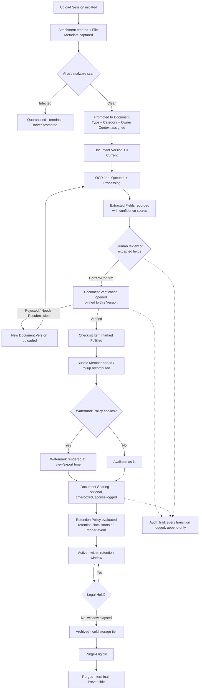
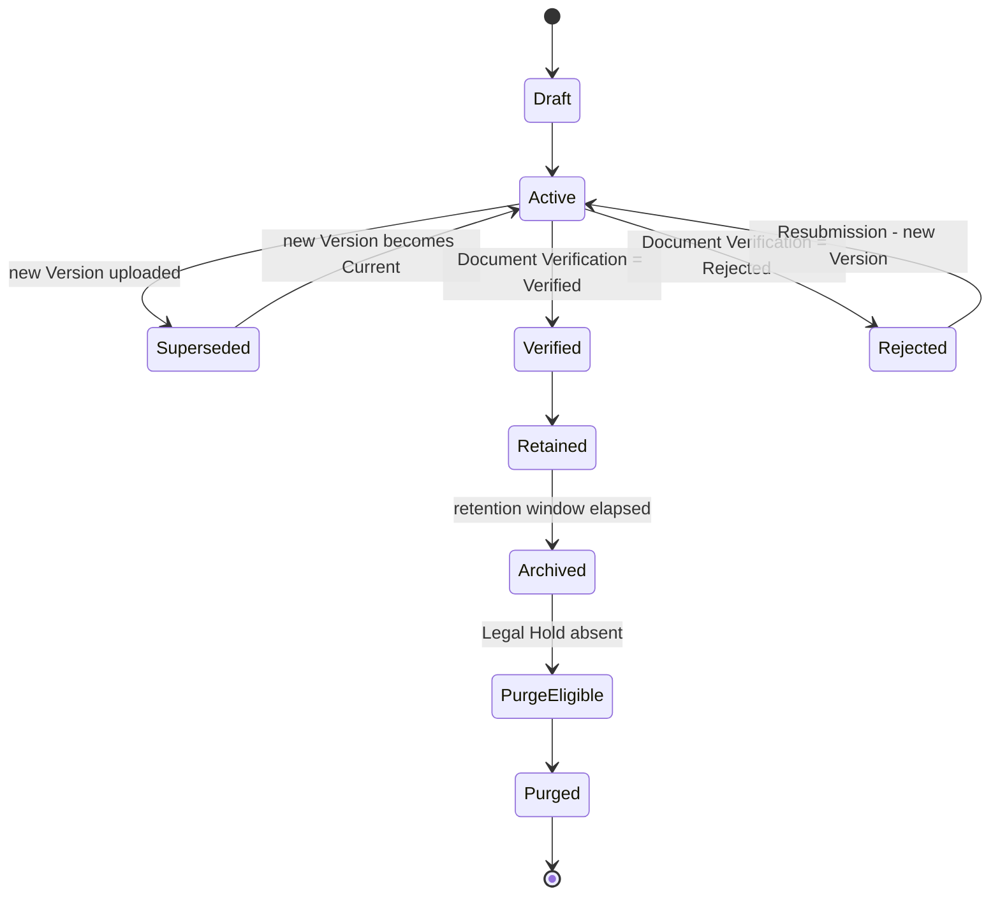
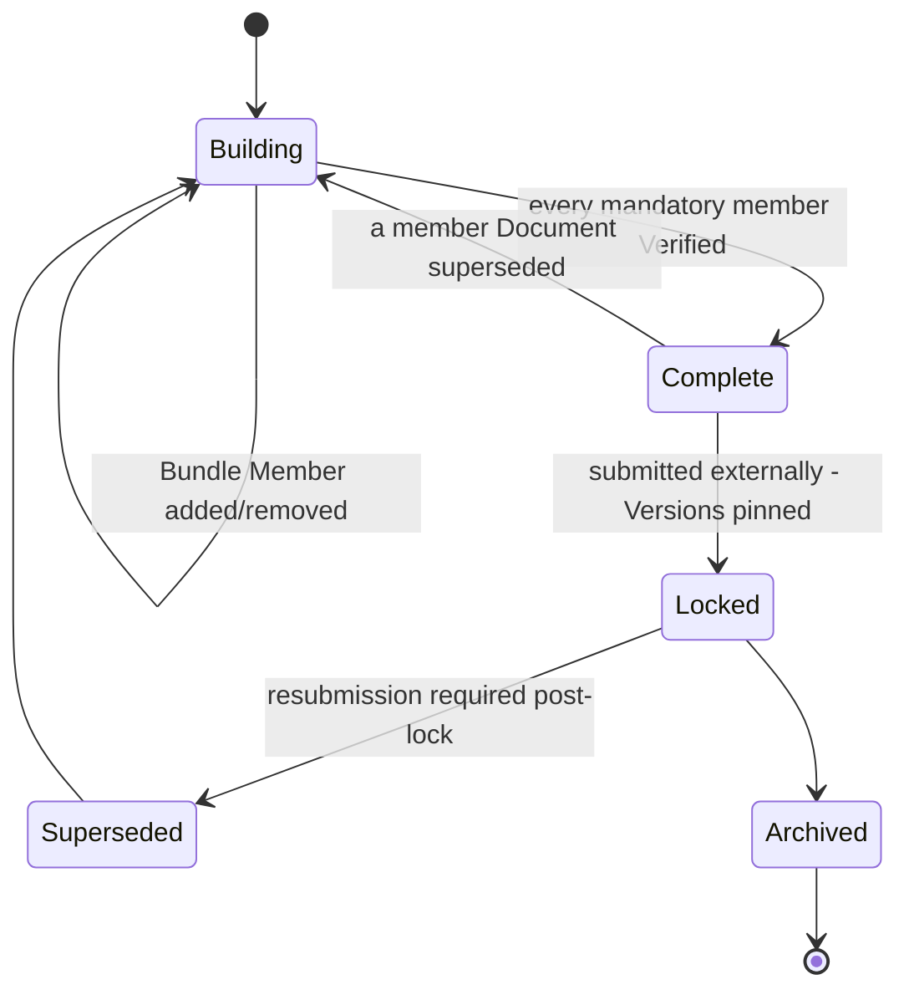
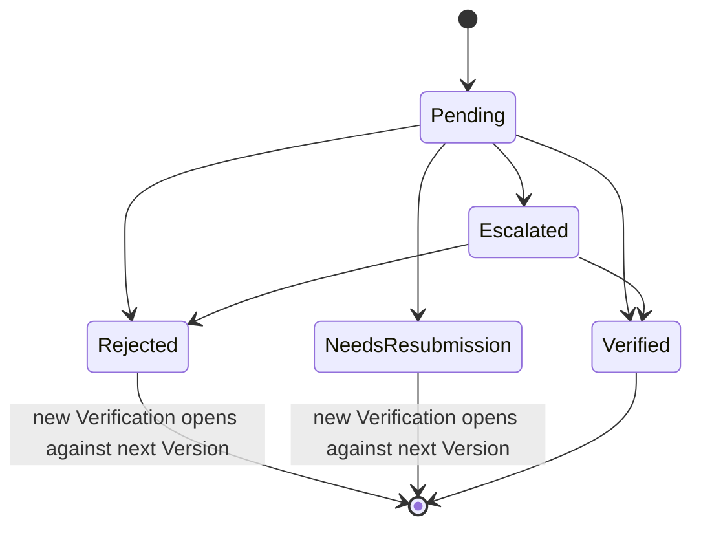
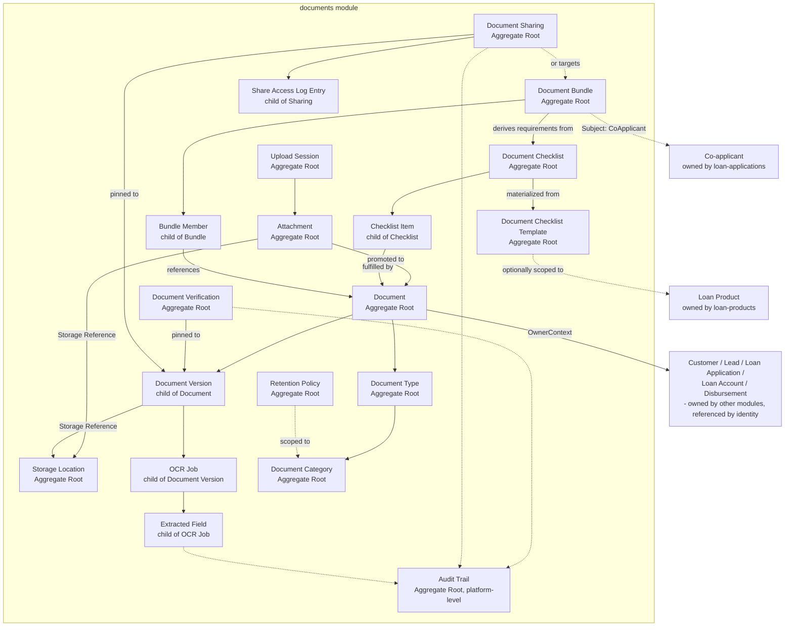

# Documents

## Purpose

Own everything required to receive, classify, version, extract data from,
verify, package, retain, and safely expose every file Mudrax Capitals ever
collects — KYC evidence, income proof, collateral papers, loan execution
documents — from the moment a file is uploaded through archival and eventual
purge. `documents` is the single write path for all document-management
state; it never writes Customer, Lead, Loan Application, Loan Account, or
Disbursement state, and those modules never duplicate document metadata —
they reference a Document by identity. See
[ADR 0007](../adr/0007-document-management-aggregate-boundaries-and-storage-abstraction.md)
for the full reasoning behind every decision below.

## Owned Entities

### Core File Entities

- `Attachment` - Aggregate Root; generic registration of any raw uploaded
  file (used by any module, not only compliance documents), carrying `File
  Metadata` (filename, MIME type, size, checksum) and a `Storage Reference`.
  Lifecycle: Uploading -> Scanning -> Clean/Infected -> Available ->
  (optionally) Promoted-to-Document -> Archived -> Purged.
- `Document` - Aggregate Root; the business-classified, workflow-bearing
  wrapper built on one Attachment's version lineage. References exactly one
  `Document Type` and one `Owner Context` by identity. Lifecycle: Draft ->
  Active -> Superseded -> Verified/Rejected -> Retained -> Archived ->
  Purge-Eligible -> Purged. Never hard-deleted before purge eligibility.
- `Document Version` - child entity of Document; one immutable file revision.
  Lifecycle: Uploaded -> Current -> Superseded -> Archived -> Purged. File
  bytes are always an external `Storage Reference`, never inlined.

### Classification Catalogs

- `Document Type` - Aggregate Root; admin catalog entry ("PAN Card,"
  "Aadhaar," "Salary Slip," "Bank Statement," "Photo," "Signature").
  References exactly one Document Category.
- `Document Category` - Aggregate Root; admin catalog grouping Document
  Types (KYC, Income Proof, Collateral, Loan Execution, Compliance, Other).
  A closed, versionable set.

### Checklist & Bundling

- `Document Checklist Template` - Aggregate Root; reusable definition of
  which Document Types are required. Global by default, or scoped to one
  Loan Product **by reference** (never embedded). Lifecycle: Draft ->
  Published -> Superseded.
- `Checklist Template Item` - child entity of Document Checklist Template;
  one required Document Type entry with a mandatory/optional flag.
- `Document Checklist` - **independent Aggregate Root**; the materialized,
  per-case tracking instance (Lead / Loan Application / Customer), generated
  once from the applicable Global + Loan-Product templates. Lifecycle:
  Materialized -> In-Progress -> Complete / Blocked.
- `Checklist Item` - child entity of Document Checklist; one required-item
  tracking row referencing a fulfilling Document. Lifecycle: Pending ->
  Submitted -> Verified / Rejected -> Resubmission-Requested.
- `Document Bundle` - **independent Aggregate Root**; a complete,
  presentable, verifiable, shareable package of Documents for one business
  process ("Loan Application Documents," "KYC Package," "Property
  Documents," "Co-applicant Documents"). References an `Owner Context`, an
  optional `Subject` (`PrimaryApplicant` / `CoApplicant` / `Asset` / `None`),
  and the case's Document Checklist as its source of truth for requirements.
  Lifecycle: Draft/Building -> Complete -> Locked/Submitted -> Superseded ->
  Archived.
- `Bundle Member` - child entity of Document Bundle; links one Document
  (and, where applicable, the Checklist Item it fulfills) into the Bundle.
  Lifecycle: Added -> Active -> Removed / Superseded.

### Verification & Extraction

- `Document Verification` - **independent Aggregate Root**; one decision
  cycle confirming a specific, pinned `Document Version` is genuine, legible,
  and correct. Carries a `Verification Status` value object (Pending ->
  Verified / Rejected / Needs-Resubmission -> Escalated) and a method
  discriminator (Manual / OCR-assisted / future eKYC).
- `OCR Job` - child entity of Document Version; one background text/data
  extraction run. Carries an engine/type discriminator (`GenericOCR` /
  `AadhaarOCR` / `PANOCR` / `BankStatementParser` / future). Lifecycle:
  Queued -> Processing -> Completed / Failed (reprocess always creates a new
  Job).
- `Extracted Field` - child entity of OCR Job; one recognized key/value with
  a confidence score. Lifecycle: Extracted -> Reviewed -> Confirmed /
  Overridden. Always advisory; never auto-writes into another module's
  trusted state.

### Storage & Upload

- `Storage Location` - Aggregate Root; one configured storage backend
  binding (Local Disk path, NAS share, S3 bucket + region, Azure Blob
  container) with a `StorageProviderType` discriminator. Lifecycle: Active ->
  Deprecated -> Retired.
- `Upload Session` - Aggregate Root; one resumable/chunked/multi-file upload
  operation. Lifecycle: Initiated -> In-Progress -> Completed / Abandoned /
  Failed -> Expired. Idempotent by session token.

### Retention & Lifecycle

- `Retention Policy` - Aggregate Root; versioned, append-only rule set for
  how long a Document Category/Type must be retained and under what trigger.
  Lifecycle: Draft -> Effective -> Superseded.
- **Archive** - not a persisted entity; a storage-tier lifecycle state on
  Document/Document Version (`Active -> Archived -> Purge-Eligible ->
  Purged`), kept separate from Document's own workflow state and from
  Verification Status.
- **Watermark** - not a persisted per-view entity; a declarative rendering
  policy attached to a Document Type/Category or Retention Policy, applied at
  view/export time.

### Sharing & Audit

- `Document Sharing` - **independent Aggregate Root**; one controlled,
  time-boxed exposure of a Document or Document Bundle, pinned to specific
  Versions. Lifecycle: Created -> Active -> Expired / Revoked.
- `Share Access Log Entry` - child entity of Document Sharing; one recorded
  access event, append-only.
- `Audit Trail` - Aggregate Root, platform-level; immutable, append-only
  record of every significant action across this bounded context. No
  update/delete use-case is exposed at the domain layer.

### Future Entities

- `Digital Signature` - future Aggregate Root; cryptographically verifiable
  execution of a pinned Document Version by a named signatory. Permanently
  distinct from Watermark.
- `eKYC Verification` - future Aggregate Root; automated identity-proofing
  session producing a Document Verification with `method = eKYC`.
- `Face Match Result` - future child entity of eKYC Verification; one
  biometric comparison outcome.

### Not Modeled as Separate Entities

- **Customer Documents** / **Loan Documents** - a `Document` classified by
  `OwnerContext.ownerType` (`Customer` vs. `LoanApplication` /
  `LoanAccount` / `Disbursement`). Not distinct types.
- **KYC Documents** - a `Document` whose `Document Type` belongs to
  `Document Category = KYC`. A classification, not a type.

## Business Rules

- Attachment and Document are separate entities: Attachment is the generic
  raw-file registration used by any module; Document is the business-
  classified wrapper that enters KYC/loan/compliance workflows. Not every
  Attachment is promoted to a Document.
- A file must pass virus/malware scanning (`Clean`) before it may be
  promoted to a Document, OCR'd, or shared.
- Document Version is a child entity of Document, never edited in place; a
  resubmission always appends a new Version and marks the prior one
  Superseded. File bytes are always an external Storage Reference.
- OCR Job is a child entity of Document Version, orchestrated as a
  background process; Extracted Fields are always advisory and never
  auto-write into another module's trusted state (e.g., `customers`'
  Customer Identifier) without an explicit human/Verification confirmation
  step. A human override is recorded via Audit Trail, never a silent
  overwrite.
- Document Verification is an independent Aggregate Root, pinned to the
  exact Document Version reviewed — never "the current version." A
  Rejected/Needs-Resubmission outcome always opens a new Verification
  against the next Version.
- Document Checklist Template can be Global or scoped to one Loan Product
  **by reference** (never embedded); a Loan-Product template is additive to
  the Global one, never a silent removal of a global requirement. Document
  Checklist is materialized once per case and is not silently recomputed if
  the template changes mid-case.
- Document Bundle is an independent Aggregate Root that never invents its
  own required-item list — it always derives "what should be in me" from
  the case's Document Checklist, filtered by Document Category and/or
  Subject. Every Checklist Item belongs to at most one Bundle at a time.
  Bundle completeness is a derived rollup over its members' existing
  Document Verification outcomes — never a parallel or shortcut verification
  path. Locking a Bundle pins the exact Document Version of every member at
  that moment.
- Multiple applicants are supported through Document Bundle's optional
  `Subject` reference (`PrimaryApplicant` / `CoApplicant` / `Asset` /
  `None`); `CoApplicant` resolves by identity against `loan-applications`'
  existing Co-applicant entity, never duplicated here.
- Every Document carries exactly one accountable `Owner Context` at a time
  (`Customer` / `Lead` / `LoanApplication` / `LoanAccount` / `Disbursement`).
  Customer is the permanent anchor for KYC-classified Documents; cross-case
  reuse is always an explicit Link (Checklist Item, Bundle Member, or
  Document Sharing), never a re-parenting of `Owner Context`. A Customer
  Merge redirect (per `customers`/ADR 0004) must resolve every Document that
  pointed at the merged-away Customer — never orphaned.
- Storage access happens only through the `IStorageProvider` port; vendor
  SDK code lives exclusively in `src/integrations/storage/*`, never in this
  module's domain layer. Attachment/Document Version never store a raw path
  — only a `Storage Reference` resolved through `Storage Location`.
- Retention Policy, Archive (storage tier), and Document's own workflow
  state are three permanently separate concerns and must never be
  collapsed. A Legal Hold overrides Retention Policy's computed purge date.
  Purge is the only hard, irreversible action, and requires policy
  eligibility **and** no active Legal Hold **and** no open
  Verification/Sharing/Bundle-lock referencing the Document.
- Document Sharing is an independent Aggregate Root, pinning the exact
  Document Version(s) or Document Bundle exposed; every access creates an
  append-only Share Access Log Entry; a share always has an expiry.
- Audit Trail exposes no update/delete use-case at the domain layer at all —
  structurally, not conventionally, append-only.
- Watermark is a declarative rendering policy, not a per-view persisted
  event; it is permanently distinct from Digital Signature (cosmetic vs.
  legally binding) and the two must never be collapsed.

## Who Can Do What

| Role | Capability |
| --- | --- |
| Admin | Full configuration of Document Type/Category, Checklist Templates, Retention Policy, Storage Location; views and can force-quarantine any Attachment; can revoke any Document Sharing |
| Manager | Reviews Document Checklist/Bundle completeness within their span; performs Document Verification; reassigns escalated verifications |
| Team Leader | Ensures Document Checklist/Bundle completeness for their team's cases (per BRD §10.5); performs Document Verification within their team |
| Caller | Uploads Documents against assigned Leads; views own Leads' Checklist/Bundle status; cannot verify, share externally, or override Retention Policy |
| Compliance Officer | Owns Retention Policy; applies/lifts Legal Hold; reviews Audit Trail; approves external Document Sharing and Purge eligibility |

## Dependencies

- References Customer identity from `customers`; every KYC-classified
  Document's `Owner Context` ultimately anchors to a Customer, and Customer
  Merge redirects must resolve correctly for Document ownership. `documents`
  never writes Customer state directly.
- References Lead identity from `leads` for Lead-scoped Documents and
  Checklists; never duplicates Lead state.
- References Loan Application, Loan Account, and Disbursement identity from
  `loan-applications`, `loan-accounts`, and `disbursements` respectively for
  case-scoped Documents, Checklist Templates (Loan Product scope), and
  Document Bundle Subjects (Co-applicant). `documents` never writes state in
  any of those modules.
- References Loan Product identity from `loan-products` for Loan-Product-
  scoped Document Checklist Templates.
- Authorization for Verification, Sharing, Retention override, and Legal
  Hold comes from `rbac`.
- Vendor-specific storage integration code (AWS S3, Azure Blob, filesystem/
  NAS access) lives in `src/integrations/storage/*`, implementing the
  `IStorageProvider` port — never inside this module's domain layer.
- Publishes domain events on Document Verification outcome, Bundle lock, and
  Retention/Archive transitions; `activity-timeline` (out of scope for this
  document) and `reports` (out of scope) may consume them.

## Document Lifecycle

### Document state diagram

### Document Bundle state diagram

### Document Verification lifecycle

## Aggregate Boundary Diagram

## Open Questions

- Whether a future Bundle-level cross-document consistency check (e.g.,
  name-matching across PAN/Aadhaar/Photo within one Bundle) should be a new
  entity or an extension of Document Verification's method discriminator.
- Whether Digital Signature should support multi-party sequential signing
  (Customer, Co-applicant, and Mudrax representative in a defined order).
- Whether eKYC Verification's Face Match Result needs its own retention rule
  distinct from the Document Category it supports, given biometric data's
  stricter regulatory handling.

## Implementation Status

Architecture documentation only. No schema, Prisma models, APIs, UI, or
business logic exist.
