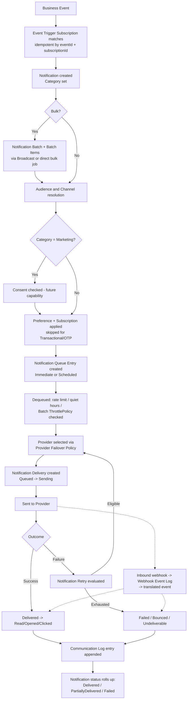
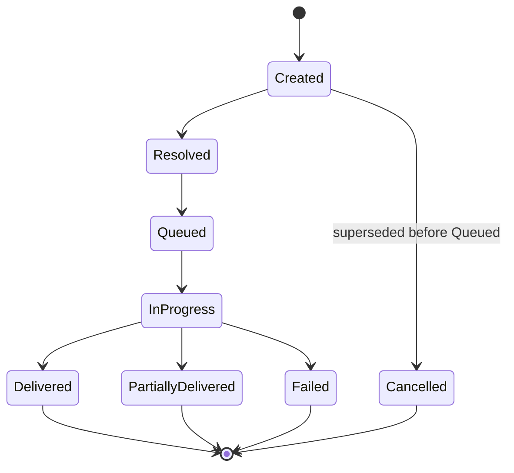
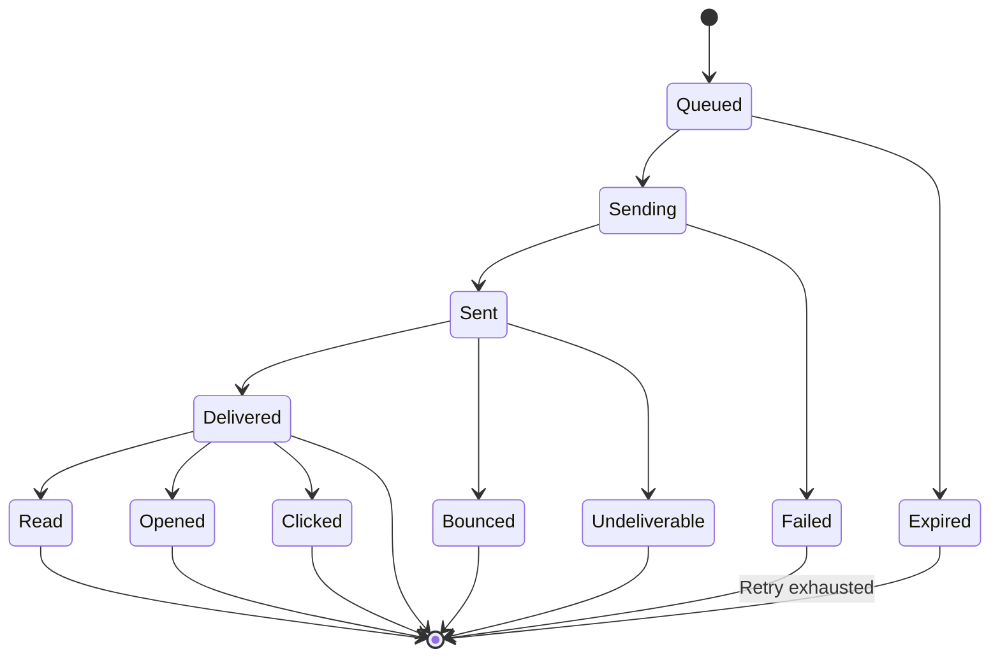
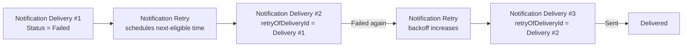
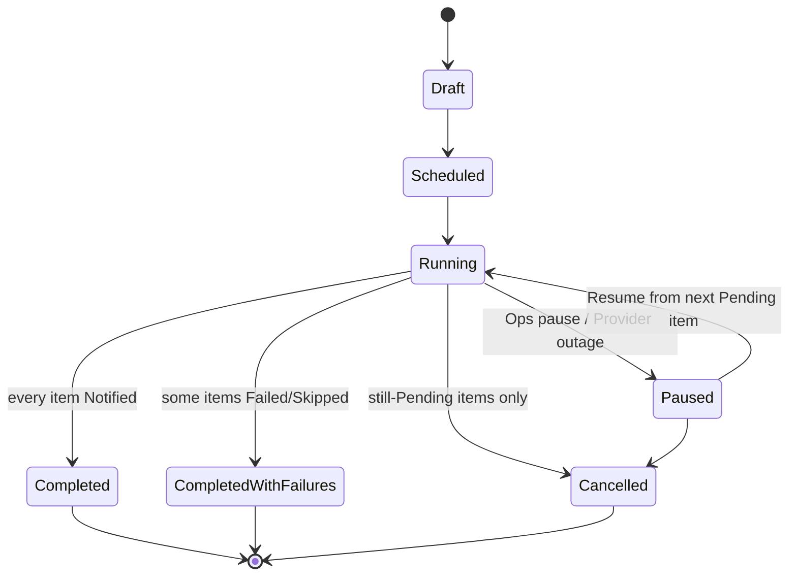
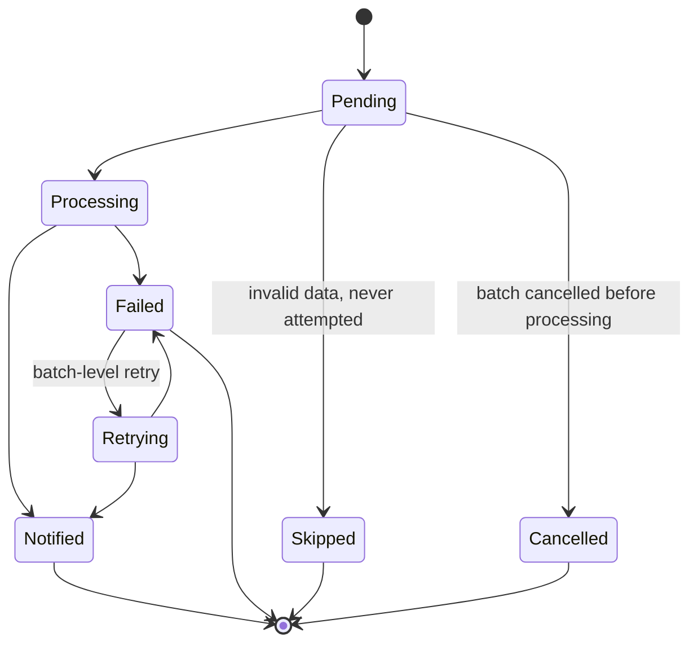
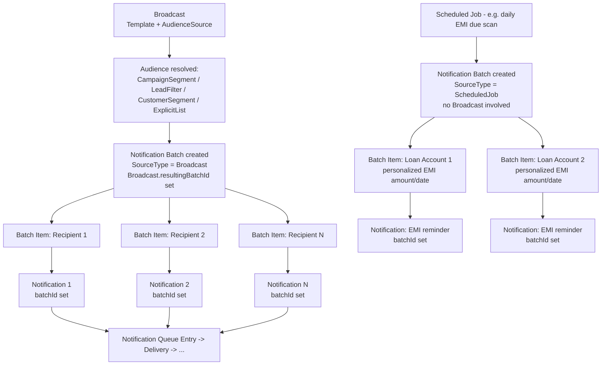
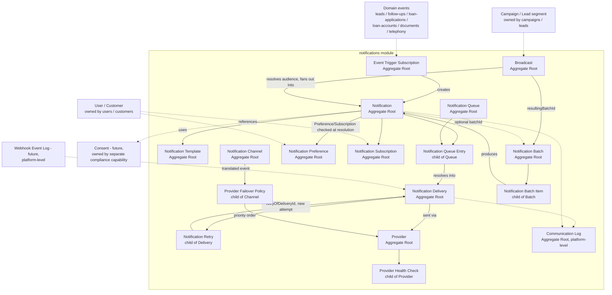

# Notifications

## Purpose

Own everything required to decide, template, queue, send, retry, and prove
delivery of every communication Mudrax Capitals sends or receives — Email,
SMS, WhatsApp, Push, In-App, and future Webhook — from the moment a business
event fires through to a provable delivered/failed outcome. `notifications`
is the single write path for all notification-management state; it never
writes Lead, Customer, Loan Application, Loan Account, or Document state,
and those modules never duplicate notification/delivery metadata — they
publish a domain event or call `notifications`' public API. See
[ADR 0008](../adr/0008-notifications-communications-aggregate-boundaries-and-provider-abstraction.md)
for the full reasoning behind every decision below.

## Owned Entities

### Core Intent & Execution

- `Notification` - Aggregate Root; the business intent to communicate
  something to someone, independent of how many channels or attempts it
  takes to deliver it. Carries a `Category` discriminator (`Transactional` /
  `OTP` / `Operational` / `Marketing`) that governs whether Preference/
  Consent can suppress it. Lifecycle: Created -> Resolved -> Queued ->
  InProgress -> Delivered / PartiallyDelivered / Failed -> Closed, or
  Cancelled before delivery. Immutable once Queued.
- `Notification Delivery` - **independent Aggregate Root**; one physical
  send attempt against one Provider. References Notification and Provider
  by identity. Lifecycle: Queued -> Sending -> Sent -> Delivered -> Read/
  Opened/Clicked (channel-dependent) or Failed -> Bounced/Undeliverable/
  Expired.
- `Delivery Status` - Value Object catalog embedded on Notification
  Delivery (`Queued` / `Sending` / `Sent` / `Delivered` / `Read` /
  `Opened` / `Clicked` / `Failed` / `Bounced` / `Undeliverable` /
  `Expired`); each Channel Type uses only its meaningful subset.
- `Notification Retry` - child entity of Notification Delivery; owns only
  the attempt counter, backoff schedule, and next-eligible-time. Never
  mutates the failed Delivery it retries from — a retry always creates a
  new Notification Delivery, linked by an additive `retryOfDeliveryId`.

### Templates & Channels

- `Notification Template` - Aggregate Root; reusable content definition per
  event/purpose/Channel. Global by default, with an additive Organization-
  specific override **by reference** (never embedded). Lifecycle: Draft ->
  Active -> Deprecated -> Archived. Every content edit creates a new,
  append-only `Template Version`; a live Notification always pins the exact
  Version it used.
- `Notification Channel` - Aggregate Root; Organization-level configuration of
  one medium, carrying a `ChannelType` discriminator (`Email` / `SMS` /
  `WhatsApp` / `Push` / `InApp` / `Webhook`[future]) and rate-limit/quiet-
  hours defaults. Lifecycle: Configured -> Active -> Suspended -> Retired.

### Provider Abstraction

- `Provider` - Aggregate Root; one vendor integration (Twilio, MSG91,
  Gupshup, Meta WhatsApp Cloud API, AWS SES, SendGrid, Firebase, future)
  behind a single `INotificationProvider` port, distinguished by a
  `ProviderType` discriminator. Belongs to exactly one Channel Type.
  Lifecycle: Registered -> Active -> Degraded -> Suspended -> Retired
  (`Degraded`/`Suspended` are system-set from Health Check signals, never
  manually faked).
- `Provider Failover Policy` - child entity of Notification Channel; ordered
  Provider priority list plus a health-threshold switch rule. Versioned,
  append-only on every edit.
- `Provider Health Check` - child entity of Provider, append-only; recorded
  health-probe/circuit-breaker signal feeding failover decisions. Never
  mutated or deleted; system-written only.

### Preferences, Subscriptions & Consent Boundary

- `Notification Preference` - Aggregate Root; the concrete realization of
  the future "Communication Preference" concept referenced in
  `docs/domain/domain-model.md`, now owned here. Scoped per-Recipient
  (User or Customer) and per-EventCategory, optionally narrowed per-Channel.
  Lifecycle: Created -> Updated -> Inactive. Can suppress/reorder
  `Operational`/`Marketing` sends only — never `Transactional`/`OTP`.
- `Notification Subscription` - Aggregate Root; opt-in/opt-out to a specific
  Broadcast topic (e.g. "monthly newsletter"), independent of Preference's
  channel/quiet-hours mechanics. Lifecycle: Subscribed -> Unsubscribed ->
  Resubscribed.
- **Consent** - not owned here; a future, separate compliance Aggregate
  (see `docs/domain/domain-model.md`), referenced by identity. Checked
  before Preference for `Marketing`-category sends and never overridden by
  it.

### Queueing & Scheduling

- `Notification Queue` - Aggregate Root; the standing outbound work queue
  per Channel/priority. Lifecycle: Active <-> Paused.
- `Notification Queue Entry` - child entity of Notification Queue; one
  resolved "send Notification N on Channel C to Recipient R" work item,
  carrying a `TriggerType` (`Immediate` / `Scheduled`) and a `scheduledFor`
  timestamp — this is the entire "Scheduled Notification" capability, not a
  separate entity. Lifecycle: Enqueued -> Eligible -> Dequeued -> Resolved /
  Cancelled / Expired.

### Bulk Execution

- `Broadcast` - Aggregate Root; one message fanned out to a resolved
  audience/segment. References a Notification Template and an
  `AudienceSource` discriminator (`ExplicitList` / `CampaignSegment` /
  `LeadFilter` / `CustomerSegment`), resolving `CampaignSegment`/
  `LeadFilter` by identity against `campaigns`/`leads`. Fans out into one
  Notification per resolved recipient at dispatch. "Campaign Notification"
  is not a separate entity — it is a Broadcast with `AudienceSource =
  CampaignSegment`. Lifecycle: Draft -> Scheduled -> Dispatching ->
  Completed / Cancelled.
- `Notification Batch` - **independent Aggregate Root**; the execution/
  tracking envelope for enterprise-scale bulk sends (EMI reminders, festival
  greetings, marketing campaigns, organization announcements). Carries a
  `SourceType` discriminator (`Broadcast` / `ScheduledJob` /
  `BulkEventTrigger` / `BulkAdminAction`) and an optional `ThrottlePolicy`.
  Lifecycle: Draft -> Scheduled -> Running -> Paused <-> Running ->
  Completed / Completed-with-Failures / Cancelled.
- `Notification Batch Item` - child entity of Notification Batch; one
  immutable work-item row (target recipient + personalization data),
  recorded before any Notification exists — the same shape as `Import Row`
  existing before `Lead` creation. Once processed, holds a forward reference
  to the `Notification` it produced. Lifecycle: Pending -> Processing ->
  Notified / Failed / Skipped / Cancelled, with optional Retrying re-entry
  from Failed.

### History & Event Sourcing

- `Communication Log` - Aggregate Root, platform-level, structurally
  append-only (no update/delete use-case at the domain layer, the same
  treatment as Audit Trail). Immutable historical record of every
  significant Notification/Delivery lifecycle transition; the permanent
  compliance and Customer-history source of truth, independent of
  prunable/archivable operational Delivery data.
- `Event Trigger Subscription` - Aggregate Root; admin-configured mapping
  from one domain event (`Follow-up.Escalated`, `LoanApplication.Approved`,
  `LoanAccount.EmiDueSoon`, etc.) to a Template, an audience-resolution
  rule, and a Channel policy — the seam every other bounded context uses to
  cause a Notification. Idempotent by `(eventId, triggerSubscriptionId)`.
  Lifecycle: Configured -> Active -> Disabled -> Archived.

### Not Modeled as Separate Entities

- **Email / SMS / WhatsApp / Push / In-App Notification** - a `Notification
  Channel`/`Provider` classified by `ChannelType`/`ProviderType`. Not
  distinct entity types.
- **Campaign Notification** - a `Broadcast` classified by `AudienceSource =
  CampaignSegment`. Not a distinct entity type.
- **Scheduled Notification** - a `Notification Queue Entry` with
  `TriggerType = Scheduled` and a populated `scheduledFor`. Not a distinct
  entity type.
- **Webhook (outbound, future)** - a future `ChannelType = Webhook` value.
  Inbound provider webhooks are never parsed here directly — they land in
  the platform-level future Webhook Event Log first and arrive as translated
  domain events.

## Business Rules

- Notification represents business intent; Notification Delivery represents
  one physical send attempt. A Notification is immutable once Queued — a
  correction always creates a new Notification and cancels the old one.
- Notification Delivery is an independent Aggregate Root, not a Notification
  child, because its dominant queries (system-wide retry backlog, per-
  Provider success rate) are portfolio-wide.
- Notification Retry never mutates the Delivery it retries from; a retry
  always creates a new Notification Delivery linked by an additive
  `retryOfDeliveryId` reference.
- Notification Template can be Global or Organization-specific **by
  reference** (never embedded); every content edit is versioned and
  append-only. A live Notification always pins the exact Template Version
  used.
- Notification Channel and Provider each carry a discriminator
  (`ChannelType`/`ProviderType`); adding a channel or provider is a new
  discriminator value plus one adapter in `src/integrations/notifications/*`
  — never a redesign of Notification, Delivery, Channel, or Retry.
- Provider Failover Policy is versioned and append-only; automatic failover
  never requires human approval, only fail-back does. Provider Health Check
  is system-written only and never mutated.
- Preference resolution is centralized and ordered: Consent (future, blocks
  Marketing only) -> Category (Transactional/OTP always deliver) ->
  Notification Preference (Operational/Marketing only) -> Notification
  Subscription (per-Topic, Broadcast-specific). These four layers must never
  be collapsed or reimplemented independently per Channel.
- "Scheduled Notification" is a `TriggerType` + `scheduledFor` on Notification
  Queue Entry, never a separate entity.
- Broadcast fans out into individually-suppressible Notifications; it can
  never bypass a recipient's Preference/Subscription/Consent. "Campaign
  Notification" is a Broadcast `AudienceSource`, never a separate entity.
- Notification Batch owns many immutable Notification Batch Items, created
  before any Notification exists. Batch progress is always a derived rollup
  over Batch Item statuses, never an independently maintained counter.
  Partial failure is a first-class, expected outcome — one bad recipient
  never blocks or rolls back the rest. Batch-level retry only re-drives
  `Failed` items (never `Skipped`) and always creates new
  Notifications/Deliveries, never mutating the originals. Cancellation is
  forward-only and never touches already-`Notified`/in-flight items; a
  cancelled Batch cannot be resumed. Pause/Resume is a distinct, resumable,
  non-terminal state pair, never collapsed with Cancel. A Batch's
  `ThrottlePolicy` is always bounded by its Notification Channel's own
  rate limit — never the other way around.
- Communication Log exposes no update/delete use-case at the domain layer at
  all — structurally, not conventionally, append-only.
- Event Trigger Subscription creation of a Notification is always idempotent
  by `(eventId, triggerSubscriptionId)`; a redelivered event can never
  create a duplicate Notification.
- Inbound provider webhook payloads (delivery receipts, read receipts,
  status callbacks) are never parsed directly by this module's domain
  layer — they are always translated first through the platform-level
  Webhook Event Log.

## Who Can Do What

| Role | Capability |
| --- | --- |
| Admin | Full configuration of Notification Channel, Provider, Provider Failover Policy, Notification Template (Global), Event Trigger Subscription; can suspend any Channel/Provider Organization-wide; views Communication Log across the organization |
| Manager | Views Communication Log and Notification Batch/Broadcast progress within their span; approves Organization-specific Template overrides for their scope |
| Marketing | Authors and dispatches Broadcast and Notification Batch (marketing-category); manages Notification Subscription topics; cannot touch Transactional/OTP templates or Provider configuration |
| Team Leader / Caller | Triggers ad hoc predefined WhatsApp/Email sends against their own assigned Leads (per BRD §13), which create a Notification through the standard intent -> delivery path; cannot configure Channels, Providers, or Templates |
| Compliance Officer | Reviews Communication Log; approves `Marketing`-category Template versions; coordinates with the future Consent capability before Marketing Broadcasts/Batches go live |
| Recipient (User or Customer) | Owns their own Notification Preference and Notification Subscription; can always unsubscribe from a Broadcast topic without authentication friction |

## Dependencies

- References Lead and Customer identity from `leads`/`customers` as
  Notification recipients; never duplicates or writes their state.
- References User identity from `users`; authorization for Channel/Provider/
  Template configuration comes from `rbac`.
- Consumes domain events published by `leads`, `follow-ups`,
  `loan-applications`, `loan-accounts`, `documents`, and `telephony` through
  Event Trigger Subscription — a strictly one-directional dependency; those
  modules never write Notification state directly.
- References CRM Campaign identity from `campaigns` and Lead filters from
  `leads` for Broadcast's `AudienceSource`, never duplicating their data.
- References the future Consent capability by identity before any
  `Marketing`-category send; never bypasses it.
- Consumes the platform-level future Webhook Event Log for inbound provider
  delivery/read receipts, translated into domain events before updating
  Notification Delivery.
- Vendor-specific provider integration code (Twilio, MSG91, Gupshup, Meta
  WhatsApp Cloud API, AWS SES, SendGrid, Firebase) lives in
  `src/integrations/notifications/*`, implementing the
  `INotificationProvider` port — never inside this module's domain layer.
- Publishes domain events on Notification Delivery outcome and Notification
  Batch completion; `activity-timeline` (out of scope for this document) and
  `reports` (out of scope) may consume them — `reports` owns any derived
  communication analytics, `notifications` does not.

## Notification Lifecycle

### Notification state diagram

### Notification Delivery state diagram

### Retry flow (Notification Retry — never mutates a prior Delivery)

### Notification Batch lifecycle

### Notification Batch Item lifecycle

### Broadcast -> Notification Batch -> Notification flow

## Aggregate Boundary Diagram

## Open Questions

- Whether In-App Notification needs its own lightweight, directly-queryable
  "inbox" read model (unread counts, mark-as-read UX) beyond what
  Notification Delivery's `Read` status already provides.
- Whether Notification Batch Item needs its own pinned Template Version
  snapshot, distinct from the Notification it later produces, for
  personalization auditability at enterprise scale.
- Whether a future AI-generated-content source needs its own `SourceType`
  value on Notification or can be folded into the manual composer path.

## Implementation Status

Architecture documentation only. No schema, Prisma models, APIs, UI, or
business logic exist.
