# Reports

## Purpose

Own everything required to turn the facts published by every other bounded
context into curated metrics, KPIs, dashboards, and reports — for Executive,
Branch, Team, and individual audiences — through to scheduled delivery,
export (PDF/Excel/CSV), and governed BI/Data-Warehouse/AI consumption.
`reports` is a **derived, read-side bounded context**: it never becomes the
source of truth for a Lead, Loan Application, Loan Account, Call Attempt,
Document, or Notification. It consumes domain events published by `leads`,
`campaigns`, `loan-applications`, `loan-accounts`, `disbursements`, `banks`,
`loan-products`, `telephony`, `documents`, `notifications`, `users`, and
`organization`, and owns only its own derived work product — Metric
Definition, Analytics Dataset, Analytics Snapshot, Dashboard, KPI, Report
Template, Saved Report, Scheduled Report, Report Execution, and Export Job.
See [ADR 0009](../adr/0009-reports-and-analytics-aggregate-boundaries-and-dataset-abstraction.md)
for the full reasoning behind every decision below.

This document uses `reports` as the single owner module for the entire
Reports & Analytics bounded context, matching ADR 0009. The pre-existing
`src/modules/analytics` code scaffold predates this decision; reconciling
physical module layout (whether `analytics` becomes a thin re-export of
`reports` or is folded into it) is an implementation-time concern, out of
scope for this documentation-only change.

## Owned Entities

### Dashboarding

- `Dashboard` - Aggregate Root; a named, curated visual workspace composed of
  Dashboard Widgets, scoped to an audience (Executive, Branch, Team,
  Personal). Stores only layout and widget bindings — never business data.
  Lifecycle: Draft -> Published -> Archived.
- `Dashboard Widget` - child entity of Dashboard; one visual tile (chart /
  table / counter / leaderboard) binding a visualization type to exactly one
  Metric Definition or KPI, with its own embedded Report Filter. Lifecycle:
  Added -> Configured -> Active -> Removed.

### Metrics, KPIs & Datasets

- `Metric Definition` - Aggregate Root; the atomic, reusable calculation —
  source event stream or Analytics Dataset, aggregation function, dimensions,
  time-grain, and a `Domain` discriminator (`Lead` / `Loan` / `Telephony` /
  `Document` / `User` / `Organization` / `Audit`) realizing every "*Analytics"
  subject area without a parallel entity family per domain. Carries a
  freshness policy (`RealTime` / `NearRealTime(interval)` / `Periodic`).
  Lifecycle: Draft -> Published -> Deprecated -> Retired; formula edits are
  versioned, append-only (Metric Definition Version).
- `KPI` - **independent Aggregate Root**; a business-curated indicator that
  elevates one Metric Definition to leadership visibility with a target/
  threshold and a derived On-Track/At-Risk/Off-Track status. References
  exactly one Metric Definition by identity; owns an append-only KPI Target
  Version history. Lifecycle: Defined -> Active -> Retired (never hard-deleted
  once it has appeared on any Analytics Snapshot/Report Execution).
- `Analytics Dataset` - **independent Aggregate Root**; a named, reusable,
  governed analytical data source (a curated, row-level or dimensional
  extract assembled from one or more modules' published domain events) — a
  reusable semantic view, never a database table or a live cross-module join.
  Upstream of Metric Definition's aggregation and the entry point for BI/Data
  Warehouse/AI consumption (see Dataset & BI Integration below). Lifecycle:
  Defined -> Published -> Deprecated -> Retired; schema/grain changes are
  versioned, append-only.

### Historical / Computed Data

- `Analytics Snapshot` - Aggregate Root; an immutable, timestamped,
  pre-computed rollup of one or more Metric Definitions, computed per a
  **Hybrid** live/periodic freshness policy (see Business Rules). The
  backbone for anything historical, trend, or forecast-facing. Lifecycle:
  Computed -> Published, then permanently immutable; superseded, never
  overwritten, by the next period's Snapshot.

### Report Definition

- `Report` - **not a persisted entity**. Business language for "a piece of
  reporting output," realized structurally by Report Template + Saved Report
  + Report Execution — the same test already used to reject a wrapping "Call"
  aggregate (ADR 0006) and an independent Campaign Analytics aggregate (ADR
  0004).
- `Report Template` - Aggregate Root; a reusable, admin/system-defined report
  blueprint (columns, referenced Metric Definitions and/or an Analytics
  Dataset for row-level output, default grouping/sort). Global by default,
  with an Organization-specific override by reference (never embedded), the
  same pattern as Notification Template and Document Checklist Template.
  Lifecycle: Draft -> Published -> Deprecated -> Retired; versioned.
- `Saved Report` - Aggregate Root; a named, owned, reusable parameterization
  of a Report Template plus a specific Report Filter — the reporting
  analogue of BRD §16.1's saved lead views. Lifecycle: Created -> Active ->
  Archived.
- `Scheduled Report` - Aggregate Root; a recurring execution policy that runs
  a Saved Report on a cadence and routes output through Export Job. Lifecycle:
  Active -> Paused -> Cancelled (Pause/Resume kept distinct from Cancel,
  mirroring Notification Batch).
- `Report Filter` - Value Object, embedded on Dashboard Widget, Saved Report,
  and Report Execution — no independent identity. Supports both absolute and
  relative/dynamic expressions (e.g. `RollingLast(30, Days)`); a Report
  Execution always freezes the *resolved* absolute values it actually ran
  with.

### Report Execution & Delivery

- `Report Execution` - **independent Aggregate Root**; one concrete,
  immutable run of a Report Template Version + resolved Report Filter — the
  same intent/execution split already applied to Loan Application/Loan
  Account (ADR 0005), Call Attempt/"Call" (ADR 0006), and Notification/
  Notification Delivery (ADR 0008). Lifecycle: Queued -> Running -> Completed
  / Failed / Cancelled; immutable once Completed.
- `Export Job` - **independent Aggregate Root**; one render operation
  converting a completed Report Execution's result (or, for BI-feed formats,
  a live connection to an Analytics Dataset) into a deliverable artifact.
  Carries an `Export Format` discriminator (`PDF` / `Excel` / `CSV` /
  `PowerBIFeed` / `TableauFeed` / `DataWarehouseFeed` / future `JSON`).
  Output is registered as a `documents`-owned Attachment, never promoted to a
  compliance Document. Lifecycle: Queued -> Rendering -> Completed / Failed;
  a retry always creates a **new**, linked Export Job.

### Not Modeled as Separate Entities

- **Export Format** - a discriminator value on Export Job, not a separate
  entity — the same pattern as `ChannelType`/`TrunkType`/
  `StorageProviderType`.
- **Drill Down** - not a persisted entity; a runtime navigation capability
  (identical treatment to Click-to-Call, ADR 0006) that walks from an
  aggregated Metric Definition/Analytics Snapshot dimension down to the
  authoritative owning module's own record. RBAC scope is re-checked at
  every hop; `reports` never copies the record-level detail into its own
  store.
- **Audit Analytics / Organization Analytics / User Analytics / Lead
  Analytics / Loan Analytics / Telephony Analytics / Document Analytics** -
  not seven separate entity families; each is a `Domain` discriminator value
  on Metric Definition and Analytics Snapshot, extending the discipline
  already recorded for Campaign Analytics
  (`docs/domain/domain-model.md` rule 12).
- **Forecast (future extension point)** - not designed by this document.
  When scoped, it will be a separate, versioned, model-attributed projection
  referencing the historical Analytics Snapshot series and/or an Analytics
  Dataset it was trained against — never merged into Analytics Snapshot
  itself. See Dataset & BI Integration below for the seam it will use.

## Business Rules

- `reports` never owns another module's business data. It consumes domain
  events published by every other bounded context and owns only its own
  derived data (Analytics Dataset, Analytics Snapshot, Report Execution
  results, Export Job output) — never a live cross-module join, never a
  copy of another module's transactional record.
- Dashboard and Dashboard Widget store only configuration (layout, bindings,
  filters, visibility scope) — never computed values. Real-time KPIs would be
  structurally impossible if a Dashboard held frozen data.
- KPI is an independent Aggregate Root, never a Value Object or a child of
  Dashboard/Widget, because the same KPI is referenced by many Dashboards and
  its target/threshold history changes independently of any one Dashboard's
  edit cycle.
- Metric Definition is the single reusable calculation source; a `Domain`
  discriminator realizes every "*Analytics" subject area without a parallel
  entity family per domain, and a freshness policy governs whether it is
  Live, Near-Real-Time, or Periodic-Snapshot-backed (Hybrid model).
- Analytics Snapshot is structurally append-only — no update/delete use-case,
  the same guarantee as Audit Trail/Communication Log — and always pins the
  Metric Definition Version it used, so a later formula change never rewrites
  history.
- "Report" is never modeled as a fourth wrapper entity; it is fully expressed
  by Report Template (definition) + Saved Report (parameterization) + Report
  Execution (one run).
- Report Template is Global by default with an Organization-specific override
  **by reference**, versioned, append-only — the same pattern as Notification
  Template and Document Checklist Template.
- Report Execution is an independent Aggregate Root, immutable once
  Completed; ad hoc and Scheduled-triggered executions share one state
  machine — no parallel "ad hoc report" concept.
- Scheduled Report always references exactly one Saved Report (never a
  duplicated inline Template+Filter); each fire is independent, and a missed
  or failed fire never blocks the next. Pause/Resume is a distinct,
  non-terminal state pair, never collapsed with Cancel.
- Export Job never re-executes the underlying Report — it only renders an
  already-frozen Report Execution result (or, for BI-feed formats, exposes a
  live Analytics Dataset connection). Retries always create a new, linked
  Export Job, never mutating the failed one. Output artifacts reuse
  `documents`' Attachment/Storage Location primitive for storage mechanics
  only — never promoted to a compliance-classified Document — and carry
  Reports' own, separate retention rule.
- Report Filter can only narrow, never widen, the requester's RBAC-scoped
  data boundary. A Report Execution's Filter is immutable history even if the
  Saved Report's default Filter is later edited.
- Drill Down re-checks RBAC scope at every hop and resolves Snapshot-backed
  widgets against the Snapshot's frozen filter/window, Live widgets against
  current data — the two must never be visually conflated.
- Analytics Dataset is the single, governed contract boundary for external
  BI tools and future AI analytics; Power BI, Tableau, and any future Data
  Warehouse feed or AI/forecasting capability connect only to a **published**
  Analytics Dataset through the Export Job seam — never directly to internal
  Metric Definition calculation logic, the Analytics Snapshot store, or raw
  published domain events. Analytics Dataset is not promoted to a generic,
  platform-wide data-access layer — see ADR 0009 for the full reasoning.

## Who Can Do What

| Role | Capability |
| --- | --- |
| Admin | Full configuration of Metric Definition, Analytics Dataset, KPI targets, Report Template (Global), Scheduled Report, and Export/BI connections; views every Dashboard and Report across the organization (BRD §15.1) |
| Manager | Views/configures Dashboards, Saved Reports, and Scheduled Reports scoped to their own Team Leaders and Callers; cannot edit Global Report Template or Metric Definition/Dataset formulas |
| Team Leader | Views Dashboards and runs/saves Reports scoped to their own team; cannot configure Scheduled Reports' recipients outside their team |
| Caller | Views only their own performance Dashboard and Reports (BRD §15.1's "own performance only") |
| Compliance / Audit | Views Audit Analytics-tagged Dashboards/Reports over the future Audit Trail/Communication Log; cannot alter Metric Definition formulas |
| External BI Consumer (Power BI / Tableau) | Reads a published Analytics Dataset only through a scoped, revocable Export Job access grant; never granted direct access to internal Reports storage |

## Dependencies

- Consumes domain events published by `leads`, `campaigns`,
  `loan-applications`, `loan-accounts`, `disbursements`, `banks`,
  `loan-products`, `telephony`, `documents`, and `notifications` — a strictly
  one-directional dependency; `reports` never writes state into any of them.
- References User identity from `users` and Branch/Team/Region scope from
  `organization` for both visibility enforcement (RBAC-scoped Dashboards/
  Reports) and User/Organization Analytics.
- Authorization for configuring Metric Definition, Analytics Dataset, Report
  Template, and Scheduled Report comes from `rbac`.
- Registers Export Job output as an Attachment via `documents`' existing
  Storage Location abstraction — reusing storage mechanics only, never
  promoting export exhaust to a compliance-classified Document.
- Hands off Scheduled Report / Export Job delivery to `notifications` — never
  re-implements send/retry/delivery-proof logic itself.
- Exposes Analytics Dataset to external Power BI/Tableau connections and any
  future Data Warehouse ETL or AI/forecasting capability, always through the
  Export Job seam — never a direct connection to internal storage.

## Analytics Pipeline

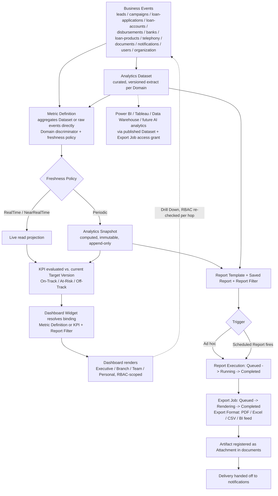

## Dashboard Flow

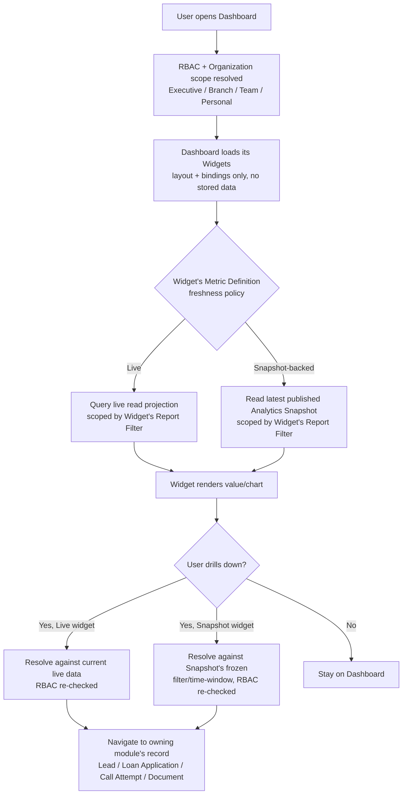

## Dataset & BI Integration

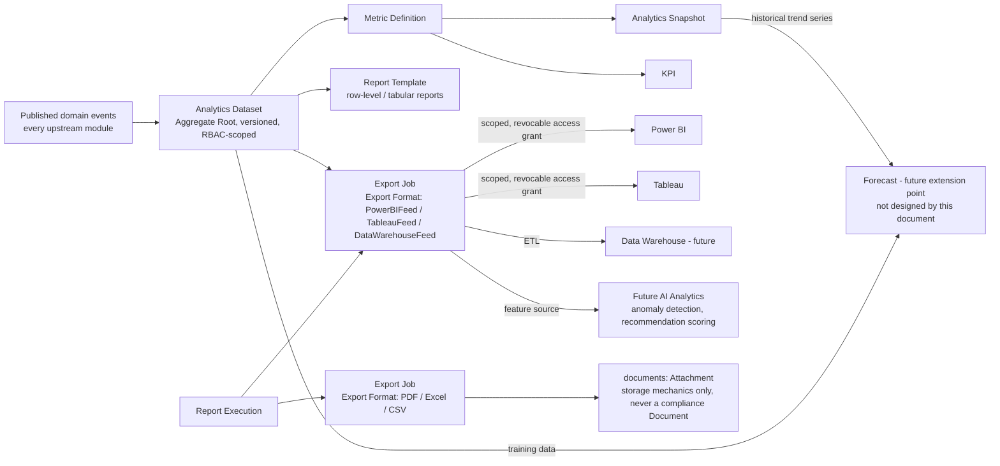

## Lifecycle Diagrams

### Dashboard lifecycle

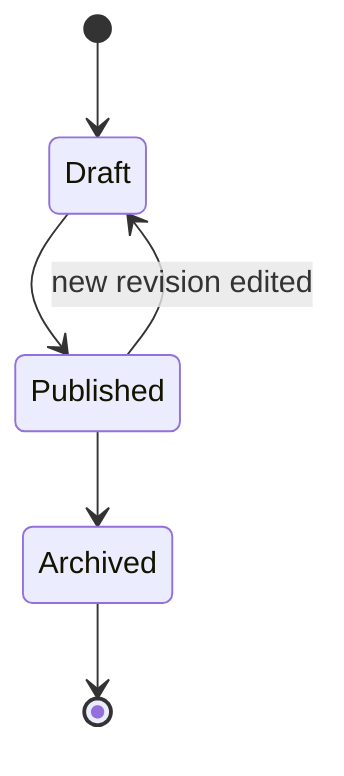

### Metric Definition lifecycle

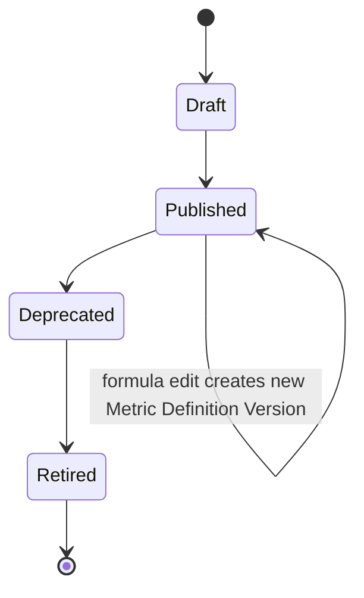

### KPI lifecycle

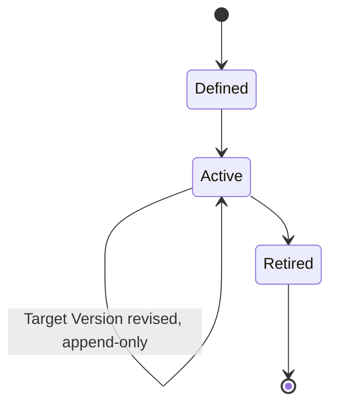

### Analytics Dataset lifecycle

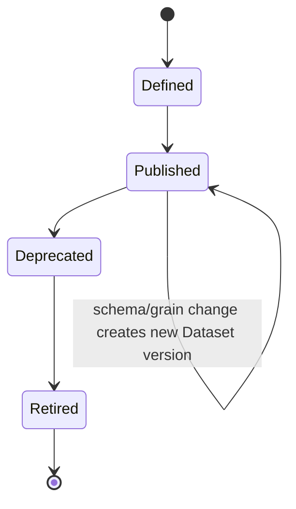

### Analytics Snapshot lifecycle

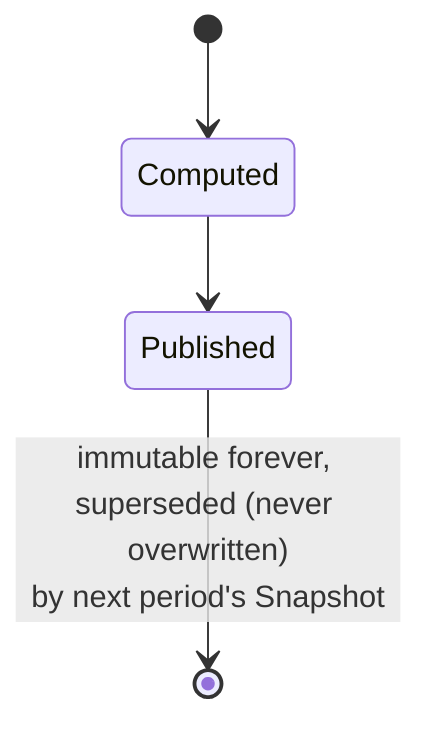

### Report Template lifecycle

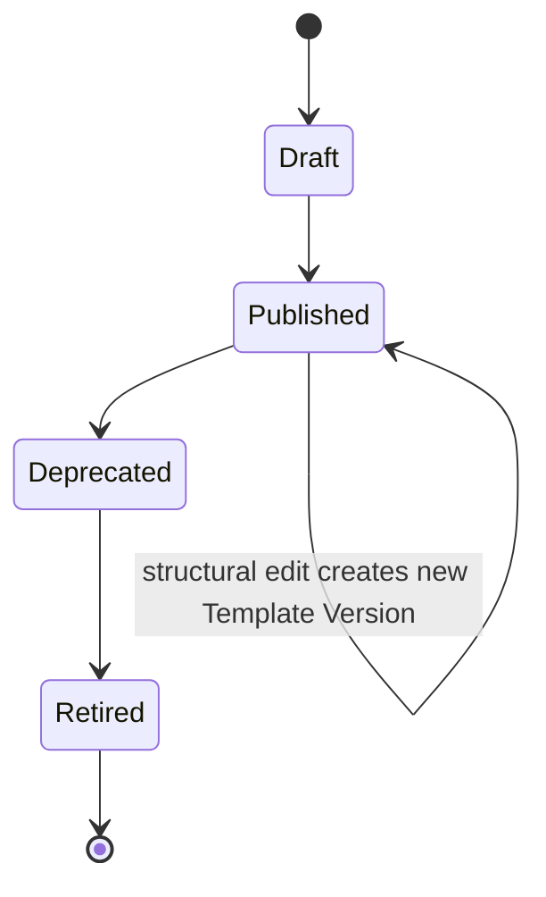

### Saved Report lifecycle

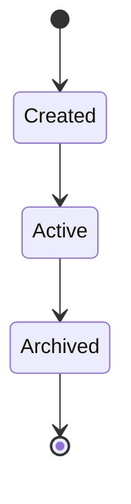

### Scheduled Report lifecycle

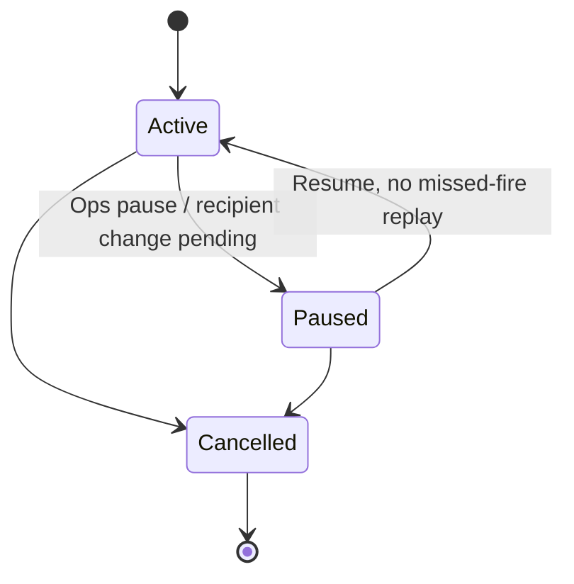

### Report Execution lifecycle

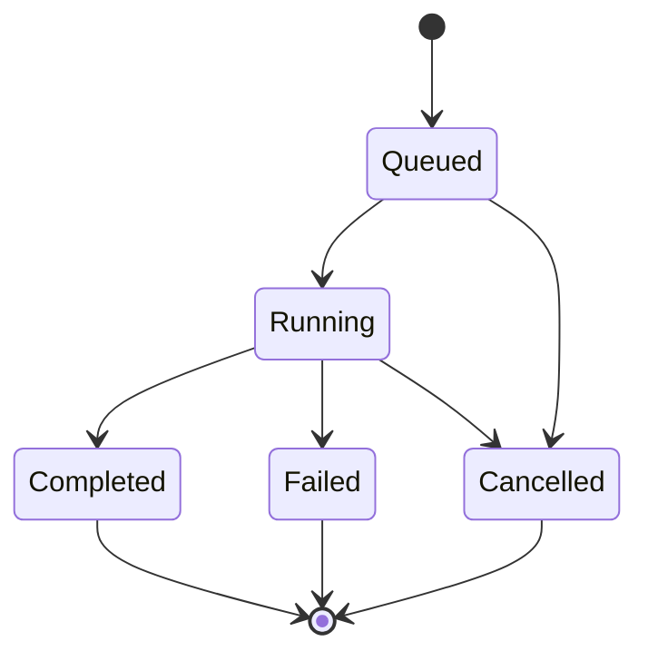

### Export Job lifecycle (retry never mutates a prior job)

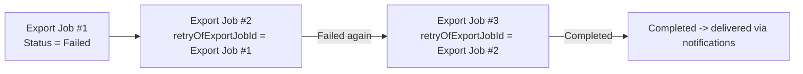

## Aggregate Boundary Diagram

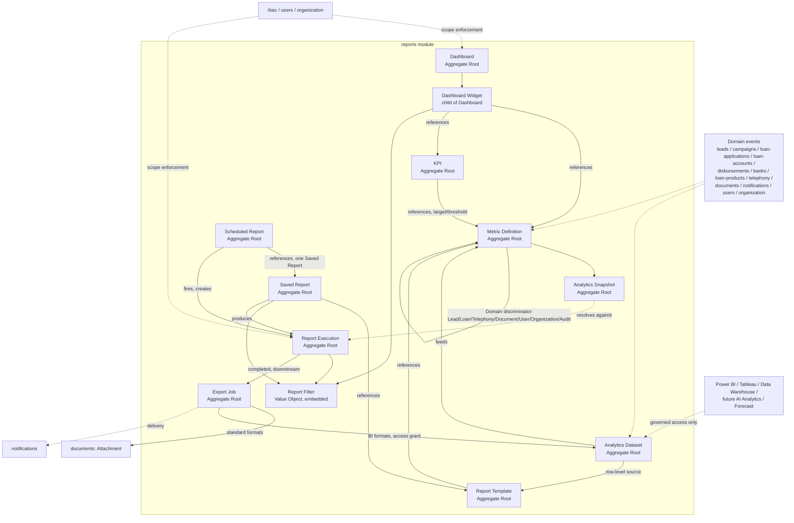

## Open Questions

- Whether Report Filter needs a first-class, named, versioned "Filter Preset"
  (a reusable starting point Widgets/Saved Reports can override) beyond a
  purely per-consumer embedded Value Object — deferred to implementation-time
  design.
- Whether Notification Batch-style bulk delivery (rather than one-off
  `notifications` handoff) is needed for Scheduled Reports fanning out to a
  very large recipient list — deferred until an actual recipient-count need
  is scoped.
- How the pre-existing `src/modules/analytics` code scaffold should be
  reconciled with the single-owner-module (`reports`) decision in this
  document and ADR 0009 — an implementation-time, code-only concern, out of
  scope here.
- Whether Forecast, once scoped, needs its own Aggregate Root or can be
  expressed as a specialized Analytics Dataset with a `SourceType = Model`
  discriminator — deferred until forecasting is actually designed.

## Implementation Status

Architecture documentation only. No schema, Prisma models, APIs, UI, or
business logic exist.
