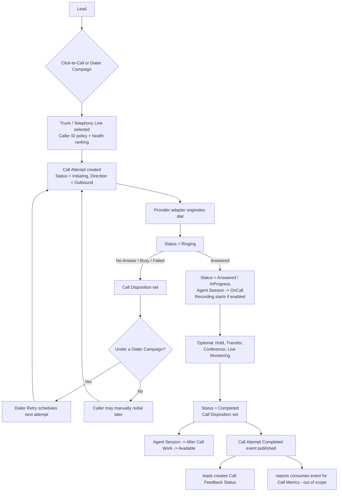
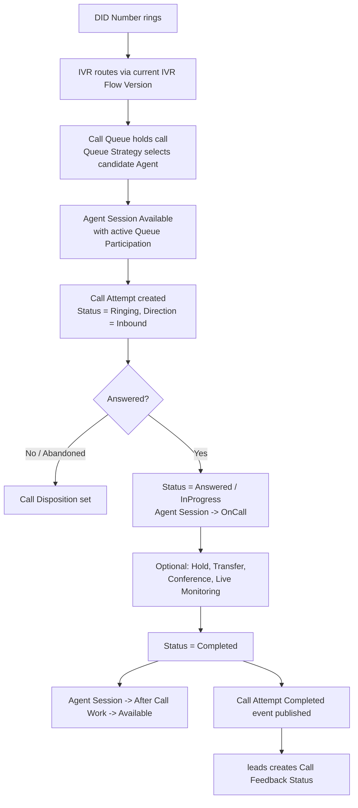
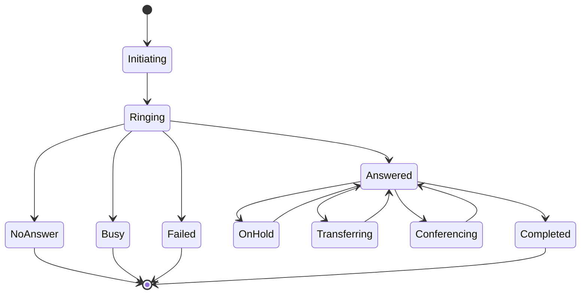
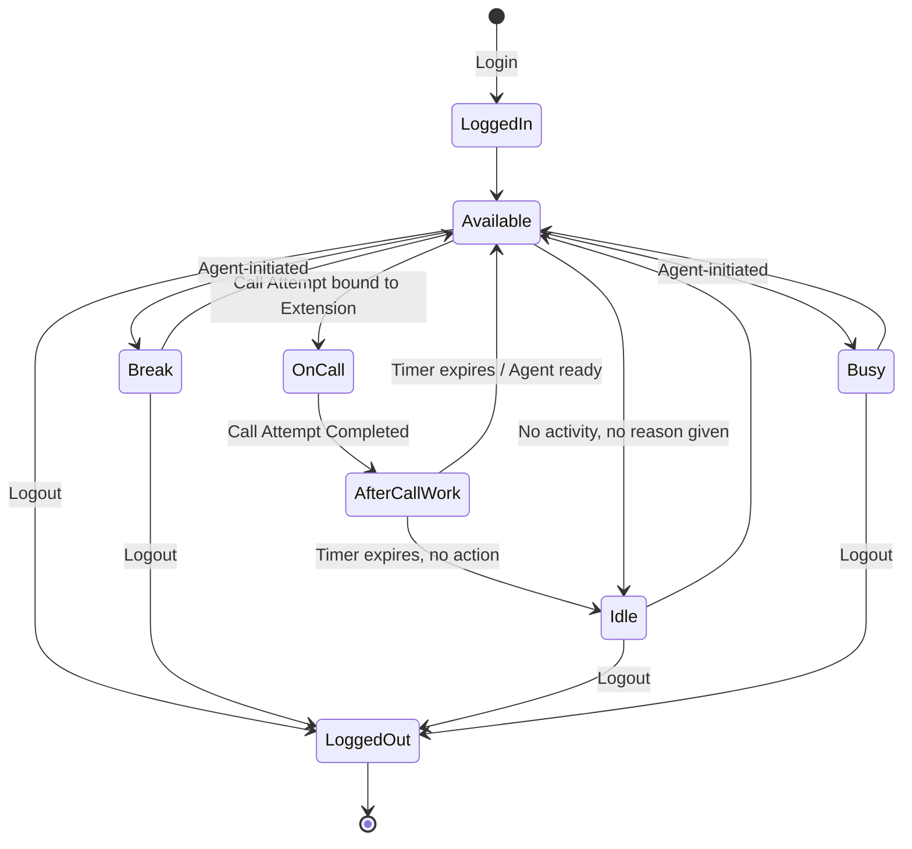
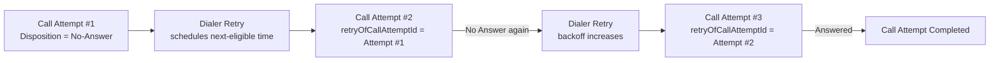

# Telephony

## Purpose

Own everything required to place, receive, route, monitor, record, and staff
calls for Mudrax Capitals' call center — from a Caller's Click-to-Call
through to the moment `leads` records a Call Feedback Status. `telephony` is
the single write path for all call execution, live call-center features, and
outbound dialing; it never writes Lead, Customer, or Campaign state directly.
See [ADR 0006](../adr/0006-telephony-call-center-aggregate-boundaries.md) for
the full reasoning behind every decision below.

## Owned Entities

### Connectivity & Carrier Layer

- `Trunk` - Aggregate Root abstracting PRI, GSM Gateway, and SIP behind one
  `TrunkType` discriminator and a type-specific configuration value. Owns a
  collection of `Telephony Line` children. Lifecycle: Provisioned -> Active
  -> Degraded -> Suspended -> Decommissioned.
- `Telephony Line` - child entity of Trunk; one addressable channel/circuit/
  registration slot, optionally bound (GSM-backed lines only) to a `SIM
  Inventory` item by identity. Bound to at most one live Call Attempt at a
  time.
- `SIM Inventory` - Aggregate Root; physical/eSIM asset master record
  (carrier, MSISDN, plan, activation state), referenced by identity, never
  embedded. Lifecycle: Procured -> Activated -> InService -> Suspended ->
  Blacklisted/Retired.
- `DID Numbers` - Aggregate Root; leased/owned inbound numbers. Resolves to
  exactly one routing target (IVR, Call Queue, or Extension) at a time.
- `Caller ID` - child policy on Trunk/Telephony Line/Dialer Campaign
  governing the outbound-presented number; supports rotation without
  altering historical Call Attempts.
- `Extension` - Aggregate Root; an Agent's dial-able endpoint, referencing a
  User (from `users`) by identity. Modeled device/location-agnostic to
  support Remote Agents without redesign.

### Call Execution

- `Call Attempt` - **Aggregate Root.** The atomic unit of telephony
  execution. Lifecycle: Initiating -> Ringing -> Answered/NoAnswer/Busy/
  Failed -> (if Answered) InProgress -> Completed. Immutable once Completed.
- `Call Status`, `Call Direction`, `Call Disposition` - Value Objects on Call
  Attempt (technical live state, Inbound/Outbound/Internal, and
  system-detected outcome respectively).
- `Click-to-Call` - not a persisted entity; the command that creates a new
  Call Attempt from a Lead.
- **`Call` is not a stored aggregate.** It is business language only; a
  cross-attempt grouping view, if ever needed, is a derived projection owned
  elsewhere, never a new aggregate here.

### Live Call Features

- `Call Recording` - child entity of Call Attempt (metadata + access-audit
  trail); audio payload is always an external reference. Carries an
  additive, optional annotation seam (`transcriptRef`/`summaryRef`/
  `qualityScoreRef`) reserved for future AI capabilities.
- `Call Monitoring Session` - child entity of Call Attempt with `Mode`
  (`Listen` / `Whisper` / `Barge`); every mode transition is individually
  logged.
- `Call Transfer` - child entity of Call Attempt; one Blind or Warm transfer
  event, append-only.
- `Call Conference` - child entity of Call Attempt; added-participant
  join/leave events. Barge is realized through this same mechanism.
- `IVR` - Aggregate Root; a configured voice-menu flow with an append-only
  `IVR Flow Version` so a completed Call Attempt always references the exact
  flow that routed it.

### Queueing & Agent Workforce

- `Call Queue` - Aggregate Root; a live-call holding pool with an embedded
  `Queue Strategy` (ring-all/round-robin/skill-based/longest-idle, plus
  overflow/timeout rules).
- `Queue Membership` - historical, append-only child entity of Call Queue
  (`effectiveFrom`/`effectiveTo`) recording Agent eligibility over time.
- `Agent Session` - **Aggregate Root, independent of Call Attempt.** One
  Agent's Login-to-Logout work session: assigned Extension, availability
  state (`Available`/`Break`/`Idle`/`Busy`/`After Call Work`), Queue
  Participation, and a Remote Agent context snapshot.
- `Queue Participation` - child entity of Agent Session; the live,
  session-scoped fact that an already-eligible Agent joined/left a Queue's
  active pool. Distinct from Queue Membership.

### Outbound Dialing

- `Dialer Campaign` - Aggregate Root; execution configuration (pacing,
  Trunk/Line pool, Caller ID policy, retry defaults) that optionally
  references a CRM Campaign (owned by `campaigns`) by identity.
- `Dialer Queue` - Aggregate Root; the outbound work queue of numbers/Leads
  still to be dialed for a Dialer Campaign. Distinct from Call Queue.
- `Dialer Retry` - child entity of a Dialer Queue Entry; owns only the retry
  counter/backoff/next-eligible-time policy, never telephony facts.

## Business Rules

- Call Attempt is the Aggregate Root for all call execution; "Call" is never
  modeled as a separate stored aggregate.
- An outbound retry always creates a new Call Attempt (linked to its
  predecessor by an additive `retryOfCallAttemptId` reference) — never a
  mutation or reopening of a completed one.
- Call Recording's audio payload is always an external reference; recording
  access is always logged, never anonymous.
- Trunk is the only abstraction domain logic depends on for PRI/GSM
  Gateway/SIP connectivity, via the `ITelephonyProvider` port; vendor and
  protocol-specific code lives only in `src/integrations/telephony/*`.
- Listen, Whisper, and Barge are modes of one Call Monitoring Session, not
  three entities; every mode escalation is individually logged and
  authorized by `rbac` against a Queue/Team scope — never a global
  permission.
- Call Queue, Queue Strategy, and Queue Membership are owned here, not by
  `users`/`organization`. Queue Membership is historical, never a single
  mutable "current members" field.
- Agent Session is independent of Call Attempt. `OnCall` and `After Call
  Work` are system-derived from the bound Call Attempt's own lifecycle —
  Agent Session never sets them manually. Exactly one Active Agent Session
  is permitted per Extension at a time. A Queue Participation entry may only
  reference a Queue the Agent already holds an active Queue Membership for.
  A Logout ends a session immutably; it is never reopened.
- Dialer Campaign, Dialer Queue, and Dialer Retry are independent of CRM
  Campaign; Dialer Campaign may reference a CRM Campaign by identity but
  never replaces or duplicates its allocation logic. Dialer Queue (outbound
  work queue) is never conflated with Call Queue (live-call holding pool).
- Call Disposition (system-detected) and `leads`' Call Feedback Status
  (human-entered) are permanently separate catalogs and must never be
  collapsed into one concept.
- On Call Attempt completion, `telephony` publishes a domain event; `leads`
  is the sole writer of the resulting Call Feedback Status — `telephony`
  never writes Lead state directly.

## Who Can Do What

| Role | Capability |
| --- | --- |
| Admin | Full configuration of Trunks, DID Numbers, SIM Inventory, Call Queues, IVR, Dialer Campaigns; listens to all Call Recordings; may Barge any monitored call |
| Manager | Listens to Call Recordings and monitors (Listen/Whisper/Barge) calls within their span; views Agent Session/Queue Participation history for their team |
| Team Leader | Listens to Call Recordings and monitors calls within their team; reassigns follow-on actions per CRM Core rules |
| Caller (Agent) | Places calls via Click-to-Call on assigned Leads; logs into an Agent Session on their Extension; joins/leaves Call Queues per Queue Participation; cannot access other Agents' recordings or monitor other calls |

## Dependencies

- References Lead and Customer identity from `leads`/`customers`; never
  duplicates or writes their state.
- References User identity from `users`; authorization for monitoring,
  recording access, and configuration comes from `rbac`.
- Consumes CRM Campaign context from `campaigns` for Dialer Campaign, without
  ever writing Campaign or Lead Assignment state.
- Publishes Call Attempt completion and Agent Session availability-change
  domain events; `leads` reacts to create Call Feedback Status, and `reports`
  (out of scope for this document) consumes the same events for Call
  Metrics.
- Vendor/protocol-specific PRI, GSM Gateway, and SIP integration code lives
  in `src/integrations/telephony/*`, implementing the `ITelephonyProvider`
  port — never inside this module's domain layer.

## Call Lifecycle

### Outbound (Click-to-Call or Dialer-driven)

### Inbound

### Call Attempt state diagram

### Agent Session state diagram

### Outbound retry flow (Dialer Retry)

## Open Questions

- Whether Telephony Line health-check feedback (SIM suspended/blacklisted,
  Trunk degraded) should automatically exclude a Line from selection, or
  require manual intervention.
- Whether Trunk, DID Numbers, and Extension need an explicit Branch
  reference from day one ahead of Multiple Branches support.
- Whether After Call Work's maximum duration is a global `telephony` policy
  or configurable per Call Queue/Dialer Campaign.

## Implementation Status

Architecture documentation only. No schema, Prisma models, APIs, UI, or
business logic exist.
